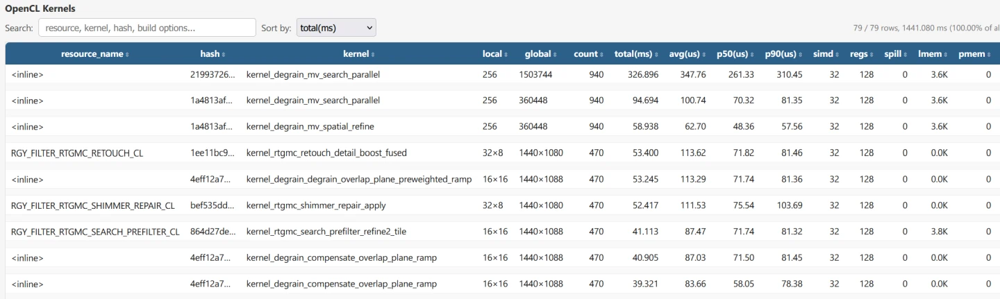
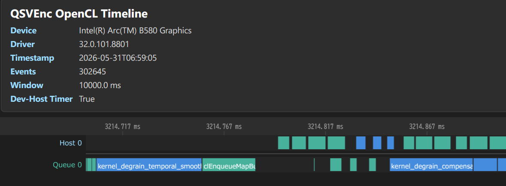


# QSVEncC option list <!-- omit in toc -->

**[日本語版はこちら＞＞](./QSVEncC_Options.ja.md)**

- [Command line example](#command-line-example)
  - [Basic commands](#basic-commands)
  - [More practical commands](#more-practical-commands)
    - [example of using hw decoder](#example-of-using-hw-decoder)
    - [example of using hw decoder (interlaced)](#example-of-using-hw-decoder-interlaced)
    - [avs (Avisynth) example (avs and vpy can also be read via vfw)](#avs-avisynth-example-avs-and-vpy-can-also-be-read-via-vfw)
    - [example of pipe usage](#example-of-pipe-usage)
    - [pipe usage from ffmpeg](#pipe-usage-from-ffmpeg)
    - [Passing video \& audio from ffmpeg](#passing-video--audio-from-ffmpeg)
    - [Passing filtered results \& audio to ffmpeg](#passing-filtered-results--audio-to-ffmpeg)
    - [Copy all tracks and metadata during video encode](#copy-all-tracks-and-metadata-during-video-encode)
- [Option format](#option-format)
- [Display options](#display-options)
  - [-h, -? --help](#-h-----help)
  - [-v, --version](#-v---version)
  - [--option-list](#--option-list)
  - [--check-hw](#--check-hw)
  - [--check-lib](#--check-lib)
  - [--check-impl](#--check-impl)
  - [--check-features](#--check-features)
  - [--check-features-html \[\<string\>\]](#--check-features-html-string)
  - [--check-environment](#--check-environment)
  - [--check-device](#--check-device)
  - [--check-clinfo](#--check-clinfo)
  - [--check-codecs, --check-decoders, --check-encoders](#--check-codecs---check-decoders---check-encoders)
  - [--check-profiles \<string\>](#--check-profiles-string)
  - [--check-formats](#--check-formats)
  - [--check-protocols](#--check-protocols)
  - [--check-avdevices](#--check-avdevices)
  - [--check-filters](#--check-filters)
  - [--check-avversion](#--check-avversion)
- [Basic encoding options](#basic-encoding-options)
  - [-d, --device \<string\> or \<int\>](#-d---device-string-or-int)
  - [-c, --codec \<string\>](#-c---codec-string)
  - [-o, --output \<string\>](#-o---output-string)
  - [-i, --input \<string\>](#-i---input-string)
  - [--raw](#--raw)
  - [--y4m](#--y4m)
  - [--avi](#--avi)
  - [--avs](#--avs)
  - [--vpy](#--vpy)
  - [--vpy-mt](#--vpy-mt)
  - [--avsw \[\<string\>\]](#--avsw-string)
  - [--avhw](#--avhw)
  - [--interlace \<string\>](#--interlace-string)
  - [--crop \<int\>,\<int\>,\<int\>,\<int\>](#--crop-intintintint)
  - [--frames \<int\>](#--frames-int)
  - [--fps \<int\>/\<int\> or \<float\>](#--fps-intint-or-float)
  - [--input-res \<int\>x\<int\>](#--input-res-intxint)
  - [--output-res \<int\>x\<int\>](#--output-res-intxint)
  - [--input-csp \<string\>](#--input-csp-string)
  - [--output-csp \<string\>](#--output-csp-string)
  - [--output-depth \<int\>](#--output-depth-int)
- [Encode Mode Options](#encode-mode-options)
  - [--icq \<int\> (ICQ, Intelligent Const. Quality mode, default: 23)](#--icq-int-icq-intelligent-const-quality-mode-default-23)
  - [--la-icq \<int\> (LA-ICQ, Lookahead based ICQ mode: default: 23)](#--la-icq-int-la-icq-lookahead-based-icq-mode-default-23)
  - [--cqp \<int\> or \<int\>:\<int\>:\<int\>](#--cqp-int-or-intintint)
  - [--cbr \<int\>  (CBR, Constant Bitrate mode)](#--cbr-int--cbr-constant-bitrate-mode)
  - [--vbr \<int\>  (VBR, Variable Bitrate mode)](#--vbr-int--vbr-variable-bitrate-mode)
  - [--avbr \<int\> (AVBR, Adaptive Variable Bitrate mode)](#--avbr-int-avbr-adaptive-variable-bitrate-mode)
  - [--la \<int\>   (LA, LookAhead mode)](#--la-int---la-lookahead-mode)
  - [--la-hrd \<int\> (LA-HRD, HRD-compliant LookAhead mode)](#--la-hrd-int-la-hrd-hrd-compliant-lookahead-mode)
  - [--vcm \<int\> (VCM, Video Conference Mode)](#--vcm-int-vcm-video-conference-mode)
  - [--qvbr \<int\>, --qvbr-q \<int\> (QVBR, Quality based VBR mode)](#--qvbr-int---qvbr-q-int-qvbr-quality-based-vbr-mode)
  - [--fallback-rc](#--fallback-rc)
  - [--workaround-hevc10bit-enctools / --no-workaround-hevc10bit-enctools](#--workaround-hevc10bit-enctools----no-workaround-hevc10bit-enctools)
- [Options for Frame Buffer](#options-for-frame-buffer)
  - [--disable-d3d (Win)](#--disable-d3d-win)
  - [--disable-va (Linux)](#--disable-va-linux)
  - [--d3d](#--d3d)
  - [--d3d9](#--d3d9)
  - [--d3d11](#--d3d11)
  - [--va](#--va)
- [Other Options for Encoder](#other-options-for-encoder)
  - [--function-mode \<string\>](#--function-mode-string)
  - [--fixed-func](#--fixed-func)
  - [--hyper-mode \<string\>](#--hyper-mode-string)
  - [--max-bitrate \<int\>](#--max-bitrate-int)
  - [--vbv-bufsize \<int\>](#--vbv-bufsize-int)
  - [--qvbr-quality \<int\>](#--qvbr-quality-int)
  - [--avbr-unitsize \<int\>](#--avbr-unitsize-int)
  - [--qp-min \<int\> or \<int\>:\<int\>:\<int\>](#--qp-min-int-or-intintint)
  - [--qp-max \<int\> or \<int\>:\<int\>:\<int\>](#--qp-max-int-or-intintint)
  - [--qp-offset \<int\>\[:\<int\>\]\[:\<int\>\]...](#--qp-offset-intintint)
  - [-u, --quality \<string\>](#-u---quality-string)
  - [--dynamic-rc \<int\>:\<int\>:\<int\>\<int\>,\<param1\>=\<value1\>\[,\<param2\>=\<value2\>\],...](#--dynamic-rc-intintintintparam1value1param2value2)
  - [--la-depth \<int\>](#--la-depth-int)
  - [--la-window-size \<int\> 0(auto)](#--la-window-size-int-0auto)
  - [--la-quality \<string\>](#--la-quality-string)
  - [--tune \<string\>\[,\<string\>\]...](#--tune-stringstring)
  - [--scenario-info \<string\>](#--scenario-info-string)
  - [--extbrc](#--extbrc)
  - [--mbbrc](#--mbbrc)
  - [--i-adapt](#--i-adapt)
  - [--b-adapt](#--b-adapt)
  - [--strict-gop](#--strict-gop)
  - [--gop-len \<int\>](#--gop-len-int)
  - [--open-gop](#--open-gop)
  - [-b, --bframes \<int\> \[H.264/HEVC/MPEG2\]](#-b---bframes-int-h264hevcmpeg2)
  - [--gop-ref-dist \<int\>](#--gop-ref-dist-int)
  - [--ref \<int\>](#--ref-int)
  - [--b-pyramid](#--b-pyramid)
  - [--weightb](#--weightb)
  - [--weightp](#--weightp)
  - [--direct-bias-adjust](#--direct-bias-adjust)
  - [--adapt-ref](#--adapt-ref)
  - [--adapt-ltr](#--adapt-ltr)
  - [--adapt-cqm](#--adapt-cqm)
  - [--mv-scaling \<string\>](#--mv-scaling-string)
  - [--fade-detect](#--fade-detect)
  - [--slices \<int\>](#--slices-int)
  - [--level \<string\>](#--level-string)
  - [--profile \<string\>](#--profile-string)
  - [--tier \<string\>  \[HEVC only\]](#--tier-string--hevc-only)
  - [--sar \<int\>:\<int\>](#--sar-intint)
  - [--dar \<int\>:\<int\>](#--dar-intint)
  - [--colorrange \<string\>](#--colorrange-string)
  - [--videoformat \<string\>](#--videoformat-string)
  - [--colormatrix \<string\>](#--colormatrix-string)
  - [--colorprim \<string\>](#--colorprim-string)
  - [--transfer \<string\>](#--transfer-string)
  - [--chromaloc \<int\> or "auto"](#--chromaloc-int-or-auto)
  - [--max-cll \<int\>,\<int\> or "copy" \[HEVC, AV1\]](#--max-cll-intint-or-copy-hevc-av1)
  - [--master-display \<string\> or "copy" \[HEVC, AV1\]](#--master-display-string-or-copy-hevc-av1)
  - [--atc-sei \<string\> or \<int\> \[HEVC only\]](#--atc-sei-string-or-int-hevc-only)
  - [--dhdr10-info \<string\> \[HEVC, AV1\]](#--dhdr10-info-string-hevc-av1)
  - [--dhdr10-info copy \[HEVC, AV1\]](#--dhdr10-info-copy-hevc-av1)
  - [--dolby-vision-profile \<string\> \[HEVC, AV1\]](#--dolby-vision-profile-string-hevc-av1)
  - [--dolby-vision-rpu \<string\> \[HEVC, AV1\]](#--dolby-vision-rpu-string-hevc-av1)
  - [--dolby-vision-rpu copy \[HEVC, AV1\]](#--dolby-vision-rpu-copy-hevc-av1)
  - [--dolby-vision-rpu-prm \<param1\>=\<value1\>\[,\<param2\>=\<value2\>\]...](#--dolby-vision-rpu-prm-param1value1param2value2)
  - [--aud](#--aud)
  - [--pic-struct](#--pic-struct)
  - [--buf-period](#--buf-period)
  - [--repeat-headers](#--repeat-headers)
  - [--no-repeat-headers](#--no-repeat-headers)
  - [--bluray \[H.264 only\]](#--bluray-h264-only)
  - [--repartition-check](#--repartition-check)
  - [--trellis \<string\> \[H.264\]](#--trellis-string-h264)
  - [--intra-refresh-cycle \<int\>](#--intra-refresh-cycle-int)
  - [--max-framesize \<int\>](#--max-framesize-int)
  - [--max-framesize-i \<int\>](#--max-framesize-i-int)
  - [--max-framesize-p \<int\>](#--max-framesize-p-int)
  - [--no-deblock](#--no-deblock)
  - [--tskip](#--tskip)
  - [--sao \<string\>](#--sao-string)
  - [--ctu \<int\>](#--ctu-int)
  - [--hevc-gpb](#--hevc-gpb)
  - [--no-hevc-gpb](#--no-hevc-gpb)
  - [--tile-row \<int\>](#--tile-row-int)
  - [--tile-col \<int\>](#--tile-col-int)
  - [--ssim](#--ssim)
  - [--psnr](#--psnr)
- [IO / Audio / Subtitle Options](#io--audio--subtitle-options)
  - [--input-analyze \<float\>](#--input-analyze-float)
  - [--input-probesize \<int\>](#--input-probesize-int)
  - [--trim \<int\>:\<int\>\[,\<int\>:\<int\>\]\[,\<int\>:\<int\>\]...](#--trim-intintintintintint)
  - [--seek \[\<int\>:\]\[\<int\>:\]\<int\>\[.\<int\>\]](#--seek-intintintint)
  - [--seekto \[\<int\>:\]\[\<int\>:\]\<int\>\[.\<int\>\]](#--seekto-intintintint)
  - [--input-format \<string\>](#--input-format-string)
  - [-f, --output-format \<string\>](#-f---output-format-string)
  - [--video-track \<int\>](#--video-track-int)
  - [--video-streamid \<int\>](#--video-streamid-int)
  - [--video-tag \<string\>](#--video-tag-string)
  - [--video-metadata \<string\> or \<string\>=\<string\>](#--video-metadata-string-or-stringstring)
  - [--avcodec-prms \<string\>](#--avcodec-prms-string)
  - [--audio-copy \[\<int/string\>;\[,\<int/string\>\]...\]](#--audio-copy-intstringintstring)
  - [--audio-codec \[\[\<int/string\>?\]\<string\>\[:\<string\>=\<string\>\[,\<string\>=\<string\>\]...\]...\]](#--audio-codec-intstringstringstringstringstringstring)
  - [--audio-encode-other-codec-only](#--audio-encode-other-codec-only)
  - [--audio-bitrate \[\<int/string\>?\]\<int\>](#--audio-bitrate-intstringint)
  - [--audio-quality \[\<int/string\>?\]\<int\>](#--audio-quality-intstringint)
  - [--audio-profile \[\<int/string\>?\]\<string\>](#--audio-profile-intstringstring)
  - [--audio-stream \[\<int/string\>?\]{\<string1\>}\[:\<string2\>\]](#--audio-stream-intstringstring1string2)
  - [--audio-samplerate \[\<int/string\>?\]\<int\>](#--audio-samplerate-intstringint)
  - [--audio-resampler \<string\>](#--audio-resampler-string)
  - [--audio-delay \[\<int/string\>?\]\<float\>](#--audio-delay-intstringfloat)
  - [--audio-file \[\<int/string\>?\]\[\<string\>\]\<string\>](#--audio-file-intstringstringstring)
  - [--audio-filter \[\<int/string\>?\]\<string\>](#--audio-filter-intstringstring)
  - [--audio-disposition \[\<int/string\>?\]\<string\>\[,\<string\>\]\[\]...](#--audio-disposition-intstringstringstring)
  - [--audio-metadata \[\<int/string\>?\]\<string\> or \[\<int/string\>?\]\<string\>=\<string\>](#--audio-metadata-intstringstring-or-intstringstringstring)
  - [--audio-bsf \[\<int/string\>?\]\<string\>](#--audio-bsf-intstringstring)
  - [--audio-ignore-decode-error \<int\>](#--audio-ignore-decode-error-int)
  - [--audio-source \<string\>\[:{\<int\>?}\[;\<param1\>=\<value1\>...\]/\[\]...\]](#--audio-source-stringintparam1value1)
  - [--chapter \<string\>](#--chapter-string)
  - [--chapter-copy](#--chapter-copy)
  - [--chapter-no-trim](#--chapter-no-trim)
  - [--sub-source \<string\>\[:{\<int\>?}\[;\<param1\>=\<value1\>...\]/\[\]...\]](#--sub-source-stringintparam1value1)
  - [--sub-copy \[\<int/string\>;\[,\<int/string\>\]...\]](#--sub-copy-intstringintstring)
  - [--sub-disposition \[\<int/string\>?\]\<string\>](#--sub-disposition-intstringstring)
  - [--sub-metadata \[\<int/string\>?\]\<string\> or \[\<int/string\>?\]\<string\>=\<string\>](#--sub-metadata-intstringstring-or-intstringstringstring)
  - [--sub-bsf \[\<int/string\>?\]\<string\>](#--sub-bsf-intstringstring)
  - [--data-copy \[\<int\>\[,\<int\>\]...\]](#--data-copy-intint)
  - [--attachment-copy \[\<int\>\[,\<int\>\]...\]](#--attachment-copy-intint)
  - [--attachment-source \<string\>\[:{\<int\>?}\[;\<param1\>=\<value1\>\]...\]...](#--attachment-source-stringintparam1value1)
  - [--input-option \<string1\>:\<string2\>](#--input-option-string1string2)
  - [-m, --mux-option \<string1\>:\<string2\>](#-m---mux-option-string1string2)
  - [--metadata \<string\> or \<string\>=\<string\>](#--metadata-string-or-stringstring)
  - [--avsync \<string\>](#--avsync-string)
  - [--timestamp-passthrough](#--timestamp-passthrough)
  - [--muxer-add-cmd](#--muxer-add-cmd)
  - [--timecode \[\<string\>\]](#--timecode-string)
  - [--tcfile-in \<string\>](#--tcfile-in-string)
  - [--timebase \<int\>/\<int\>](#--timebase-intint)
  - [--input-hevc-bsf \<string\>](#--input-hevc-bsf-string)
  - [--input-pixel-format \<string\>](#--input-pixel-format-string)
  - [--offset-video-dts-advance](#--offset-video-dts-advance)
  - [--allow-other-negative-pts](#--allow-other-negative-pts)
- [Vpp Options](#vpp-options)
  - [Vpp Filtering order](#vpp-filtering-order)
  - [--vpp-colorspace \[\<param1\>=\<value1\>\[,\<param2\>=\<value2\>\]...\]](#--vpp-colorspace-param1value1param2value2)
  - [--vpp-rff](#--vpp-rff)
  - [--vpp-libplacebo-tonemapping \[\<param1\>=\<value1\>\]\[,\<param2\>=\<value2\>\],...](#--vpp-libplacebo-tonemapping-param1value1param2value2)
  - [--vpp-libplacebo-tonemapping-lut \<string\>](#--vpp-libplacebo-tonemapping-lut-string)
  - [--vpp-delogo \<string\>\[,\<param1\>=\<value1\>\]\[,\<param2\>=\<value2\>\],...](#--vpp-delogo-stringparam1value1param2value2)
  - [--vpp-afs \[\<param1\>=\<value1\>\[,\<param2\>=\<value2\>\]...\]](#--vpp-afs-param1value1param2value2)
  - [--vpp-bwdif \[\<param1\>=\<value1\>\]](#--vpp-bwdif-param1value1)
  - [--vpp-yadif \[\<param1\>=\<value1\>\]](#--vpp-yadif-param1value1)
  - [--vpp-stdeint \[\<param1\>=\<value1\>\]\[,\<param2\>=\<value2\>\],...](#--vpp-stdeint-param1value1param2value2)
  - [--vpp-nnedi \[\<param1\>=\<value1\>\[,\<param2\>=\<value2\>\]...\]](#--vpp-nnedi-param1value1param2value2)
  - [--vpp-rtgmc \[\<param1\>=\<value1\>\]](#--vpp-rtgmc-param1value1)
  - [--vpp-rtgmc-bob \[\<param1\>=\<value1\>\]](#--vpp-rtgmc-bob-param1value1)
  - [--vpp-rtgmc-search-prefilter \[\<param1\>=\<value1\>\]](#--vpp-rtgmc-search-prefilter-param1value1)
  - [--vpp-rtgmc-edi \[\<param1\>=\<value1\>\]](#--vpp-rtgmc-edi-param1value1)
  - [--vpp-rtgmc-retouch \[\<param1\>=\<value1\>\]](#--vpp-rtgmc-retouch-param1value1)
  - [--vpp-rtgmc-shimmer-repair \[\<param1\>=\<value1\>\]](#--vpp-rtgmc-shimmer-repair-param1value1)
  - [--vpp-rtgmc-primitive \[\<param1\>=\<value1\>\]](#--vpp-rtgmc-primitive-param1value1)
  - [--vpp-degrain \[\<param1\>=\<value1\>\]](#--vpp-degrain-param1value1)
  - [--vpp-kfm \[\<param1\>=\<value1\>\[,\<param2\>=\<value2\>\]...\]](#--vpp-kfm-param1value1param2value2)
  - [--vpp-deinterlace \<string\>](#--vpp-deinterlace-string)
  - [--vpp-deint-csp \<string\>](#--vpp-deint-csp-string)
  - [--vpp-decomb \[\<param1\>=\<value1\>\[,\<param2\>=\<value2\>\]...\]](#--vpp-decomb-param1value1param2value2)
  - [--vpp-ivtc \[\<param1\>=\<value1\>\[,\<param2\>=\<value2\>\]...\]](#--vpp-ivtc-param1value1param2value2)
  - [--vpp-decimate \[\<param1\>=\<value1\>\[,\<param2\>=\<value2\>\]...\]](#--vpp-decimate-param1value1param2value2)
  - [--vpp-mpdecimate \[\<param1\>=\<value1\>\[,\<param2\>=\<value2\>\]...\]](#--vpp-mpdecimate-param1value1param2value2)
  - [--vpp-convolution3d \[\<param1\>=\<value1\>\[,\<param2\>=\<value2\>\]...\]](#--vpp-convolution3d-param1value1param2value2)
  - [--vpp-smooth \[\<param1\>=\<value1\>\[,\<param2\>=\<value2\>\]...\]](#--vpp-smooth-param1value1param2value2)
  - [--vpp-denoise-dct \[\<param1\>=\<value1\>\]\[,\<param2\>=\<value2\>\],...](#--vpp-denoise-dct-param1value1param2value2)
  - [--vpp-fft3d \[\<param1\>=\<value1\>\]\[,\<param2\>=\<value2\>\],...](#--vpp-fft3d-param1value1param2value2)
  - [--vpp-msmooth \[\<param1\>=\<value1\>\[,\<param2\>=\<value2\>\]...\]](#--vpp-msmooth-param1value1param2value2)
  - [--vpp-knn \[\<param1\>=\<value1\>\[,\<param2\>=\<value2\>\]...\]](#--vpp-knn-param1value1param2value2)
  - [--vpp-nlmeans \[\<param1\>=\<value1\>\[,\<param2\>=\<value2\>\]...\]](#--vpp-nlmeans-param1value1param2value2)
  - [--vpp-pmd \[\<param1\>=\<value1\>\[,\<param2\>=\<value2\>\]...\]](#--vpp-pmd-param1value1param2value2)
  - [--vpp-hqdn3d \[\<param1\>=\<value1\>\[,\<param2\>=\<value2\>\]...\]](#--vpp-hqdn3d-param1value1param2value2)
  - [--vpp-denoise \<int\> or \[\<param1\>=\<value1\>\[,\<param2\>=\<value2\>\]...\]](#--vpp-denoise-int-or-param1value1param2value2)
  - [--vpp-image-stab \<string\>](#--vpp-image-stab-string)
  - [--vpp-mctf \["auto" or \<int\>\]](#--vpp-mctf-auto-or-int)
  - [--vpp-subburn \[\<param1\>=\<value1\>\[,\<param2\>=\<value2\>\]...\]](#--vpp-subburn-param1value1param2value2)
  - [--vpp-libplacebo-shader \[\<param1\>=\<value1\>\]\[,\<param2\>=\<value2\>\],...](#--vpp-libplacebo-shader-param1value1param2value2)
  - [--vpp-descale \[\<param1\>=\<value1\>\[,\<param2\>=\<value2\>\]...\]](#--vpp-descale-param1value1param2value2)
  - [--vpp-resize \<string\>](#--vpp-resize-string)
  - [--vpp-resize-mode \<string\>](#--vpp-resize-mode-string)
  - [--vpp-unsharp \[\<param1\>=\<value1\>\[,\<param2\>=\<value2\>\]...\]](#--vpp-unsharp-param1value1param2value2)
  - [--vpp-vinverse \[\<param1\>=\<value1\>\[,\<param2\>=\<value2\>\]...\]](#--vpp-vinverse-param1value1param2value2)
  - [--vpp-chromashift \[\<param1\>=\<value1\>\[,\<param2\>=\<value2\>\]...\]](#--vpp-chromashift-param1value1param2value2)
  - [--vpp-deblock \[\<param1\>=\<value1\>\[,\<param2\>=\<value2\>\]...\]](#--vpp-deblock-param1value1param2value2)
  - [--vpp-deflicker \[\<param1\>=\<value1\>\[,\<param2\>=\<value2\>\]...\]](#--vpp-deflicker-param1value1param2value2)
  - [--vpp-stab \[\<param1\>=\<value1\>\[,\<param2\>=\<value2\>\]...\]](#--vpp-stab-param1value1param2value2)
  - [--vpp-colorfix \[\<param1\>=\<value1\>\[,\<param2\>=\<value2\>\]...\]](#--vpp-colorfix-param1value1param2value2)
  - [--vpp-dehalo \[\<param1\>=\<value1\>\[,\<param2\>=\<value2\>\]...\]](#--vpp-dehalo-param1value1param2value2)
  - [--vpp-finedehalo \[\<param1\>=\<value1\>\[,\<param2\>=\<value2\>\]...\]](#--vpp-finedehalo-param1value1param2value2)
  - [--vpp-hqdering \[\<param1\>=\<value1\>\[,\<param2\>=\<value2\>\]...\]](#--vpp-hqdering-param1value1param2value2)
  - [--vpp-edgelevel \[\<param1\>=\<value1\>\[,\<param2\>=\<value2\>\]...\]](#--vpp-edgelevel-param1value1param2value2)
  - [--vpp-msharpen \[\<param1\>=\<value1\>\[,\<param2\>=\<value2\>\]...\]](#--vpp-msharpen-param1value1param2value2)
  - [--vpp-cas \[\<param1\>=\<value1\>\[,\<param2\>=\<value2\>\]...\]](#--vpp-cas-param1value1param2value2)
  - [--vpp-warpsharp \[\<param1\>=\<value1\>\[,\<param2\>=\<value2\>\]...\]](#--vpp-warpsharp-param1value1param2value2)
  - [--vpp-detailsharpen \[\<param1\>=\<value1\>\[,\<param2\>=\<value2\>\]...\]](#--vpp-detailsharpen-param1value1param2value2)
  - [--vpp-maa \[\<param1\>=\<value1\>\[,\<param2\>=\<value2\>\]...\]](#--vpp-maa-param1value1param2value2)
  - [--vpp-detail-enhance \<int\>](#--vpp-detail-enhance-int)
  - [--vpp-rotate \<int\>](#--vpp-rotate-int)
  - [--vpp-transform \[\<param1\>=\<value1\>\[,\<param2\>=\<value2\>\]...\]](#--vpp-transform-param1value1param2value2)
  - [--vpp-softlight \[\<param1\>=\<value1\>\]\[,\<param2\>=\<value2\>\],...](#--vpp-softlight-param1value1param2value2)
  - [--vpp-curves \[\<param1\>=\<value1\>\]\[,\<param2\>=\<value2\>\],...](#--vpp-curves-param1value1param2value2)
  - [--vpp-tweak \[\<param1\>=\<value1\>\[,\<param2\>=\<value2\>\]...\]](#--vpp-tweak-param1value1param2value2)
  - [--vpp-deband \[\<param1\>=\<value1\>\[,\<param2\>=\<value2\>\]...\]](#--vpp-deband-param1value1param2value2)
  - [--vpp-libplacebo-deband \[\<param1\>=\<value1\>\]\[,\<param2\>=\<value2\>\],...](#--vpp-libplacebo-deband-param1value1param2value2)
  - [--vpp-pad \<int\>,\<int\>,\<int\>,\<int\>](#--vpp-pad-intintintint)
  - [--vpp-overlay \[\<param1\>=\<value1\>\]\[,\<param2\>=\<value2\>\],...](#--vpp-overlay-param1value1param2value2)
  - [--vpp-perc-pre-enc](#--vpp-perc-pre-enc)
  - [--vpp-mfx-insert-clcopy \[\<int\>\]](#--vpp-mfx-insert-clcopy-int)
  - [--vpp-anime4k-shader \[\<param1\>=\<value1\>\]\[,\<param2\>=\<value2\>\],...](#--vpp-anime4k-shader-param1value1param2value2)
  - [--vpp-onnx \[\<param1\>=\<value1\>\]\[,\<param2\>=\<value2\>\],...](#--vpp-onnx-param1value1param2value2)
  - [--vpp-onnx-model-dir \<string\>](#--vpp-onnx-model-dir-string)
  - [--vpp-onnx-cache-dir \<string\>](#--vpp-onnx-cache-dir-string)
  - [--vpp-ai-frameinterp \[\<param1\>=\<value1\>\]\[,\<param2\>=\<value2\>\],...](#--vpp-ai-frameinterp-param1value1param2value2)
  - [--vpp-perf-monitor](#--vpp-perf-monitor)
- [Other Options](#other-options)
  - [--parallel \[\<int\>\] or \[\<string\>\]](#--parallel-int-or-string)
  - [--parallel-force-large-memory-filters](#--parallel-force-large-memory-filters)
  - [--async-depth \<int\>](#--async-depth-int)
  - [--input-buf \<int\>](#--input-buf-int)
  - [--output-buf \<int\>](#--output-buf-int)
  - [--mfx-thread \<int\>](#--mfx-thread-int)
  - [--gpu-copy](#--gpu-copy)
  - [--output-thread \<int\>](#--output-thread-int)
  - [--min-memory](#--min-memory)
  - [--(no-)timer-period-tuning](#--no-timer-period-tuning)
  - [--benchmark \<string\>](#--benchmark-string)
  - [--bench-quality "all" or \[,\]\[,\]...](#--bench-quality-all-or-)
  - [--log \<string\>](#--log-string)
  - [--log-level \[\<param1\>=\]\<value\>\[,\<param2\>=\<value\>\]...](#--log-level-param1valueparam2value)
  - [--log-opt \<param1\>=\<value\>\[,\<param2\>=\<value\>\]...](#--log-opt-param1valueparam2value)
  - [--log-framelist \[\<string\>\]](#--log-framelist-string)
  - [--log-packets \[\<string\>\]](#--log-packets-string)
  - [--log-mux-ts \[\<string\>\]](#--log-mux-ts-string)
  - [--thread-affinity \[\<string1\>=\]{\<string2\>\[#\<int\>\[:\<int\>\]\[\]...\] or 0x\<hex\>}](#--thread-affinity-string1string2intint-or-0xhex)
  - [--thread-priority \[\<string1\>=\]\<string2\>\[#\<int\>\[:\<int\>\]\[\]...\]](#--thread-priority-string1string2intint)
  - [--thread-throttling \[\<string1\>=\]\<string2\>\[#\<int\>\[:\<int\>\]\[\]...\]](#--thread-throttling-string1string2intint)
  - [--option-file \<string\>](#--option-file-string)
  - [--max-procfps \<int\>](#--max-procfps-int)
  - [--avoid-idle-clock \<string\>\[=\<float\>\]](#--avoid-idle-clock-stringfloat)
  - [--lowlatency](#--lowlatency)
  - [--fallback-bitdepth](#--fallback-bitdepth)
  - [--avsdll \<string\>](#--avsdll-string)
  - [--vsdir \<string\>](#--vsdir-string)
  - [--vpy-assume-script-dir](#--vpy-assume-script-dir)
  - [--process-codepage \<string\> \[Windows OS only\]](#--process-codepage-string-windows-os-only)
  - [--task-perf-monitor](#--task-perf-monitor)
  - [--opencl-task-threads \<auto|int\>](#--opencl-task-threads-autoint)
  - [--cl-perf-dump \<dir\>](#--cl-perf-dump-dir)
  - [--cl-perf-timeline \[\<float\>\]](#--cl-perf-timeline-float)
  - [--ocloc-path \<path\>](#--ocloc-path-path)
  - [--python \<string\>](#--python-string)
  - [--perf-monitor \[\<string\>\[,\<string\>\]...\]](#--perf-monitor-stringstring)
  - [--perf-monitor-interval \<int\>](#--perf-monitor-interval-int)

## Command line example


### Basic commands
```Batchfile
QSVEncC.exe [Options] -i <filename> -o <filename>
```

### More practical commands
#### example of using hw decoder
```Batchfile
QSVEncC --avhw -i "<mp4(H.264/AVC) file>" -o "<outfilename.264>"
```

#### example of using hw decoder (interlaced)
```Batchfile
QSVEncC --avhw --interlace tff -i "<mp4(H.264/AVC) file>" -o "<outfilename.264>"
```

#### avs (Avisynth) example (avs and vpy can also be read via vfw)
```Batchfile
QSVEncC -i "<avsfile>" -o "<outfilename.264>"
```

#### example of pipe usage
```Batchfile
avs2pipemod -y4mp "<avsfile>" | QSVEncC --y4m -i - -o "<outfilename.264>"
```

#### pipe usage from ffmpeg

```Batchfile
ffmpeg -y -i "<inputfile>" -an -pix_fmt yuv420p -f yuv4mpegpipe - | QSVEncC --y4m -i - -o "<outfilename.264>"
```

#### Passing video & audio from ffmpeg
--> use "nut" to pass both video & audio through pipe.
```Batchfile
ffmpeg -y -i "<input>" <options for ffmpeg> -codec:a copy -codec:v rawvideo -pix_fmt yuv420p -f nut - | NVEncC --avsw -i - --audio-codec aac -o "<outfilename.mp4>"
```

#### Passing filtered results & audio to ffmpeg
--> use "nut" to pass both video & audio through pipe.
```Batchfile
NVEncC -i "<input>" <filter options> --audio-copy -c raw --output-format nut -o - | ffmpeg -y -f nut -i - <encode options for ffmpeg> -o output.mp4
```

#### Copy all tracks and metadata during video encode

```Batchfile
NVEncC -i "<input>" <encode options> --colormatrix auto --transfer auto --colorprim auto --chromaloc auto --max-cll copy --master-display copy --dhdr10-info copy --dolby-vision-rpu copy --video-metadata copy --audio-copy --audio-metadata copy  --sub-copy --sub-metadata copy --data-copy --attachment-copy --chapter-copy -o output.mkv
```

## Option format

```
-<short option name>, --<option name> <argument>

The argument type is
- none
- <int>    ... use integer
- <float>  ... use decimal point
- <string> ... use character string

The argument with [ ] { } brackets are optional.
"..." means repeat of previous block.

--(no-)xxx
If it is attached with --no-xxx, you get the opposite effect of --xxx.
Example 1: --xxx: enable xxx → --no-xxx: disable xxx
Example 2: --xxx: disable xxx → --no-xxx: enable xxx
```

## Display options

### -h, -? --help
Show help

### -v, --version
Show version of QSVEncC

### --option-list
Show option list.

### --check-hw
Check whether the specified device is able to run QSVEnc.

### --check-lib
Show the API version of Media SDK installed on the system.

### --check-impl
Show the API version of VPL installed on the system.

### --check-features
Show the information of features supported.

### --check-features-html [&lt;string&gt;]
Output the information of features supported to the specified path in html format.
If path is not specified, the output will be "qsv_check.html".

### --check-environment
Show environment information recognized by QSVEncC.

### --check-device
Show device(s) available for QSV.

### --check-clinfo
Show OpenCL information.

### --check-codecs, --check-decoders, --check-encoders
Show available audio codec names

### --check-profiles &lt;string&gt;
Show profile names available for specified codec

### --check-formats
Show available output format

### --check-protocols
Show available protocols

### --check-avdevices
Show available devices (from libavdevice)

### --check-filters
Show available audio filters

### --check-avversion
Show version of ffmpeg dll

## Basic encoding options

### -d, --device &lt;string&gt; or &lt;int&gt;
Select device number to use. (auto(default), 1, 2, 3, ...)

### -c, --codec &lt;string&gt;
Specify the output codec
 - h264 (default)
 - hevc
 - mpeg2
 - vp9
 - av1
 - raw
 - av_xxx (to use avcodec encoder)

When using avcodec encoders (av_xxx format), you can check available encoders with `--check-encoders` option. In this case parameters can be set only by [--avcodec-prms](#--avcodec-prms-string) option.

   ```-c raw``` will not encode and output raw frames.

### -o, --output &lt;string&gt;
Set output file name, pipe output with "-"

### -i, --input &lt;string&gt;
Set input file name, pipe input with "-"

Table below shows the supported readers of QSVEnc. When input format is not set,
reader used will be selected depending on the extension of input file.

**Auto selection of reader**  

| reader |  target extension |
|:---|:---|          
| Avisynth reader    | avs |
| VapourSynth reader | vpy |
| avi reader         | avi |
| y4m reader         | y4m |
| raw reader         | yuv |
| avhw/avsw reader | others |

**color format supported by reader**  

| 入力方法の対応色空間 | yuv420 | yuy2 | yuv422(*) | yuv444 | rgb24 | rgb32 |
|:---|:---:|:---:|:---:|:---:|:---:|:---:|
| raw               |   ◎   |      |   ◎   |   ◎   |        |       |
| y4m               |   ◎   |      |   ◎   |   ◎   |        |       |
| avi               |   ○   |  ○  |        |        |   ○   |   ○  |
| avs               |   ◎   |  ○  |   ◎   |   ◎   |        |       |
| vpy               |   ◎   |      |   ◎   |   ◎   |        |       |
| avhw              |   ◎   |      |        |       |        |       |
| avsw              |   ◎   |      |   ◎   |   ◎   |   ○   |   ○   |
(*) yuv422 is not supported on linux environment.
◎ ... 8bit / 9bit / 10bit / 12bit / 14bit / 16bit supported  
○ ... support only 8 bits

### --raw
Set the input to raw format.
input resolution & input fps must also be set.

### --y4m
Read input as y4m (YUV4MPEG2) format.

### --avi
Read avi file using avi reader.

### --avs
Read Avisynth script file using avs reader.

QSVEncC works on UTF-8 mode as default, so the Avisynth script is required to be also in UTF-8 when using non ASCII characters.
When using scripts in the default codepage of the OS, such as ANSI,
you will need to add "[--process-codepage](#--process-codepage-string-windows-os-only) os" option to change QSVEncC also work on the default codepage of the OS.

### --vpy
### --vpy-mt
Read VapourSynth script file using vpy reader.

### --avsw [&lt;string&gt;]
Read input file using avformat + libavcodec's sw decoder. The optional parameter will set decoder name to be used, otherwise decoder will be selected automatically.

### --avhw
Read input file using avformat + QSV hw decoder. Using this mode will provide maximum performance,
since entire transcode process will be run on the GPU.

**Codecs supported by avhw reader**  

| Codecs | Status |
|:---|:---:|
| MPEG1      | ○ |
| MPEG2      | ○ |
| H.264/AVC  | ○ |
| H.265/HEVC | ○ |
| VP8        | × |
| VP9        | ○ |
| AV1        | ○ |
| VC-1       | × |
| WMV3/WMV9  | × |

○ ... supported  
× ... no support

### --interlace &lt;string&gt;
Set interlace flag of **input** frame.

- **Parameters**
  - none ... progressive
  - tff ... top field first
  - bff ... Bottom Field First
  - auto ... auto detect when possible

### --crop &lt;int&gt;,&lt;int&gt;,&lt;int&gt;,&lt;int&gt;
Number of pixels to be cropped from left, top, right, bottom.

### --frames &lt;int&gt;
Number of frames to input. (Note: input base, not output base)

### --fps &lt;int&gt;/&lt;int&gt; or &lt;float&gt;
Set the input frame rate when --raw is used. Not recommended to be used with readers other than --raw.

Only valid for raw format (when --raw is used), otherwise it will be ignored or only treated as a hint.

### --input-res &lt;int&gt;x&lt;int&gt;
Set input resolution. Required for raw format.

### --output-res &lt;int&gt;x&lt;int&gt;
Set output resolution. When it is different from the input resolution, HW/GPU resizer will be activated automatically.

If not specified, it will be same as the input resolution. (no resize)

- **Special Values**
  - 0 ... Will be same as input.
  - One of width or height as negative value    
    Will be resized keeping aspect ratio, and a value which could be divided by the negative value will be chosen.

- **Parameters**
  - preserve_aspect_ratio=&lt;string&gt;  
    Resize to specified width **or** height, while preserving input aspect ratio.
    - increase ... preserve aspect ratio by increasing resolution.
    - decrease ... preserve aspect ratio by decreasing resolution.
  - ignore_sar=&lt;bool&gt;  
    When auto resizing with negative value, ignore in/out SAR ratio in calculation. Default = off.

- Example
  ```
  When input is 1280x720...
  --output-res 1024x576 -> normal
  --output-res 960x0    -> resize to 960x720 (0 will be replaced to 720, same as input)
  --output-res 1920x-2  -> resize to 1920x1080 (calculated to keep aspect ratio)

  --output-res 1440x1440,preserve_aspect_ratio=increase -> resize to 2560x1440
  --output-res 1440x1440,preserve_aspect_ratio=decrease -> resize to 1440x810
  ```

### --input-csp &lt;string&gt;
Set input colorspace for --raw input. Default is yv12.
```
  yv12, nv12, p010, yuv420p9le, yuv420p10le, yuv420p12le, yuv420p14le, yuv420p16le
  yuv422p, yuv422p9le, yuv422p10le, yuv422p12le, yuv422p14le, yuv422p16le
  yuv444p, yuv444p9le, yuv444p10le, yuv444p12le, yuv444p14le, yuv444p16le
```

### --output-csp &lt;string&gt;
Set output colorspace. Default is yuv420.
```
yuv420, yuv422, yuv444, rgb
```

### --output-depth &lt;int&gt;
Set output bit depth. Default is 8.
```
8, 10
```

## Encode Mode Options

The default is ICQ (Intelligent Const. Quality mode).

### --icq &lt;int&gt; (ICQ, Intelligent Const. Quality mode, default: 23)
### --la-icq &lt;int&gt; (LA-ICQ, Lookahead based ICQ mode: default: 23)
Constant Quality encoding modes. (lower value => high quality)

### --cqp &lt;int&gt; or &lt;int&gt;:&lt;int&gt;:&lt;int&gt;
Set the QP value of &lt;I frame&gt;:&lt;P frame&gt;:&lt;B frame&gt;

Generally, it is recommended to specify the QP value to be I &lt; P &lt; B.

### --cbr &lt;int&gt;  (CBR, Constant Bitrate mode)
### --vbr &lt;int&gt;  (VBR, Variable Bitrate mode)
### --avbr &lt;int&gt; (AVBR, Adaptive Variable Bitrate mode)
### --la &lt;int&gt;   (LA, LookAhead mode)
### --la-hrd &lt;int&gt; (LA-HRD, HRD-compliant LookAhead mode)
### --vcm &lt;int&gt; (VCM, Video Conference Mode)
Encode in bitrate(kbps) specified.

### --qvbr &lt;int&gt;, --qvbr-q &lt;int&gt; (QVBR, Quality based VBR mode)
Encode in bitrate specified with "--qvbr", based on quality specified by "--qvbr-quality" (default: 23, lower value => high quality).

### --fallback-rc
Enable fallback of ratecontrol mode, when platform does not support new ratecontrol modes.

### --workaround-hevc10bit-enctools / --no-workaround-hevc10bit-enctools

Workaround for image corruption when using EncTools related options (--scenario-info, --extbrc, --tune) with 10bit HEVC FF encoding on iGPUs older than or equal to AlderLake.

When enabled, automatically disables the above options with a warning on affected GPU generations. Enabled by default.

**Selecting Encode modes**  
CBR, VBR, AVBR are rather basic encoding modes, and although they are fast, the quality tends to be poor.
Using more complex encoding modes, such as ICQ, LA-ICQ, QVBR, LA modes, will result in higher quality.
CQP will be the fastest and will provide stable quality, but with rather large output.

Special encoding, such as encoding for Bluray, requires max bitrate to be set.
In those cases VBR or CBR must be used, as max bitrate can be set only with those modes. 

## Options for Frame Buffer

**Types of Frame Buffer**  

| OS  | system memory | graphics memory |
|:---|:---:|:---:|
| Windows | system | d3d9 / d3d11 |
| Linux   | system | va           |

Types of Frame Buffer will be set automatically by default as below.

**Windows**  
<u>When using QSV encode:</u>  
d3d11 which can be used with dGPU is used.

<u>When not using QSV encode (QSV decode only):</u>  
When graphic memory is used, QSV decode will be fast, but sending back frame data from graphics memory to system memory is **very** slow.
Therefore, when you only use QSV decode and pass frame data to other apps, graphics memory will not be used (system memory is used).

**Linux**  
To enhance stability, system memory is used.


### --disable-d3d (Win)
### --disable-va (Linux)
Disable use of graphics memory. (Use system memory.) Please note that OpenCL filter cannot be used in this mode.

### --d3d
Use d3d9 or d3d11 memory mode. (Windows only)

### --d3d9
Use d3d9 memory mode. (Windows only)

### --d3d11
Use d3d11 memory mode. (Windows only)

### --va
Use va memory mode. (Linux only)


## Other Options for Encoder

### --function-mode &lt;string&gt;
Select QSV function mode.

- **パラメータ**
  - auto (default)  
    Select suitable mode automatically.

  - PG  
    Encode partially using GPU EU.

  - FF  
    Use only fixed function (fully hw encoding) and not use GPU EU. In this mode, encoding will be done in very low GPU utilization in low power.
    Available features might differ from PG.

### --fixed-func
Same as ```--function-mode FF```.

### --hyper-mode &lt;string&gt;
Enable encode speed boost using Intel Deep Link Hyper Encode.

When using Hyper Encode, it is required to use encode settings which can be use both on iGPU and dGPU, thus please note that some options might be disabled.

- **パラメータ**
  - off (default)  

  - on  
    Use Hyper Encode. (some options might be adjusted by the limitation of Hyper Encode)

  - adaptive  
    Use Hyper Encode whenever possible, depending on the options specified.

### --max-bitrate &lt;int&gt;
Maximum bitrate (in kbps).

### --vbv-bufsize &lt;int&gt;
VBV buffersize (in kb).

### --qvbr-quality &lt;int&gt;
Set quality used in qvbr mode, should be used with --qvbr. (0 - 51, default = 23)

### --avbr-unitsize &lt;int&gt;
Set AVBR calculation period in unit of 100 frames. Default 90 (means the unit is 9000 frames).

### --qp-min &lt;int&gt; or &lt;int&gt;:&lt;int&gt;:&lt;int&gt;
Set the minimum QP value with &lt;I frame&gt;:&lt;P frame&gt;:&lt;B frame&gt;. This option will be ignored in CQP mode. 

It could be used to suppress bitrate being used unnecessarily to a portion of movie with still image.

### --qp-max &lt;int&gt; or &lt;int&gt;:&lt;int&gt;:&lt;int&gt;
Set the maximum QP value to &lt;I frame&gt;:&lt;P frame&gt;:&lt;B frame&gt;. This option will be ignored in CQP mode.

It could be used to maintain certain degree of image quality in any part of the video, even if doing so may exceed the specified bitrate.

### --qp-offset &lt;int&gt;[:&lt;int&gt;][:&lt;int&gt;]...
Set qp offset of each pyramid reference layers. (default = 0)

### -u, --quality &lt;string&gt;
Set encoding quality preset.
```
best, higher, high, balanced(default), fast, faster, fastest
```

### --dynamic-rc &lt;int&gt;:&lt;int&gt;:&lt;int&gt;&lt;int&gt;,&lt;param1&gt;=&lt;value1&gt;[,&lt;param2&gt;=&lt;value2&gt;],...  
Change the rate control mode and rate control params within the specified range of input frames.

- **required parameters**
  It is required to specify one of the params below.  
  - [icq](https://github.com/rigaya/QSVEnc/blob/master/QSVEncC_Options.ja.md#--icq-int-icq-%E5%9B%BA%E5%AE%9A%E5%93%81%E8%B3%AA%E3%83%A2%E3%83%BC%E3%83%89-%E3%83%87%E3%83%95%E3%82%A9%E3%83%AB%E3%83%88-23)=&lt;int&gt;  
  - [la-icq](https://github.com/rigaya/QSVEnc/blob/master/QSVEncC_Options.ja.md#--la-icq-int-la-icq-%E5%85%88%E8%A1%8C%E6%8E%A2%E7%B4%A2%E4%BB%98%E3%81%8D%E5%9B%BA%E5%AE%9A%E5%93%81%E8%B3%AA%E3%83%A2%E3%83%BC%E3%83%89-%E3%83%87%E3%83%95%E3%82%A9%E3%83%AB%E3%83%88-23)=&lt;int&gt;  
  - [cqp](https://github.com/rigaya/QSVEnc/blob/master/QSVEncC_Options.ja.md#--cqp-int-or-intintintcqp-%E5%9B%BA%E5%AE%9A%E9%87%8F%E5%AD%90%E5%8C%96%E9%87%8F)=&lt;int&gt; or cqp=&lt;int&gt;:&lt;int&gt;:&lt;int&gt;  
  - [cbr](https://github.com/rigaya/QSVEnc/blob/master/QSVEncC_Options.ja.md#--cbr-int--cbr-%E5%9B%BA%E5%AE%9A%E3%83%93%E3%83%83%E3%83%88%E3%83%AC%E3%83%BC%E3%83%88)=&lt;int&gt;  
  - [vbr](https://github.com/rigaya/QSVEnc/blob/master/QSVEncC_Options.ja.md#--vbr-int--vbr-%E5%8F%AF%E5%A4%89%E3%83%93%E3%83%83%E3%83%88%E3%83%AC%E3%83%BC%E3%83%88)=&lt;int&gt;  
  - [avbr](https://github.com/rigaya/QSVEnc/blob/master/QSVEncC_Options.ja.md#--avbr-int-avbr-%E9%81%A9%E5%BF%9C%E7%9A%84%E5%8F%AF%E5%A4%89%E3%83%93%E3%83%83%E3%83%88%E3%83%AC%E3%83%BC%E3%83%88)=&lt;int&gt;  
  - [la](https://github.com/rigaya/QSVEnc/blob/master/QSVEncC_Options.ja.md#--la-int---la-%E5%85%88%E8%A1%8C%E6%8E%A2%E7%B4%A2%E3%83%AC%E3%83%BC%E3%83%88%E5%88%B6%E5%BE%A1-lookahead)=&lt;int&gt;  
  - [la-hrd](https://github.com/rigaya/QSVEnc/blob/master/QSVEncC_Options.ja.md#--la-hrd-int-la-hrd-%E5%85%88%E8%A1%8C%E6%8E%A2%E7%B4%A2%E3%83%AC%E3%83%BC%E3%83%88%E5%88%B6%E5%BE%A1-hrd%E4%BA%92%E6%8F%9B-lookahead)=&lt;int&gt;  
  - [vcm](https://github.com/rigaya/QSVEnc/blob/master/QSVEncC_Options.ja.md#--vcm-int-vcm-%E3%83%93%E3%83%87%E3%82%AA%E4%BC%9A%E8%AD%B0%E3%83%A2%E3%83%BC%E3%83%89)=&lt;int&gt;  
  - [qvbr](https://github.com/rigaya/QSVEnc/blob/master/QSVEncC_Options.ja.md#--qvbr-int---qvbr-q-int-qvbr-%E5%93%81%E8%B3%AA%E3%83%99%E3%83%BC%E3%82%B9%E5%8F%AF%E5%A4%89%E3%83%93%E3%83%83%E3%83%88%E3%83%AC%E3%83%BC%E3%83%88)=&lt;int&gt;  

- **additional parameters**
  - [max-bitrate](./QSVEncC_Options.ja.md#--max-bitrate-int)=&lt;int&gt;  
  - [qvbr-quality](./QSVEncC_Options.ja.md#--qvbr-quality-int)=&lt;int&gt;  

- Examples
  ```
  Example1: Encode by vbr(12000kbps) in output frame range 3000-3999,
            encode by constant quality mode(29.0) in output frame range 5000-5999,
            and encode by constant quality mode(25.0) on other frame range.
    --icq 25 --dynamic-rc 3000:3999,vbr=12000 --dynamic-rc 5000:5999,icq=29.0

  Example2: Encode by vbr(6000kbps) to output frame number 2999,
            and encode by vbr(12000kbps) from output frame number 3000 and later.
    --vbr 6000 --dynamic-rc start=3000,vbr=12000
  ```

### --la-depth &lt;int&gt;
Specify lookahead depth in frames. (10 - 100)  
When encoding in interlace mode, the upper limit will be halved to 50.

For AV1 lookahead, use `--la-depth` as the EncTools LookAheadDepth option on top of bitrate control modes such as `--vbr` / `--cbr` / `--icq`, instead of the legacy `--la` / `--la-icq` / `--la-hrd` rate control modes. Intel's FFmpeg QSV examples enable it with ExtBRC, so use `--extbrc` together with this option. A typical AV1 quality-oriented example is:

```
--codec av1 --icq 24 --la-depth 40 --extbrc --i-adapt --b-adapt
```

### --la-window-size &lt;int&gt; 0(auto)
Set bitrate calculation window length in frames.

### --la-quality &lt;string&gt;
Specify quality of lookahead.
- auto (default)
- fast
- medium
- slow

### --tune &lt;string&gt;[,&lt;string&gt;]...
Set tune encode quality mode.

- **parameters**
  - default
  - psnr
  - ssim
  - ms_ssim
  - vmaf
  - perceptual

### --scenario-info &lt;string&gt;
Set scenarios for the encoding.

- unknown (default)
- display_remoting
- video_conference
- archive
- live_streaming
- camera_capture
- video_surveillance
- game_streaming
- remote_gaming

### --extbrc
Enable Ext rate control, required for --adapt-ltr.

### --mbbrc
Enable per macro block rate control.

### --i-adapt
Enable adaptive I frame insertion.

### --b-adapt
Enable adaptive B frame insertion.

### --strict-gop
Force fixed GOP length.

### --gop-len &lt;int&gt;
Set maximum GOP length. 

### --open-gop
Enable open gop.

### -b, --bframes &lt;int&gt; [H.264/HEVC/MPEG2]
Set the number of consecutive B frames.

In oneVPL, this is equivalent to "GopRefDist - 1".

### --gop-ref-dist &lt;int&gt;
Set GopRefDist parameter. Value should be 1 or larger.

In oneVPL, this is equivalent to "bframes + 1" in H.264/HEVC/MPEG encoding.

### --ref &lt;int&gt;
Set the reference distance. In hw encoding, increasing ref frames will have minor effect on image quality or compression rate.

### --b-pyramid
Enable B frame pyramid reference.

### --weightb
Enable weighted B frames.

### --weightp
Enable weighted P frames.

### --direct-bias-adjust
Lower usage of B frame Direct/Skip type.

### --adapt-ref
Adaptively select list of reference frames to imrove encoding quality.

### --adapt-ltr
Mark, modify, or remove LTR frames based on encoding parameters and content properties.

### --adapt-cqm
Adaptively select one of implementation-defined quantization matrices for each frame,
to improve subjective visual quality under certain conditions.

### --mv-scaling &lt;string&gt;
Set mv cost scaling.
- 0  set MV cost to be 0
- 1  set MV cost 1/2 of default
- 2  set MV cost 1/4 of default
- 3  set MV cost 1/8 of default

### --fade-detect
Enable fade detection.

### --slices &lt;int&gt;
Set number of slices.

### --level &lt;string&gt;
Specify the Level of the codec to be encoded. If not specified, it will be automatically set.
```
h264: auto, 1, 1 b, 1.1, 1.2, 1.3, 2, 2.1, 2.2, 3, 3.1, 3.2, 4, 4.1, 4.2, 5, 5.1, 5.2, 6, 6.1, 6.2
hevc: auto, 1, 2, 2.1, 3, 3.1, 4, 4.1, 5, 5.1, 5.2, 6, 6.1, 6.2
mpeg2: auto, low, main, high, high1440
vp9: 0, 1, 2, 3
av1:   auto, 2, 2.1, 2.2, 2.3, 3, 3.1, 3.2, 3.3, 4, 4.1, 4.2, 4.3, 5, 5.1, 5.2, 5.3, 6, 6.1, 6.2, 6.3, 7, 7.1, 7.2, 7.3
```

### --profile &lt;string&gt;
Specify the profile of the codec to be encoded. If not specified, it will be automatically set.
```
h264:  auto, baseline, main, high
hevc:  auto, main, main10
mpeg2: auto, Simple, Main, High
av1:   auto, main, high, pro
```

### --tier &lt;string&gt;  [HEVC only]
Specify the tier of the codec.
```
hevc:  main, high
```

### --sar &lt;int&gt;:&lt;int&gt;
Set SAR ratio (pixel aspect ratio).

### --dar &lt;int&gt;:&lt;int&gt;
Set DAR ratio (screen aspect ratio).

### --colorrange &lt;string&gt;
"auto" will copy characteristic from input file (available when using [avhw](#--avhw)/[avsw](#--avsw) reader).
```
  limited, full, auto
```

### --videoformat &lt;string&gt;
```
  undef, ntsc, component, pal, secam, mac
```
### --colormatrix &lt;string&gt;
"auto" will copy characteristic from input file (available when using [avhw](#--avhw)/[avsw](#--avsw) reader).
```
  undef, auto, bt709, smpte170m, bt470bg, smpte240m, YCgCo, fcc, GBR, bt2020nc, bt2020c
```
### --colorprim &lt;string&gt;
"auto" will copy characteristic from input file (available when using [avhw](#--avhw)/[avsw](#--avsw) reader).
```
  undef, auto, bt709, smpte170m, bt470m, bt470bg, smpte240m, film, bt2020
```
### --transfer &lt;string&gt;
"auto" will copy characteristic from input file (available when using [avhw](#--avhw)/[avsw](#--avsw) reader).
```
  undef, auto, bt709, smpte170m, bt470m, bt470bg, smpte240m, linear,
  log100, log316, iec61966-2-4, bt1361e, iec61966-2-1,
  bt2020-10, bt2020-12, smpte2084, smpte428, arib-std-b67
```

### --chromaloc &lt;int&gt; or "auto"
Set chroma location flag of the output bitstream from values 0 ... 5.  
"auto" will copy from input file (available when using [avhw](#--avhw)/[avsw](#--avsw) reader)
default: 0 = unspecified

### --max-cll &lt;int&gt;,&lt;int&gt; or "copy" [HEVC, AV1]
Set MaxCLL and MaxFall in nits.  "copy" will copy values from the input file. (available when using [avhw](#--avhw)/[avsw](#--avsw) reader)  

Please note that this option will implicitly activate [--repeat-headers](#--repeat-headers).  
```
Example1: --max-cll 1000,300
Example2: --max-cll copy  # copy values from source
```

### --master-display &lt;string&gt; or "copy" [HEVC, AV1]
Set Mastering display data. "copy" will copy values from the input file. (available when using [avhw](#--avhw)/[avsw](#--avsw) reader)  

Please note that this option will implicitly activate [--repeat-headers](#--repeat-headers).  
```
Example1: --master-display G(13250,34500)B(7500,3000)R(34000,16000)WP(15635,16450)L(10000000,1)
Example2: --master-display copy  # copy values from source
```

### --atc-sei &lt;string&gt; or &lt;int&gt; [HEVC only]
Set alternative transfer characteristics SEI from below or by integer, Required for HLG (Hybrid Log Gamma) signaling.
```
  undef, auto, bt709, smpte170m, bt470m, bt470bg, smpte240m, linear,
  log100, log316, iec61966-2-4, bt1361e, iec61966-2-1,
  bt2020-10, bt2020-12, smpte2084, smpte428, arib-std-b67
```  

### --dhdr10-info &lt;string&gt; [HEVC, AV1]
Apply HDR10+ dynamic metadata from specified json file. Requires [hdr10plus_gen.exe](https://github.com/rigaya/hdr10plus_gen) module  additionally.

### --dhdr10-info copy [HEVC, AV1]
Copy HDR10+ dynamic metadata from input file.  
Limitations for avhw reader: this option uses timestamps to reorder frames to decoded order to presentation order.
Therefore, input files without timestamps (such as raw ES), are not supported. Please try for avsw reader for that case.

### --dolby-vision-profile &lt;string&gt; [HEVC, AV1]
Output file which is specified in Dolby Vision profile. Recommended to be used with [--dolby-vision-rpu](#--dolby-vision-rpu-string).

For HEVC Dolby Vision output, this automatically applies Dolby Vision VUI settings and enables AUD / pic timing / buffering period signaling. Repeat headers are also inserted automatically for Dolby Vision output.

"copy" will use dolby vision profile from input file (available when using [avhw](#--avhw)/[avsw](#--avsw) reader).

```
unset, copy, 5.0, 8.1, 8.2, 8.4, 10.0, 10.1, 10.2, 10.4
```

### --dolby-vision-rpu &lt;string&gt; [HEVC, AV1]
Interleave Dolby Vision RPU metadata from the specified file into the output file. Recommended to be used with [--dolby-vision-profile](#--dolby-vision-profile-string).

Current Dolby Vision output is BL+RPU only. BL+EL output is not supported.

To better satisfy Dolby Vision profile/level bitrate and HRD limits, use bitrate/VBV-controlled modes and set [--max-bitrate](#--max-bitrate-int) / [--vbv-bufsize](#--vbv-bufsize-int) appropriately. Quality-based modes such as `--cqp` / `--icq` can also be used, but they do not enforce those limits by themselves.

### --dolby-vision-rpu copy [HEVC, AV1]
Interleave Dolby Vision RPU metadata copied from HEVC input file. Recommended to be used with [--dolby-vision-profile](#--dolby-vision-profile-string).

Limitations for avhw reader: this option uses timestamps to reorder frames to decoded order to presentation order.
Therefore, input files without timestamps (such as raw ES), are not supported. Please try for avsw reader for that case.

### --dolby-vision-rpu-prm &lt;param1&gt;=&lt;value1&gt;[,&lt;param2&gt;=&lt;value2&gt;]...  

Set parameters for ```--dolby-vision-rpu```.

- **parameters**
  
  - crop=&lt;bool&gt;  
    Set active area offsets to 0 (no letterbox bars).

- Examples
  ```
  Example:  --dolby-vision-rpu-prm crop=true
  ```

### --aud
Insert Access Unit Delimiter NAL.

### --pic-struct
Insert picture timing SEI.

### --buf-period
Insert buffering period SEI.

### --repeat-headers
Enable repeated insertion of PPS.

### --no-repeat-headers
Disable repeated insertion of PPS. Might be ignored by other options which require repeated insertion of PPS.

### --bluray [H.264 only]
Perform output for Bluray. (Default: off)

### --repartition-check
Enable prediction from small partitions. [H.264]

### --trellis &lt;string&gt; [H.264]
Set H.264 trellis mode.
- auto(default)
- off
- i
- ip
- all

### --intra-refresh-cycle &lt;int&gt;
Enable intra refresh and set number of pictures within refresh cycle starting from 2.

Default is 0, which means intra refresh is disabled.

### --max-framesize &lt;int&gt;
### --max-framesize-i &lt;int&gt;
### --max-framesize-p &lt;int&gt;
フレームの最大サイズの指定(byte単位)。

Set max frame size in bytes. --max-framesize-i targets to I frame, --max-framesize-p targets to P/B frame.

### --no-deblock
Disable deblock filter. [H.264]

### --tskip
Enable transform skip. [HEVC]

### --sao &lt;string&gt;
Set modes for SAO. [HEVC]
- auto    ... default
- none    ... disable sao
- luma    ... enable sao for luma
- chroma  ... enable sao for chroma
- all     ... enable sao for luma & chroma

### --ctu &lt;int&gt;
Set max ctu size, from 16, 32 or 64. [HEVC]

### --hevc-gpb
Use GPB for P-frames in HEVC encoding.

### --no-hevc-gpb
Make HEVC encoder use regular P-frames instead of GPB.

### --tile-row &lt;int&gt;
Number of tile rows. [AV1]

### --tile-col &lt;int&gt;
Number of tile columns. [AV1]

### --ssim
Calculate ssim of the encoded video.

### --psnr
Calculate psnr of the encoded video.


## IO / Audio / Subtitle Options

### --input-analyze &lt;float&gt;
Specify the length in seconds that libav parses for file analysis. The default is 5 (sec).
If audio / subtitle tracks etc. are not detected properly, try increasing this value (eg 60).

### --input-probesize &lt;int&gt;
Set the maximum size in bytes that libav parses for file analysis.

### --trim &lt;int&gt;:&lt;int&gt;[,&lt;int&gt;:&lt;int&gt;][,&lt;int&gt;:&lt;int&gt;]...
Encode only frames in the specified range.

- Examples
  ```
  Example 1: --trim 0:1000,2000:3000    (encode from frame #0 to #1000 and from frame #2000 to #3000)
  Example 2: --trim 2000:0              (encode from frame #2000 to the end)
  ```

### --seek [&lt;int&gt;:][&lt;int&gt;:]&lt;int&gt;[.&lt;int&gt;]
The format is hh:mm:ss.ms. "hh" or "mm" could be omitted. The transcode will start from the time specified.

Seeking by this option is not exact but fast, compared to [--trim](#--trim-intintintintintint). If you require exact seek, use [--trim](#--trim-intintintintintint).

- Examples
  ```
  Example 1: --seek 0:01:15.400
  Example 2: --seek 1:15.4
  Example 3: --seek 75.4
  ```

### --seekto [&lt;int&gt;:][&lt;int&gt;:]&lt;int&gt;[.&lt;int&gt;]
The format is hh:mm:ss.ms. "hh" or "mm" could be omitted.

Set encode finish time. This might be inaccurate, so if you require exact number of frames to encode, use [--trim](#--trim-intintintintintint).

- Examples
  ```
  Example 1: --seekto 0:01:15.400
  Example 2: --seekto 1:15.4
  Example 3: --seekto 75.4
  ```

### --input-format &lt;string&gt;
Specify input format for avhw / avsw reader.

### -f, --output-format &lt;string&gt;
Specify output format for muxer.

Since the output format is automatically determined by the output extension, it is usually not necessary to specify it, but you can force the output format with this option.

Available formats can be checked with [--check-formats](#--check-formats). To output H.264 / HEVC as an Elementary Stream, specify "raw".

### --video-track &lt;int&gt;
Set video track to encode by resolution. Will be active when used with avhw/avsw reader.
 - 1 (default)  highest resolution video track
 - 2            next high resolution video track
    ...
 - -1           lowest resolution video track
 - -2           next low resolution video track
    ...
    
### --video-streamid &lt;int&gt;
Set video track to encode in stream id.

### --video-tag &lt;string&gt;
Specify video tag.

- Examples
  ```
   -o test.mp4 -c hevc --video-tag hvc1
  ```

### --video-metadata &lt;string&gt; or &lt;string&gt;=&lt;string&gt;
Set metadata for video track.
  - copy  ... copy metadata from input if possible
  - clear ... do not copy metadata (default)

- Examples
  ```
  Example1: copy metadata from input file
  --video-metadata 1?copy
  
  Example2: clear metadata from input file
  --video-metadata 1?clear
  
  Example3: set metadata
  --video-metadata 1?title="video title" --video-metadata 1?language=jpn
  ```

### --avcodec-prms &lt;string&gt;
Set parameters for avcodec video encoder in key=value format, separated by commas.
This option is only available when avcodec encoder is enabled by specifying `-c av_xxx` (e.g., `-c av_libsvtav1`, `-c av_libvvenc`, `-c av_libvpx-vp9`).

- Examples
  ```
  Example1: Set preset and CRF for libsvtav1
  -c av_libsvtav1 --avcodec-prms "preset=6,crf=30,svtav1-params=enable-variance-boost=1:variance-boost-strength=2"
  
  Example2: Set quality and threads for libvvenc
  -c av_libvvenc --avcodec-prms qp=28,preset=medium,threads=4
  
  Example3: Set parameters for libvpx-vp9
  -c av_libvpx-vp9 --avcodec-prms crf=30,b=0,cpu-used=2
  ```

### --audio-copy [&lt;int/string&gt;;[,&lt;int/string&gt;]...]
Copy audio track into output file. Available only when avhw / avsw reader is used.

If it does not work well, try encoding with [--audio-codec](#--audio-codec-intstring), which is more stable.

You can also specify the audio track (1, 2, ...) to extract with [&lt;int&gt;], or select audio track to copy by language with [&lt;string&gt;].

- Examples
  ```
  Example: Copy all audio tracks
  --audio-copy
  
  Example: Extract track numbers #1 and #2
  --audio-copy 1,2
  
  例: Extract audio tracks marked as English and Japanese
  --audio-copy eng,jpn
  ```

### --audio-codec [[&lt;int/string&gt;?]&lt;string&gt;[:&lt;string&gt;=&lt;string&gt;[,&lt;string&gt;=&lt;string&gt;]...]...]
Encode audio track with the codec specified. If codec is not set, most suitable codec will be selected automatically. Codecs available could be checked with [--check-encoders](#--check-codecs---check-decoders---check-encoders).

You can select audio track (1, 2, ...) to encode with [&lt;int&gt;], or select audio track to encode by language with [&lt;string&gt;].

Also, after ":" you can specify params for audio encoder,  after "#" you can specify params for audio decoder.

- Examples
  ```
  Example 1: encode all audio tracks to mp3
  --audio-codec libmp3lame
  
  Example 2: encode the 2nd track of audio to aac
  --audio-codec 2?aac
  
  Example 3: encode the English audio track to aac
  --audio-codec eng?aac
  
  Example 4: encode the English audio track and Japanese audio track to aac
  --audio-codec eng?aac --audio-codec jpn?aac
  
  Example 5: set param "aac_coder" to "twoloop" which will improve quality at low bitrate for aac encoder
  --audio-codec aac:aac_coder=twoloop
  ```

### --audio-encode-other-codec-only
When used together with `--audio-codec`, if the input audio codec equals the codec specified by `--audio-codec`, the audio will be copied (`--audio-copy`). Encoding will be performed only when the codec differs.

- Examples
  ```
  Example: Copy when input is AAC, otherwise encode to AAC
  --audio-codec aac --audio-encode-other-codec-only
  ```

### --audio-bitrate [&lt;int/string&gt;?]&lt;int&gt;
Specify the bitrate in kbps when encoding audio.

You can select audio track (1, 2, ...) to encode with [&lt;int&gt;] before ```?```, or select audio track to encode by language with [&lt;string&gt;] before ```?```.

You can set different bitrate to different audio channels, by using [&lt;string&gt;] after ```?```, using symbols below.

```
mono, stereo, 2.1, 3.0, 3.0(back), 3.1, 4.0, quad, quad(side), 5.0, 5.1, 6.0, 6.0(front), hexagonal, 6.1, 6.1(front), 7.0, 7.0(front), 7.1, 7.1(wide)
```

- Examples
  ```
  Example 1: --audio-bitrate 192 (set bitrate of audio track to 192 kbps)
  Example 2: --audio-bitrate 1?320 --audio-bitrate 2?256 (set bitrate of 1st audio track to to 320 kbps, 2nd audio track   to to 256 kbps)
  Example 3: --audio-bitrate stereo:256,5.1:640 (stereoを256kbpsで、5.1chを640kbpsで変換)
  ```

### --audio-quality [&lt;int/string&gt;?]&lt;int&gt;
Specify the quality when encoding audio. The value depends on the codec used.

You can select audio track (1, 2, ...) to encode with [&lt;int&gt;], or select audio track to encode by language with [&lt;string&gt;].

### --audio-profile [&lt;int/string&gt;?]&lt;string&gt;
Specify audio codec profile when encoding audio.You can select audio track (1, 2, ...) to encode with [&lt;int&gt;], or select audio track to encode by language with [&lt;string&gt;].

### --audio-stream [&lt;int/string&gt;?]{&lt;string1&gt;}[:&lt;string2&gt;]
Separate or merge audio channels.
Audio tracks specified with this option will always be encoded. (no copying available)

By comma(",") separation, you can generate multiple tracks from the same input track.

- **format**

  Specify the track to be processed by &lt;int&gt;.
  
  Specify the channel to be used as input by &lt;string1&gt;. If omitted, input will be all the input channels.
  
  Specify the output channel format by &lt;string2&gt;. If omitted, all the channels of &lt;string1&gt; will be used.

- Examples
  ```
  Example 1: --audio-stream FR,FL
  Separate left and right channels of "dual mono" audio track, into two mono audio tracks.
  
  Example 2: --audio-stream :stereo
  Convert any audio track to stereo.
  
  Example 3: --audio-stream 2?5.1,5.1:stereo
  While encoding the 2nd 5.1 ch audio track of the input file as 5.1 ch,
  another stereo downmixed audio track will be generated
  from the same source audio track.
  ```

- **Available symbols**
  ```
  mono       = FC
  stereo     = FL + FR
  2.1        = FL + FR + LFE
  3.0        = FL + FR + FC
  3.0(back)  = FL + FR + BC
  3.1        = FL + FR + FC + LFE
  4.0        = FL + FR
  4.0        = FL + FR + FC + BC
  quad       = FL + FR + BL + BR
  quad(side) = FL + FR + SL + SR
  5.0        = FL + FR + FC + SL + SR
  5.1        = FL + FR + FC + LFE + SL + SR
  6.0        = FL + FR + FC + BC + SL + SR
  6.0(front) = FL + FR + FLC + FRC + SL + SR
  hexagonal  = FL + FR + FC + BL + BR + BC
  6.1        = FL + FR + FC + LFE + BC + SL + SR
  6.1(front) = FL + FR + LFE + FLC + FRC + SL + SR
  7.0        = FL + FR + FC + BL + BR + SL + SR
  7.0(front) = FL + FR + FC + FLC + FRC + SL + SR
  7.1        = FL + FR + FC + LFE + BL + BR + SL + SR
  7.1(wide)  = FL + FR + FC + LFE + FLC + FRC + SL + SR
  ```

### --audio-samplerate [&lt;int/string&gt;?]&lt;int&gt;
Specify the sampling frequency of the sound in Hz.
You can select audio track (1, 2, ...) to encode with [&lt;int&gt;], or select audio track to encode by language with [&lt;string&gt].

- Examples
  ```
  Example 1: --audio-bitrate 44100 (converting sound to 44100 Hz)
  Example 2: --audio-bitrate 2?22050 (Convert the second track of voice to 22050 Hz)
  ```

### --audio-resampler &lt;string&gt;
Specify the engine used for mixing audio channels and sampling frequency conversion.
- swr ... swresampler (default)
- soxr ... sox resampler (libsoxr)

### --audio-delay [&lt;int/string&gt;?]&lt;float&gt;
Specify audio delay in milli seconds.　You can select audio track (1, 2, ...) to encode with [&lt;int&gt;], or select audio track to encode by language with [&lt;string&gt;].

### --audio-file [&lt;int/string&gt;?][&lt;string&gt;]&lt;string&gt;
Extract audio track to the specified path. The output format is determined automatically from the output extension. Available only when avhw / avsw reader is used.

You can select audio track (1, 2, ...) to encode with [&lt;int&gt;], or select audio track to encode by language with [&lt;string&gt].

- Examples
  ```
  Example: extract audio track number #2 to test_out2.aac
  --audio-file 2?"test_out2.aac"
  ```

[&lt;string&gt;] allows you to specify the output format.

- Examples
  ```
  Example: Output in adts format without extension
  --audio-file 2?adts:"test_out2"  
  ```

### --audio-filter [&lt;int/string&gt;?]&lt;string&gt;
Apply filters to audio track. Filters could be slected from [link](https://ffmpeg.org/ffmpeg-filters.html#Audio-Filters).

You can select audio track (1, 2, ...) to encode with [&lt;int&gt;], or select audio track to encode by language with [&lt;string&gt;].

- Examples
  ```
  Example 1: --audio-filter volume=0.2  (lowering the volume)
  Example 2: --audio-filter 2?volume=-4db (lowering the volume of the 2nd track)
  ```

### --audio-disposition [&lt;int/string&gt;?]&lt;string&gt;[,&lt;string&gt;][]...
set disposition for the specified audio track.
You can select audio track (1, 2, ...) to encode with [&lt;int&gt;], or select audio track to encode by language with [&lt;string&gt;].

- list of dispositions
  ```
  default
  dub
  original
  comment
  lyrics
  karaoke
  forced
  hearing_impaired
  visual_impaired
  clean_effects
  attached_pic
  captions
  descriptions
  dependent
  metadata
  copy
  ```

- Examples
  ```
  Example:
  --audio-disposition 2?default,forced
  ```

### --audio-metadata [&lt;int/string&gt;?]&lt;string&gt; or [&lt;int/string&gt;?]&lt;string&gt;=&lt;string&gt;

Set metadata for audio track.
  - copy  ... copy metadata from input if possible (default)
  - clear ... do not copy metadata

You can select audio track (1, 2, ...) to encode with [&lt;int&gt;], or select audio track to encode by language with [&lt;string&gt;].

- Examples
  ```
  Example1: copy metadata from input file
  --audio-metadata 1?copy
  
  Example2: clear metadata from input file
  --audio-metadata 1?clear
  
  Example3: set metadata
  --audio-metadata 1?title="audio title" --audio-metadata 1?language=jpn
  ```

### --audio-bsf [&lt;int/string&gt;?]&lt;string&gt;
Apply [bitstream filter](https://ffmpeg.org/ffmpeg-bitstream-filters.html) to audio track.

### --audio-ignore-decode-error &lt;int&gt;
Ignore the consecutive audio decode error, and continue transcoding within the threshold specified. The portion of audio which could not be decoded properly will be replaced with silence.

The default is 10.

- Examples
  ```
  Example1: Quit transcoding for a 5 consecutive audio decode error.
  --audio-ignore-decode-error 5
  
  Example2: Quit transcoding for a single audio decode error.
  --audio-ignore-decode-error 0
  ```

### --audio-source &lt;string&gt;[:{&lt;int&gt;?}[;&lt;param1&gt;=&lt;value1&gt;...]/[]...]
Mux an external audio file specified.

- **file params**
  - format=&lt;string&gt;  
    Specify input format for the file.
  - input_opt=&lt;string&gt;  
    Specify input options for the file.

- **track params**
  - copy  
    Copy audio track.
  
  - codec=&lt;string&gt;  
    Encode audio to specified audio codec.
  
  - profile=&lt;string&gt;  
    Specify audio codec profile when encoding audio.
  
  - bitrate=&lt;int&gt;  
    Specify audio bitrate in kbps.
    
  - samplerate=&lt;int&gt;  
    Specify audio sampling rate.
    
  - delay=&lt;int&gt;  
    Set audio delay in milli seconds.
  
  - dec_prm=&lt;string&gt;  
    Specify params for audio decoder.
  
  - enc_prm=&lt;string&gt;  
    Specify params for audio encoder.
  
  - filter=&lt;string&gt;  
    Specify filters for audio.
  
  - disposition=&lt;string&gt;  
    Specify disposition for audio.
    
  - metadata=&lt;string1&gt;=&lt;string2&gt;  
    Specify metadata for audio track.
    
  - bsf=&lt;string&gt;  
    Specify bitstream filter for audio track.

- Examples
  ```
  Example1: --audio-source "<audio_file>:copy"
  Example2: --audio-source "<audio_file>:codec=aac"
  Example3: --audio-source "<audio_file>:1?codec=aac;bitrate=256/2?codec=aac;bitrate=192;metadata=language=jpn;disposition=default,forced"
  Example4: --audio-source "hw:1:format=alsa/codec=aac;bitrate=256"
  ```

### --chapter &lt;string&gt;
Set chapter in the (separate) chapter file.
The chapter file could be in nero format, apple format or matroska format. Cannot be used with --chapter-copy.

- nero format  
  ```
  CHAPTER01=00:00:39.706
  CHAPTER01NAME=chapter-1
  CHAPTER02=00:01:09.703
  CHAPTER02NAME=chapter-2
  CHAPTER03=00:01:28.288
  CHAPTER03NAME=chapter-3
  ```

- apple format (should be in utf-8)  
  ```
  <?xml version="1.0" encoding="UTF-8" ?>
    <TextStream version="1.1">
     <TextStreamHeader>
      <TextSampleDescription>
      </TextSampleDescription>
    </TextStreamHeader>
    <TextSample sampleTime="00:00:39.706">chapter-1</TextSample>
    <TextSample sampleTime="00:01:09.703">chapter-2</TextSample>
    <TextSample sampleTime="00:01:28.288">chapter-3</TextSample>
    <TextSample sampleTime="00:01:28.289" text="" />
  </TextStream>
  ```

- matroska format (hould be in utf-8)  
  [Other Samples&gt;&gt;](https://github.com/nmaier/mkvtoolnix/blob/master/examples/example-chapters-1.xml)
  ```
  <?xml version="1.0" encoding="UTF-8"?>
  <Chapters>
    <EditionEntry>
      <ChapterAtom>
        <ChapterTimeStart>00:00:00.000</ChapterTimeStart>
        <ChapterDisplay>
          <ChapterString>chapter-0</ChapterString>
        </ChapterDisplay>
      </ChapterAtom>
      <ChapterAtom>
        <ChapterTimeStart>00:00:39.706</ChapterTimeStart>
        <ChapterDisplay>
          <ChapterString>chapter-1</ChapterString>
        </ChapterDisplay>
      </ChapterAtom>
      <ChapterAtom>
        <ChapterTimeStart>00:01:09.703</ChapterTimeStart>
        <ChapterDisplay>
          <ChapterString>chapter-2</ChapterString>
        </ChapterDisplay>
      </ChapterAtom>
      <ChapterAtom>
        <ChapterTimeStart>00:01:28.288</ChapterTimeStart>
        <ChapterTimeEnd>00:01:28.289</ChapterTimeEnd>
        <ChapterDisplay>
          <ChapterString>chapter-3</ChapterString>
        </ChapterDisplay>
      </ChapterAtom>
    </EditionEntry>
  </Chapters>
  ```

### --chapter-copy
Copy chapters from input file.

### --chapter-no-trim
Do not apply --trim when reading chapters.

### --sub-source &lt;string&gt;[:{&lt;int&gt;?}[;&lt;param1&gt;=&lt;value1&gt;...]/[]...]
Read subtitle from the specified file and mux into the output file.

- **file params**
  - format=&lt;string&gt;  
    Specify input format for the file.
  - input_opt=&lt;string&gt;  
    Specify input options for the file.

- **track params**
  - disposition=&lt;string&gt;  
    Specify disposition for subtitle.
    
  - metadata=&lt;string1&gt;=&lt;string2&gt;  
    Specify metadata for subtitle track.
    
  - bsf=&lt;string&gt;  
    Specify bitstream filter for subtitle track.
  
- Examples
  ```
  Example1: --sub-source "<sub_file>"
  Example2: --sub-source "<sub_file>:disposition=default,forced;metadata=language=jpn"
  ```

### --sub-copy [&lt;int/string&gt;;[,&lt;int/string&gt;]...]
Copy subtitle tracks from input file. Available only when avhw / avsw reader is used.
It is also possible to specify subtitle tracks (1, 2, ...) to extract with [&lt;int&gt;], or select subtitle tracks to copy by language with [&lt;string&gt;].

Supported subtitles are PGS / srt / txt / ttxt.

- Examples
  ```
  Example: Copy all subtitle tracks
  --sub-copy
  
  Example: Copy subtitle track #1 and #2
  --sub-copy 1,2
  
  Example: Copy subtitle tracks marked as English and Japanese
  --sub-copy eng,jpn
  ```

### --sub-disposition [&lt;int/string&gt;?]&lt;string&gt;
set disposition for the specified subtitle track.

- list of dispositions
  ```
   default
   dub
   original
   comment
   lyrics
   karaoke
   forced
   hearing_impaired
   visual_impaired
   clean_effects
   attached_pic
   captions
   descriptions
   dependent
   metadata
   copy
  ```

### --sub-metadata [&lt;int/string&gt;?]&lt;string&gt; or [&lt;int/string&gt;?]&lt;string&gt;=&lt;string&gt;
Set metadata for subtitle track.
  - copy  ... copy metadata from input if possible (default)
  - clear ... do not copy metadata

- Examples
  ```
  Example1: copy metadata from input file
  --sub-metadata 1?copy
  
  Example2: clear metadata from input file
  --sub-metadata 1?clear
  
  Example3: set metadata
  --sub-metadata 1?title="subtitle title" --sub-metadata 1?language=jpn
  ```

### --sub-bsf [&lt;int/string&gt;?]&lt;string&gt;
Apply [bitstream filter](https://ffmpeg.org/ffmpeg-bitstream-filters.html) to subtitle track.

### --data-copy [&lt;int&gt;[,&lt;int&gt;]...]
Copy data stream from input file. Available only when avhw / avsw reader is used.

### --attachment-copy [&lt;int&gt;[,&lt;int&gt;]...]
Copy attachment stream from input file. Available only when avhw / avsw reader is used.

### --attachment-source &lt;string&gt;[:{&lt;int&gt;?}[;&lt;param1&gt;=&lt;value1&gt;]...]...
Read attachment from the specified file and mux into the output file.

- **params** 
  - metadata=&lt;string1&gt;=&lt;string2&gt;  
    Specify metadata for the attachment, setting mimetype is required.
  
- Examples
  ```
  Example1: --attachment-source <png_file>:metadata=mimetype=image/png
  Example2: --attachment-source <font_file>:metadata=mimetype=application/x-truetype-font
  ```

### --input-option &lt;string1&gt;:&lt;string2&gt;
Pass optional parameters for input for avhw/avsw reader. Specify the option name in &lt;string1&gt;, and the option value in &lt;string2&gt;.

- Examples
  ```
  Example: Reading playlist 1 of bluray 
  -i bluray:D:\ --input-option playlist:1
  ```

### -m, --mux-option &lt;string1&gt;:&lt;string2&gt;
Pass optional parameters to muxer. Specify the option name in &lt;string&gt;, and the option value in &lt;string2&gt;.

- Examples
  ```
  Example: Output for HLS
  -i <input> -o test.m3u8 -f hls -m hls_time:5 -m hls_segment_filename:test_%03d.ts --gop-len 30
  
  Example: Pass through "default" disposition even if there are no "default" tracks in the output (mkv only)
  -m default_mode:infer_no_subs
  ```

### --metadata &lt;string&gt; or &lt;string&gt;=&lt;string&gt;
Set global metadata for output file.
  - copy  ... copy metadata from input if possible (default)
  - clear ... do not copy metadata

- Examples
  ```
  Example1: copy metadata from input file
  --metadata copy
  
  Example2: clear metadata from input file
  --metadata clear
  
  Example3: set metadata
  --metadata title="video title" --metadata language=jpn
  ```

### --avsync &lt;string&gt;
  - auto (default)

  - forcecfr
    Check pts from the input file, and duplicate or remove frames if required to keep CFR, so that synchronization with the audio could be maintained. Please note that this could not be used with --trim.

  - vfr  
    Honor source timestamp and enable vfr output. Only available for avsw/avhw reader, and could not be used with --trim.
    
### --timestamp-passthrough  

Passthrough original timestamp. Implies ```--avsync vfr```.

### --muxer-add-cmd
Append input command line parameters to `encoding_tool` in muxer metadata.

### --timecode [&lt;string&gt;]  
  Write timecode file to the specified path. If the path is not set, it will be written to "&lt;output file path&gt;.timecode.txt".


### --tcfile-in &lt;string&gt;  
Read timecode file for input frames, can be used with readers except avhw.

### --timebase &lt;int&gt;/&lt;int&gt;  
Set timebase for transcoding and timecode file.

### --input-hevc-bsf &lt;string&gt;  
switch hevc bitstream filter used for hw decoder input. (for debug purpose)
- Parameters

  - internal  
    use internal implementation. (default)

  - libavcodec  
    use hevc_mp4toannexb bitstream filter.

### --input-pixel-format &lt;string&gt;
Set "pixel_format" for input avdevice. (not intended on other situations)

### --offset-video-dts-advance  
Offset timestamp to cancel bframe delay.

### --allow-other-negative-pts  
Allow negative timestamps for audio, subtitles. Intended for debug purpose only.

## Vpp Options

These options will apply filters before encoding.

### Vpp Filtering order

Vpp filters will be applied in fixed order, regardless of the order in the commandline.

- filter list
  - [--vpp-colorspace](#--vpp-colorspace-param1value1param2value2)
  - [--vpp-libplacebo-tonemapping](#--vpp-libplacebo-tonemapping-param1value1param2value2)
  - [--vpp-rff](#--vpp-rff)
  - [--vpp-delogo](#--vpp-delogo-stringparam1value1param2value2)
  - [--vpp-afs](#--vpp-afs-param1value1param2value2)
  - [--vpp-nnedi](#--vpp-nnedi-param1value1param2value2)
  - [--vpp-bwdif](#--vpp-bwdif-param1value1)
  - [--vpp-yadif](#--vpp-yadif-param1value1)
  - [--vpp-rtgmc](#--vpp-rtgmc-param1value1)
  - [--vpp-rtgmc-bob](#--vpp-rtgmc-bob-param1value1)
  - [--vpp-rtgmc-search-prefilter](#--vpp-rtgmc-search-prefilter-param1value1)
  - [--vpp-rtgmc-edi](#--vpp-rtgmc-edi-param1value1)
  - [--vpp-rtgmc-retouch](#--vpp-rtgmc-retouch-param1value1)
  - [--vpp-rtgmc-shimmer-repair](#--vpp-rtgmc-shimmer-repair-param1value1)
  - [--vpp-rtgmc-primitive](#--vpp-rtgmc-primitive-param1value1)
  - [--vpp-degrain](#--vpp-degrain-param1value1)
  - [--vpp-kfm](#--vpp-kfm-param1value1param2value2)
  - [--vpp-decomb](#--vpp-decomb-param1value1param2value2)
  - [--vpp-stdeint](#--vpp-stdeint-param1value1param2value2)
  - [--vpp-deinterlace](#--vpp-deinterlace-string)
  - [--vpp-ivtc](#--vpp-ivtc-param1value1param2value2)
  - [--vpp-decimate](#--vpp-decimate-param1value1param2value2)
  - [--vpp-mpdecimate](#--vpp-mpdecimate-param1value1param2value2)
  - [--vpp-convolution3d](#--vpp-convolution3d-param1value1param2value2)
  - [--vpp-smooth](#--vpp-smooth-param1value1param2value2)
  - [--vpp-denoise-dct](#--vpp-denoise-dct-param1value1param2value2)
  - [--vpp-fft3d](#--vpp-fft3d-param1value1param2value2)
  - [--vpp-msmooth](#--vpp-msmooth-param1value1param2value2)
  - [--vpp-knn](#--vpp-knn-param1value1param2value2)
  - [--vpp-nlmeans](#--vpp-nlmeans-param1value1param2value2)
  - [--vpp-pmd](#--vpp-pmd-param1value1param2value2)
  - [--vpp-hqdn3d](#--vpp-hqdn3d-param1value1param2value2)
  - [--vpp-descale](#--vpp-descale-param1value1param2value2)
  - [--vpp-denoise](#--vpp-denoise-int-or-param1value1param2value2)
  - [--vpp-image-stab](#--vpp-image-stab-string)
  - [--vpp-mctf](#--vpp-mctf-auto-or-int)
  - [--vpp-subburn](#--vpp-subburn-param1value1param2value2)
  - [--vpp-libplacebo-shader](#--vpp-libplacebo-shader-param1value1param2value2)
  - [--vpp-resize](#--vpp-resize-string)
  - [--vpp-unsharp](#--vpp-unsharp-param1value1param2value2)
  - [--vpp-vinverse](#--vpp-vinverse-param1value1param2value2)
  - [--vpp-chromashift](#--vpp-chromashift-param1value1param2value2)
  - [--vpp-deblock](#--vpp-deblock-param1value1param2value2)
  - [--vpp-deflicker](#--vpp-deflicker-param1value1param2value2)
  - [--vpp-stab](#--vpp-stab-param1value1param2value2)
  - [--vpp-colorfix](#--vpp-colorfix-param1value1param2value2)
  - [--vpp-dehalo](#--vpp-dehalo-param1value1param2value2)
  - [--vpp-finedehalo](#--vpp-finedehalo-param1value1param2value2)
  - [--vpp-hqdering](#--vpp-hqdering-param1value1param2value2)
  - [--vpp-edgelevel](#--vpp-edgelevel-param1value1param2value2)
  - [--vpp-msharpen](#--vpp-msharpen-param1value1param2value2)
  - [--vpp-cas](#--vpp-cas-param1value1param2value2)
  - [--vpp-warpsharp](#--vpp-warpsharp-param1value1param2value2)
  - [--vpp-detailsharpen](#--vpp-detailsharpen-param1value1param2value2)
  - [--vpp-maa](#--vpp-maa-param1value1param2value2)
  - [--vpp-detail-enhance ](#--vpp-detail-enhance-int)
  - [--vpp-transform/rotate](#--vpp-rotate-int)
  - [--vpp-softlight](#--vpp-softlight-param1value1param2value2)
  - [--vpp-curves](#--vpp-curves-param1value1param2value2)
  - [--vpp-tweak](#--vpp-tweak-param1value1param2value2)
  - [--vpp-deband](#--vpp-deband-param1value1param2value2)
  - [--vpp-libplacebo-deband](#--vpp-libplacebo-deband-param1value1param2value2)
  - [--vpp-padding](#--vpp-pad-intintintint)
  - [--vpp-overlay](#--vpp-overlay-param1value1param2value2)
  - [--vpp-perc-pre-enc](#--vpp-perc-pre-enc)
  - [--vpp-mfx-insert-clcopy](#--vpp-mfx-insert-clcopy-int)
  - [--vpp-anime4k-shader](#--vpp-anime4k-shader-param1value1param2value2)
  - [--vpp-onnx](#--vpp-onnx-param1value1param2value2)
  - [--vpp-onnx-model-dir](#--vpp-onnx-model-dir-string)
  - [--vpp-onnx-cache-dir](#--vpp-onnx-cache-dir-string)
  - [--vpp-ai-frameinterp](#--vpp-ai-frameinterp-param1value1param2value2)

### --vpp-colorspace [&lt;param1&gt;=&lt;value1&gt;[,&lt;param2&gt;=&lt;value2&gt;]...]  
Converts colorspace of the video. Available on x64 version.  
Values for parameters will be copied from input file for "input".

- **parameters**
  - matrix=&lt;from&gt;:&lt;to&gt;  
    
    ```
      bt709, smpte170m, bt470bg, smpte240m, YCgCo, fcc, GBR, bt2020nc, bt2020c, auto
    ```
  
  - colorprim=&lt;from&gt;:&lt;to&gt;  
    ```
      bt709, smpte170m, bt470m, bt470bg, smpte240m, film, bt2020, auto
    ```
  
  - transfer=&lt;from&gt;:&lt;to&gt;  
    ```
      bt709, smpte170m, bt470m, bt470bg, smpte240m, linear,
      log100, log316, iec61966-2-4, iec61966-2-1,
      bt2020-10, bt2020-12, smpte2084, arib-std-b67, auto
    ```
  
  - range=&lt;from&gt;:&lt;to&gt;  
    ```
      limited, full, auto
    ```
  
  - lut3d=&lt;string&gt;  
    Apply a 3D LUT to an input video. Curretly supports .cube file only.
    
  - lut3d_interp=&lt;string&gt;  
    ```
    nearest, trilinear, tetrahedral, pyramid, prism
    ```
  
  - hdr2sdr=&lt;string&gt;  
    Enables HDR10 to SDR by selected tone-mapping.  
  
    - none (default)  
      hdr2sdr processing is disabled.
    
    - hable  
      Trys to preserve both bright and dark detailes, but with rather dark result.
      You may specify addtional params (a,b,c,d,e,f) for the hable tone-mapping function below.  
  
      hable(x) = ( (x * (a*x + c*b) + d*e) / (x * (a*x + b) + d*f) ) - e/f  
      output = hable( input ) / hable( (source_peak / ldr_nits) )
      
      defaults: a = 0.22, b = 0.3, c = 0.1, d = 0.2, e = 0.01, f = 0.3
  
    - mobius  
      Trys to preserve contrast and colors while bright details might be removed.  
      - transition=&lt;float&gt;  (default: 0.3)  
        Threshold to move from linear conversion to mobius tone mapping.  
      - peak=&lt;float&gt;  (default: 1.0)  
        reference peak brightness
    
    - reinhard  
      - contrast=&lt;float&gt;  (default: 0.5)  
        local contrast coefficient  
      - peak=&lt;float&gt;  (default: 1.0)  
        reference peak brightness
        
    - bt2390  
      Perceptual tone mapping curve EETF) specified in BT.2390.
  
  - source_peak=&lt;float&gt;  (default: 1000.0)  
  
  - ldr_nits=&lt;float&gt;  (default: 100.0)  
    Target brightness for hdr2sdr function.
    
  - desat_base=&lt;float&gt;  (default: 0.18)  
    Offset for desaturation curve used in hdr2sr.
  
  - desat_strength=&lt;float&gt;  (default: 0.75)  
    Strength of desaturation curve used in hdr2sr.
    0.0 will disable the desaturation, 1.0 will make overly bright colors will tend towards white.
  
  - desat_exp=&lt;float&gt;  (default: 1.5)  
    Exponent of the desaturation curve used in hdr2sr.
    This controls the brightness of which desaturated is going to start.
    Lower value will make the desaturation to start earlier.

- Examples
  ```
  example1: convert from BT.601 -> BT.709
  --vpp-colorspace matrix=smpte170m:bt709
  
  example2: using hdr2sdr (hable tone-mapping)
  --vpp-colorspace hdr2sdr=hable,source_peak=1000.0,ldr_nits=100.0
  
  example3: using hdr2sdr (hable tone-mapping) and setting the coefs (this is example for the default settings)
  --vpp-colorspace hdr2sdr=hable,source_peak=1000.0,ldr_nits=100.0,a=0.22,b=0.3,c=0.1,d=0.2,e=0.01,f=0.3
  ```

### --vpp-rff
Reflect the Repeat Field Flag. The avsync error caused by rff could be solved. Available only when [--avhw](#--avhw-string), [--avsw](#--avsw-string) is used.

rff of 2 or more will not be supported (only  supports rff = 1). Also, it can not be used with [--trim](#--trim-intintintintintint).

### --vpp-libplacebo-tonemapping [&lt;param1&gt;=&lt;value1&gt;][,&lt;param2&gt;=&lt;value2&gt;],...

Performs tone mapping using [libplacebo](https://code.videolan.org/videolan/libplacebo). Available on Windows systems only.

- **Parameters**
  - src_csp=&lt;string&gt;  
    Input color space.
    ```
    auto, sdr, hdr10, hlg, dovi, rgb
    ```
  
  - dst_csp=&lt;string&gt;  
    Output color space.
    ```
    auto, sdr, hdr10, hlg, dovi, rgb
    ```

  - src_max=&lt;float&gt;  
    Input maximum luminance (nits). (Default: auto, tries to get info from input file if possible, otherwise 1000.0 (HDR) / 203.0 (SDR))
  - src_min=&lt;float&gt;  
    Input minimum luminance (nits). (Default: auto, tries to get info from input file if possible, otherwise 0.005 (HDR) / 0.2023 (SDR))
  - dst_max=&lt;float&gt;  
    Output maximum luminance (nits). (Default: auto, tries to get info from parameters if possible, otherwise 1000.0 (HDR) / 203.0 (SDR))
  - dst_min=&lt;float&gt;  
    Output minimum luminance (nits). (Default: auto, tries to get info from parameters if possible, otherwise 0.005 (HDR) / 0.2023 (SDR))
  - dynamic_peak_detection=&lt;bool&gt;  
    Enables computation of signal stats to optimize HDR tone mapping quality. Default: true
  - smooth_period=&lt;float&gt;  
    Smoothing coefficient for detected values. Default: 20.0
  - scene_threshold_low=&lt;float&gt;  
    Lower threshold for scene change detection (dB). Default: 1.0
  - scene_threshold_high=&lt;float&gt;  
    Upper threshold for scene change detection (dB). Default: 3.0
  - percentile=&lt;float&gt;  
    Percentile to consider for luminance histogram. Default: 99.995
  - black_cutoff=&lt;float&gt;  
    Black level cutoff intensity (PQ%). Default: 1.0
  - gamut_mapping=&lt;string&gt;  
    Gamut mapping mode. (Default: perceptual)
    ```
    clip, perceptual, softclip, relative, saturation, absolute, desaturate, darken, highlight, linear
    ```

  - tonemapping_function=&lt;string&gt;  
    Tone mapping function. (Default: bt2390)
    ```
    clip, st2094-40, st2094-10, bt2390, bt2446a, spline, reinhard, mobius, hable, gamma, linear, linearlight
    ```

  - for tonemapping_function=st2094-40, st2094-10, spline  
  
    - knee_adaptation=&lt;float&gt;   (float, 0.0 - 1.0, default: 0.4)  
      Configures the knee point as a ratio between the source and target average brightness in PQ space.
      - 1.0: Always adapts source scene average to scaled target average
      - 0.0: Never modifies scene brightness
    
    - knee_min=&lt;float&gt;   (0.0 - 0.5, default: 0.1)  
      Minimum knee point in ratio of PQ luminance range.
    
    - knee_max=&lt;float&gt;   (0.5 - 1.0, default: 0.8)  
      Maximum knee point in ratio of PQ luminance range.
    
    - knee_default=&lt;float&gt;   (knee_min - knee_max, default: 0.4)  
      Default knee point used when source scene average metadata is unavailable.
  
  - for tonemapping_function=bt2390

    - knee_offset=&lt;float&gt;   (0.5 - 2.0, default: 1.0)  
      Knee point offset.
  
  - for tonemapping_function=spline

    - slope_tuning=&lt;float&gt;   (0.0 - 10.0, default: 1.5)  
      Coefficient for the slope of the spline curve.
    
    - slope_offset=&lt;float&gt;   (0.0 - 1.0, default: 0.2)  
      Slope offset of the spline curve.
    
    - spline_contrast=&lt;float&gt;   (0.0 - 1.5, default: 0.5)  
      Contrast for the spline function. Higher values preserve midtones but may lose shadow/highlight details.
  
  - for tonemapping_function=reinhard

    - reinhard_contrast=&lt;float&gt;   (0.0 - 1.0, default: 0.5)  
      contrast coefficient at display peak for the reinhard function.
  
  - for tonemapping_function=mobius, gamma

    - linear_knee=&lt;float&gt;   (0.0 - 1.0, default: 0.3)  
  
  - for tonemapping_function=linear, linearlight

    - exposure=&lt;float&gt;   (0.0 - 10.0, default: 1.0)  
      Linear exposure/gain applied.
  - metadata=&lt;int&gt;  
    Data source to use for tone mapping.
    ```
    any, none, hdr10, hdr10plus, cie_y
    ```

  - contrast_recovery=&lt;float&gt;  
    Contrast recovery strength. Default: 0.3
  - contrast_smoothness=&lt;float&gt;  
    Contrast recovery lowpass kernel size. Default: 3.5
  - inverse_tone_mapping=&lt;bool&gt;  
    Inverse tone mapping. Default: false
  - visualize_lut=&lt;bool&gt;  
    Visualize tone mapping curve/LUT. Default: false
  - show_clipping=&lt;bool&gt;  
    Graphically highlight hard-clipped pixels. Default: false
  - use_dovi=&lt;bool&gt;  
    Whether to use Dolby Vision RPU as ST2086 metadata. Default: auto (enabled when tone mapping from Dolby Vision)
  - dst_pl_transfer=&lt;string&gt;  
    Output transfer function. Must be used with ```dst_pl_colorprim```.
    ```
    unknown, srgb, bt1886, linear, gamma18, gamma20, gamma22, gamma24, gamma26, gamma28,
    prophoto, st428, pq, hlg, vlog, slog1, slog2
    ```

  - dst_pl_colorprim=&lt;string&gt;  
    Output color primaries. Must be used with ```dst_pl_transfer```.
    ```
    unknown, bt601_525, bt601_625, bt709, bt470m, ebu_3213, bt2020, apple, adobe,
    prophoto, cie_1931, dci_p3, display_p3, v_gamut, s_gamut, film_c, aces_ap0, aces_ap1
    ```

- **Examples**
  ```
  Example: Dolby Vision to SDR tone mapping
  --vpp-libplacebo-tonemapping src_csp=dovi,dst_csp=sdr
  ```

### --vpp-libplacebo-tonemapping-lut &lt;string&gt;

  lut file path used in --vpp-libplacebo-tonemapping.

### --vpp-delogo &lt;string&gt;[,&lt;param1&gt;=&lt;value1&gt;][,&lt;param2&gt;=&lt;value2&gt;],...
Specify the logo file and settings for the logo to be eliminated. The logo file supports ". lgd", ". ldp", and ". ldp2" formats.

- **Parameters**
  - select=&lt;string&gt;  
    For logo pack, specify the logo to use with one of the following.
      - Logo name
      - Index (1, 2, ...)
      - Automatic selection ini file
  
    For logo pack, specify the logo to use with one of the following.
  
  - Logo name
  - Index (1, 2, ...)
  - Automatic selection ini file
    ```
     [LOGO_AUTO_SELECT]
     logo<num>=<pattern>,<logo name>
    ```
  
    Example:
     ```ini
    [LOGO_AUTO_SELECT]
    logo1= (NHK-G).,NHK総合 1440x1080
    logo2= (NHK-E).,NHK-E 1440x1080
    logo3= (MX).,TOKYO MX 1 1440x1080
    logo4= (CTC).,チバテレビ 1440x1080
    logo5= (NTV).,日本テレビ 1440x1080
    logo6= (TBS).,TBS 1440x1088
    logo7= (TX).,TV東京 50th 1440x1080
    logo8= (CX).,フジテレビ 1440x1088
    logo9= (BSP).,NHK BSP v3 1920x1080
    logo10= (BS4).,BS日テレ 1920x1080
    logo11= (BSA).,BS朝日 1920x1080
    logo12= (BS-TBS).,BS-TBS 1920x1080
    logo13= (BSJ).,BS Japan 1920x1080
    logo14= (BS11).,BS11 1920x1080 v3
    ```
  
  
  - pos &lt;int&gt;:&lt;int&gt;  
    Adjustment of logo position with 1/4 pixel accuracy in x:y direction.  
  
  - depth &lt;int&gt;  
    Adjustment of logo transparency. Default 128.  
  
  - y=&lt;int&gt;  
  - cb=&lt;int&gt;  
  - cr=&lt;int&gt;  
    Adjustment of each color component of the logo.  


### --vpp-afs [&lt;param1&gt;=&lt;value1&gt;[,&lt;param2&gt;=&lt;value2&gt;]...]
Activate Auto Field Shift (AFS) deinterlacer.

- **parameters**
  - top=&lt;int&gt;
  - bottom=&lt;int&gt;
  - left=&lt;int&gt;
  - right=&lt;int&gt;  
    clip out the range to decide field shift.
  
  - method_switch=&lt;int&gt;  (0 - 256)  
    threshold to swicth field shift algorithm. 
  
  - coeff_shift=&lt;int&gt;  (0 - 256)  
    threshold for field shift, with bigger value, more field shift will be occurred.
  
  - thre_shift=&lt;int&gt;  (0 - 1024)  
    threshold for stripe detection which will be used on shift decision. Lower value will result more stripe detection.
  
  - thre_deint=&lt;int&gt;   (0 - 1024)  
    threshold for stripe detection which will be used on deinterlacing. Lower value will result more stripe detection.
  
  - thre_motion_y=&lt;int&gt;  (0 - 1024)  
  - thre_motion_c=&lt;int&gt;  (0 - 1024)  
    threshold for motion detection. Lower value will result more motion detection. 
  
  - level=&lt;int&gt;  (0 - 4)  
    Select how to remove the stripes. 
  
    | level | process | target | decription |
    |:---|:---|:---|:---|
    | 0 | none  | | Stripe removing process will not be done.<br>New frame generated by field shift will be the output. |
    | 1 | triplication | all pixels | Blend previous field into new frame generated by field shift.<br>Stripe caused be motion will all become afterimage. |
    | 2 | duplicate | stripe-detected pixels | Blend previous field into new frame generated by field shift, only on stripe detected pixels.<br>Should be used for movies with little motion. |
    | 3 (default) | duplicate  | motion-detected pixels | Blend previous field into new frame generated by field shift, only on motion detected pixels. <br>This mode can preserve more edges or small letters compared to level 2. | 
    | 4 | interpolate | motion-detected pixels | On motion detected pixels, drop one field, and generate pixel by interpolating from the other field.<br>There will be no afterimage, but the vertical resolution of pixels with motion will halved. |
    
  - shift=&lt;bool&gt;  
    Enable field shift.
  
  - drop=&lt;bool&gt;  
    drop frame which has shorter display time than "1 frame". Note that enabling this option will generate VFR (Variable Frame Rate) output.
    When muxing is done by QSVEncC, the timecode will be applied automatically. However, when using raw output,
    you will need output timecode file by adding "timecode=true" to vpp-afs option,
    and mux the timecode file later.
  
  - smooth=&lt;bool&gt;  
    Smoothen picture display timing.
  
  - 24fps=&lt;bool&gt;  
    Force 30fps -> 24fps conversion.
  
  - tune=&lt;bool&gt;  
    When this options is set true, the output will be the result of motion and stripe detection, shown by the color below.
  
    | color | description |
    |:---:|:---|
    | dark blue | motion was detected |
    | grey | stripe was detected|
    | light blue | motion & stripe was detected |
  
  - rff=&lt;bool&gt;  
    When this options is set true, rff flag from input will be checked, and when there is progressive frame coded with rff, then deinterlacing will not be applied.
  
  - log=&lt;bool&gt;  
    Generate log of per frame afs status (for debug).
  
  - preset=&lt;string&gt;  
    Parameters will be set as below.
  
    |preset name   | default | triple | double | anime<br>cinema | min_afterimg |  24fps  | 30fps |
    |:---          |:---:| :---:| :---:|:---:|:---:|:---:| :---:|
    |method_switch |     0   |    0   |     0  |       64        |       0      |    92   |   0   |
    |coeff_shift   |   192   |  192   |   192  |      128        |     192      |   192   |  192  |
    |thre_shift    |   128   |  128   |   128  |      128        |     128      |   448   |  128  |
    |thre_deint    |    48   |   48   |    48  |       48        |      48      |    48   |   48  |
    |thre_motion_y |   112   |  112   |   112  |      112        |     112      |   112   |  112  |
    |thre_motion_c |   224   |  224   |   224  |      224        |     224      |   224   |  224  |
    |level         |     3   |    1   |     2  |        3        |       4      |     3   |    3  |
    |shift         |    on   |  off   |    on  |       on        |      on      |    on   |  off  |
    |drop          |   off   |  off   |    on  |       on        |      on      |    on   |  off  |
    |smooth        |   off   |  off   |    on  |       on        |      on      |    on   |  off  |
    |24fps         |   off   |  off   |   off  |      off        |     off      |    on   |  off  |
    |tune          |   off   |  off   |   off  |      off        |     off      |   off   |  off  |

- examples
  ```
  example: same as --vpp-afs preset=24fps
  --vpp-afs preset=anime,method_switch=92,thre_shift=448,24fps=true
  ```

### --vpp-bwdif [&lt;param1&gt;=&lt;value1&gt;]
Bwdif deinterlacer.

- **parameters**

  - mode

    - frame (default)
      Same-rate output, one frame per input frame.
    - bob
      Double-rate output, two frames per input frame.

  - order

    - auto (default)
      Detect field order from each input frame.
    - tff
      Assume top field first.
    - bff
      Assume bottom field first.

  - thr
    Motion threshold. Default: 0.0 (0.0 - 100.0).

### --vpp-yadif [&lt;param1&gt;=&lt;value1&gt;]
Yadif deinterlacer.

- **parameters**

  - mode
  
    - auto (default)  
      Generate latter field from first field.
    - tff  
      Generate bottom field using top field.
    - bff  
      Generate top field using bottom field.
    - bob   
      Generate one frame from each field.
    - bob_tff   
      Generate one frame from each field assuming top field first.
    - bob_bff   
      Generate one frame from each field assuming bottom field first.

### --vpp-nnedi [&lt;param1&gt;=&lt;value1&gt;[,&lt;param2&gt;=&lt;value2&gt;]...]
nnedi deinterlacer.

- **parameters**

  - planes=&lt;string&gt;
    Target planes. `all`, or `:`-separated list of `y`, `u`, `v`. Default: `all`.
  - field=&lt;string&gt;  
    Target field selector. `bob`, `auto` (default), `top`, `bottom`, `bob_tff`, `bob_bff`.
  - nsize=&lt;string&gt;  
    Neighborhood size. `8x6`, `16x6`, `32x6`, `48x6`, `8x4`, `16x4`, `32x4` (default).
  - nns=&lt;int&gt;  
    Neuron count. `16`, `32` (default), `64`, `128`, `256`.
  - quality=&lt;string&gt;  
    Quality mode. `fast` (default) or `slow`.
  - prescreen=&lt;int&gt;  
    Supported values: `2/3/4`. `0/1` are not implemented. Default: `2`.
  - errortype=&lt;string&gt;  
    Error type. `abs` (default) or `square`.
  - clamp=&lt;int&gt;  
    Clamp range mode. `0-4`. Default: `1`.
  - double_height=&lt;bool&gt;  
    Double output height. Supported only with `field=auto/top/bottom`. Default: off.
  - weightfile=&lt;path&gt;  
    Path to `nnedi3_weights.bin`. If omitted, Windows builds search for `nnedi3_weights.bin`, and Linux builds use embedded weights.

- **Note**
  - `prescreen=0/1` is currently unsupported.

### --vpp-rtgmc [&lt;param1&gt;=&lt;value1&gt;]
High quality QTGMC deinterlacer with relaxed implementation for GPU.

- **major parameters**

  - preset=&lt;string&gt;  
    `slower`, `slow`, `medium`, `fast`, `faster` (default), `veryfast`, `superfast`, `ultrafast`, `draft`.
    This refers the original values.
  - tuning=&lt;string&gt;  
    `none` (default), `dv-sd`, `dv-hd`.

  - preset expansion table (implementation values)

    | preset | tr0 | tr1 | tr2 | rep0-thin | rep2-thin | edi | nnsize | nneurons | search_refine | search | searchparam | pelsearch | chroma_motion | precise | prog_sad_mask |
    |:--|--:|--:|--:|--:|--:|:--|--:|--:|--:|--:|--:|--:|:--|:--|--:|
    | slower | 2 | 2 | 1 | 4 | 4 | nnedi3 | 1 | 1 | 3 | 4 | 2 | 2 | on | off | 10.0 |
    | slow | 2 | 1 | 1 | 4 | 4 | nnedi3 | 1 | 1 | 3 | 4 | 2 | 2 | off | off | 10.0 |
    | medium | 2 | 1 | 1 | 3 | 4 | nnedi3 | 5 | 1 | 3 | 4 | 2 | 1 | off | off | 10.0 |
    | fast | 2 | 1 | 0 | 3 | 4 | nnedi3 | 5 | 0 | 2 | 4 | 2 | 1 | off | off | 0.0 |
    | faster | 1 | 1 | 0 | 0 | 4 | nnedi3 | 4 | 0 | 2 | 4 | 2 | 1 | off | off | 0.0 |
    | veryfast | 1 | 1 | 0 | 0 | 4 | nnedi3 | 4 | 0 | 2 | 4 | 1 | 1 | off | off | 0.0 |
    | superfast | 1 | 1 | 0 | 0 | 3 | nnedi3 | 4 | 0 | 1 | 0 | 1 | 1 | off | off | 0.0 |
    | ultrafast | 1 | 1 | 0 | 0 | 3 | repyadif | 4 | 0 | 1 | 0 | 1 | 1 | off | off | 0.0 |
    | draft | 0 | 1 | 0 | 0 | 0 | bob | 4 | 0 | 0 | 0 | 1 | 1 | off | off | 0.0 |

    - `blksize` is tuning-dependent (`dv-hd=32`, otherwise `16`) for `slower..fast`, and fixed to `32` for `faster..draft`.
    - `overlap` is `blksize/2` for `slower..faster`, and `blksize/4` for `veryfast..draft`.
    - `subpel` is `2` for `slower..slow`, and `1` for `medium..draft`.

  - source_match=&lt;int&gt;  
    `0-3`. `match_tr1/match_tr2` are `0-2`; `match_enhance` is `0.0-1.0`.

  - edi/match_edi=&lt;string&gt;  
    `bob`, `yadif`, `cyadif`, `repyadif`, `repcyadif`, `nnedi3`, `passthrough`.
    For `source_match>0`, `match_edi` is limited to `bob/yadif/cyadif/repyadif/repcyadif/nnedi3`.
  - tr0/rep0-thin/rep0-pad/search_refine
    `tr0=-1..2`, `rep0-thin=0-7`, `rep0-pad=0-3`, `search_refine=0-3`.

  - mv_spatial_refine=&lt;int|auto&gt;  
    Motion-vector spatial refinement count. Motion estimation proceeds through a coarse-to-fine pyramid of analysis levels; this option controls how many spatial refinement passes (which **consult neighboring block motion vectors to further improve precision**) are run at each level.
    Default is `auto` (`-1`): **perform spatial refinement only at the coarsest (lowest-resolution) level, where the block count is smallest, and skip it at all finer levels**. This concentrates spatial-neighbor based refinement on the level where its serial-dependency cost is negligible, while letting the finer levels (with many blocks) run with maximum GPU parallelism.
    `0` disables spatial refinement at every level; `1` runs one pass at every level, `2` runs two passes at every level, and so on.

  - rep1-thin/rep1-pad/rep2-thin/rep2-pad
    `repN-thin=0-7`, `repN-pad=0-3`.

  - noise group  
    This stage controls noise extraction, denoising, and grain/noise restoration.
    - `noise_process`  
      Master mode for the noise path. `0` disables noise processing, `1` enables the current denoise/restore path, `2` is currently unsupported.
    - `denoiser`  
      Denoiser selection. `nlmeans` uses the NLMeans path, while `fft3d` uses the FFT3D path.
    - `noise_deint`  
      Deinterlace mode for extracted noise. `none` keeps as-is, `bob` uses bob-style interpolation, `generate` is currently unsupported.
    - `sigma`  
      Denoise strength proxy; higher values increase smoothing.
    - `chroma_noise`  
      Whether chroma planes are included in noise processing.
    - `grain_restore` / `noise_restore`  
      Amount of texture/noise restored after denoising; currently valid only with `noise_process=1`.
    Effective support is constrained as listed in **Note** below.

  - motion group  
    This stage controls motion-vector search behavior and temporal reference direction.
    - `searchparam` / `pelsearch`  
      Search preset factors. `1` is lighter/faster, `2` is more exhaustive.
    - `useflag`  
      Temporal direction limit. `0` uses both directions, `1` backward-only, `2` forward-only.
    - `pel` / `levels` / `lambda` / `lsad` / `pnew` / `plevel` / `globalmotion`  
      Additional block-matching controls for subpixel granularity, search hierarchy, penalties, and global motion handling.
    `subpelinterp=2`, `truemotion=false`, and `dct=0` are fixed for CUDA-reference compatibility.

  - retouch group  
    Final resharpen/limit stage for edge recovery and anti-overshoot control.
    - `sharpness`  
      Base sharpening amount (`0.0-1.0`).
    - `limit`  
      Legacy-compatible limiting factor (`0.0-1.0`) to reduce sharpening overshoot.
    - `smode`  
      Sharpening path selector (`0-2`). `0` is effectively off; `1/2` use different retouch paths.
    - `slmode` / `slrad` / `sovs`  
      Sharpen-limit mode, radius, and overshoot allowance (`slmode=0-4`, `slrad=0-3`, `sovs>=0`).
    - `svthin`  
      Vertical thinning strength (`0.0-1.0`) to suppress line-thickening artifacts.
    - `sbb`  
      Back-blend mode (`0-3`) controlling where sharpen/unsharpen differences are mixed.
    - `precise`  
      Enables the precise retouch path variant (`on/off`).

- **Note (Limitations)**
  
  - EDI is limited to bob/yadif/cyadif/repyadif/repcyadif/nnedi3(rnnedi3)-equivalent modes. NNEDI2/NNEDI/
  EEDI3(+NNEDI3)/EEDI2/TDeint, EdiMaxD, and EdiThreads are not supported.
  - chroma_edi supports only none or nnedi3(rnnedi3).
  - Noise processing does not support noise_process=2, ezkeepgrain, denoise_mc=true, noise_tr>0, noise_deint=generate,
  ShowNoise, StabilizeNoise, dfttest/KNLMeansCL, or lsb/lsbd/DftDither-equivalent paths.
  - source_match supports stages 0-3, but per-stage MatchPreset/MatchPreset2 settings, independent MatchEdi2, and
  EdiMaxD-related settings are not supported. match_edi is limited to bob/yadif/cyadif/repyadif/repcyadif/nnedi3.
  - Motion blur and frame decimation options such as FPSDivisor, ShutterBlur, ShutterAngleSrc/Out, and SBlurLimit are
  not supported.
  - Some KTGMC/MVTools parameters are fixed or restricted: subpelinterp=2, dct=0, truemotion=false, and searchparam/
  pelsearch are limited to 1-2.

### --vpp-rtgmc-bob [&lt;param1&gt;=&lt;value1&gt;]
For debug. Parameters: `order=auto|tff|bff`.

### --vpp-rtgmc-search-prefilter [&lt;param1&gt;=&lt;value1&gt;]
For debug. Parameters: `tr0`, `rep0-thin`, `rep0-pad`, `search_refine`, `tv_range`, `chroma_motion`, `dump_y4m`, `dump_stage`, `dump_max_frames`.

### --vpp-rtgmc-edi [&lt;param1&gt;=&lt;value1&gt;]
For debug. Parameters: `mode`, `nnsize`, `nneurons`, `ediqual`, `chroma_edi`.

### --vpp-rtgmc-retouch [&lt;param1&gt;=&lt;value1&gt;]
For debug. Parameters: `sharpness`, `limit`, `smode`, `slmode`, `slrad`, `sovs`, `svthin`, `sbb`, `precise`, `tr1`, `tr2`.

### --vpp-rtgmc-shimmer-repair [&lt;param1&gt;=&lt;value1&gt;]
For debug. Parameters: `stage=rep1|rep2`, `rep-thin`, `rep-pad`, `rep_chroma`.

### --vpp-rtgmc-primitive [&lt;param1&gt;=&lt;value1&gt;]
For debug. Parameters: `op`, `ref`, `mode`, `weight`, `chroma`.

### --vpp-degrain [&lt;param1&gt;=&lt;value1&gt;]
Motion compensated degrain debug filter.

- **parameters**
  - preset=&lt;string&gt;  
    Surface preset. `custom` (default), `auto`.
    This refers the original values.
  - mode=&lt;string&gt;  
    Output mode. `source` (default), `analyze`, `compb`, `compf`, `compb2`, `compf2`, `degrain`, `mv`, `sad`.
  - stage=&lt;string&gt;  
    Step2 stage marker. `auto` (default), `tr1`, `tr2`.
  - tr=&lt;int&gt;  
    Auto preset temporal radius. `1` or `2`. Sets `mode=degrain`, `stage`, and `delta`.
  - blksize/search/overlap/delta/levels/pel  
    Block matching geometry and temporal radius parameters.
  - thsad/thsadc/thscd1/thscd2  
    Degrain and scene-change thresholds.
  - tr0/rep0/search_refine  
    Search reference prefilter parameters.
  - searchparam/pelsearch/truemotion/lambda/lsad/pnew/plevel/globalmotion/dct/useflag  
    Motion search tuning parameters.
  - mv_spatial_refine=&lt;int|auto&gt;  
    Motion-vector spatial refinement count. Default is `auto` (`-1`): run spatial refinement (which consults neighboring block motion vectors) only at the coarsest (lowest-resolution) analysis level, and skip it at all finer levels. This concentrates spatial-neighbor refinement on the level where serial-dependency cost is small, and lets the finer levels run with maximum GPU parallelism. `0` disables it entirely; `1` runs one pass at every level, `2` runs two passes at every level, and so on.
  - chroma/binomial/tv_range  
    Chroma analysis and prefilter/range controls.


- **Note (Limitations)**
  - Analysis modes require levels=2.
  - Analysis supports only blksize=8, 16, or 32.
  - overlap supports only 0 or blksize/2.
  - delta supports 1-5, but delta>2 is supported only for analyze or stage=tr2 degrain.
  - pel supports only 1, 2, or 4.

### --vpp-kfm [&lt;param1&gt;=&lt;value1&gt;[,&lt;param2&gt;=&lt;value2&gt;]...]
Adaptive inverse telesine filter supporting 24/30/60 mixed VFR output using `--vpp-rtgmc`.

Please note that this filter is slow, recommended to be used on dGPUs.

- **parameters**

  - mode=&lt;string&gt;  
    Output mode. `vfr` (default), `60`, `24`.
  - preset=&lt;string&gt;  
    Reserved nested preset. `slower`, `slow`, `medium`, `fast`, `faster` (default), `veryfast`, `superfast`, `ultrafast`, `draft`.
  - timing=&lt;string&gt;  
    Timing analysis mode. `realtime`, `realtime+` (default), `strict`.
  - past_cycles=&lt;int&gt;  
    Commit delay cycles for `realtime+`. Default: 30.
  - thswitch=&lt;float&gt;  
    60p switch threshold. Default: 0.5.
  - ucf=&lt;bool&gt;  
    Enable the UCF stage. Default: off.
  - nr=&lt;bool&gt;  
    Apply `SMDegrain` on the final KFM output stream. Default: off.
  - is120=&lt;bool&gt;  
    Reserve 120fps duration correction flag. Default: on.
  - debug=&lt;bool&gt;  
    Write `.result.dat` and `.frameinfo.tsv` dumps when `timecode` is specified. Default: off.
  - debug_stage=&lt;string&gt;  
    `none`, `switch-flag` (`switch-flag-min`), `contains-combe`, `combe-mask` (`combe-mask-min`).
    Used for 24p debug output selection.
  - timecode=&lt;path&gt;  
    Timecode v2 dump path. In `mode=24/vfr`, `*.duration.txt` is also emitted.

- **Note**
  - Parameters such as `pass`, `svp`, `cuda/dev/threads` are not exposed as CLI parameters.

### --vpp-deinterlace &lt;string&gt;
Activate GPU deinterlacer. 

- **parameters**
  - none ... no deinterlace (default)
  - normal ... standard 60i → 30p interleave cancellation.
  - it    ... inverse telecine
  - bob ... 60i → 60p interleaved.

  It is possible to set field pattern explicitly by following settings.

  - normal_tff, normal_bff
  - bob_tff, bob_bff
  - it_tff, it_bff

  For backward compatibility, `auto-bob` is available as an alias of `auto_double`.

### --vpp-deint-csp &lt;string&gt;
Select the CSP used for deinterlace filters. Default is `input`.

- **parameters**
  - input
    When deinterlace filters are enabled, run deinterlace and closely related filters on the input CSP.
  - output
    Run deinterlace filters on the output CSP, matching the previous behavior.
  
### --vpp-decomb [&lt;param1&gt;=&lt;value1&gt;[,&lt;param2&gt;=&lt;value2&gt;]...]  
Decomb deinterlaer.

- **parameters**
  
  - full=&lt;bool&gt;  
    deinterlace all frames. default on.
  - threshold=&lt;int&gt;  
    threshold for combed frame detection. default 20 (0 - 255).
  - dthreshold=&lt;int&gt;  
    threshold for deinterlacing frames detected as combed. default 7 (0 - 255).
  - blend=&lt;bool&gt;  
    blend rather than interpolate. default off.

### --vpp-ivtc [&lt;param1&gt;=&lt;value1&gt;[,&lt;param2&gt;=&lt;value2&gt;]...]
Inverse telecine for soft-telecine / hard-telecine sources.

- **parameters**
  - guide=&lt;int&gt;  (default: 1)  
    Matching mode.
    - 0  
      Select the candidate with the minimum match-quality from C/P/N. Note: if C is fully progressive (zero combing), it is always kept to avoid introducing combing from mixing fields of different time origins.
    - 1  
      Prefer C when it is clean enough, otherwise choose from P/N.
  - post=&lt;int&gt;  (default: 2)  
    Post process for residual combing.
    - 0  
      No post process.
    - 2  
      Per-pixel adaptive bob-deinterlace on second-field rows. Only pixels detected as combed are replaced with the vertical average of adjacent first-field rows. First-field rows are always passed through untouched.
  - cycle=&lt;auto|int&gt;  (default: auto)  
    Decimation cycle.
    - auto  
      Enable `cycle=5` only for ~30fps input (28-32fps range), disable for all other frame rates.
    - 0  
      Disable decimation.
    - 5  
      3:2 pulldown decimation from 30fps to 24fps.
    - 2..16  
      Custom cycle length.
  - drop=&lt;int&gt;  (default: 1)  
    Number of frames to drop in each cycle. Currently only `1` is supported.
  - combthresh=&lt;float&gt;  (default: 0.12)  
    Per-pixel combing threshold. `0.0 - 1.0`.
  - cleanfrac=&lt;float&gt;  (default: 0.01)  
    Block-level clean threshold for `guide=1` and `post=2`. Specifies the fraction of pixels within a block allowed to be combed before the block is considered dirty.
  - nt=&lt;int&gt;  (default: 10)
    Match-metric noise tolerance in 8-bit scale.
  - cthresh=&lt;int&gt;  (default: 4)
    Per-pixel comb threshold used in match scoring in 8-bit scale.
  - combpel=&lt;int&gt;  (default: 8)
    Number of combed pixels per block before the block is counted as combed.
  - scthresh=&lt;float&gt;  (default: 0.0)
    Scene-change threshold as a fraction of the maximum SAD. `0.0` uses the adaptive threshold.
  - mixed=&lt;bool&gt;  (default: off)  
    Mixed mode for TS streams containing both RFF/progressive sections and true interlaced sections. Requires `--avsw` or `--avhw` input.
    RFF sections are not decimated; when a repeat-field pending state exists, the current copy candidate and field-reconstructed candidate are compared, and the less-combed candidate is direct-emitted on the 24000/1001fps CFR timeline.
    Interlaced sections use the normal field match / post process path and internally apply `cycle=5,drop=1` to convert 30fps to 24fps.
    `mixed=on` cannot be used with `expand=on` or a user-specified `cycle`.

  - tff=&lt;auto|on|off&gt;  (default: auto)  
    Field order. `auto` checks each input frame's `picstruct`, and falls back to the input setting when unavailable.
  - log=&lt;path|bool&gt;  
    Write per-frame match logs. `log=true` uses the output filename base and creates `*.ivtc.log.txt`.

### --vpp-decimate [&lt;param1&gt;=&lt;value1&gt;[,&lt;param2&gt;=&lt;value2&gt;]...]  
Drop duplicated frame in cycles set.

- **parameters**
  - cycle=&lt;int&gt;  (default: 5)  
    num of frame to select frame(s) to be droppped.
  - drop=&lt;int&gt;  (default: 1)  
    num of frame(s) to drop within a cycle.
  
  - thredup=&lt;float&gt;  (default: 1.1,  0.0 - 100.0)  
    duplicate threshold.
  
  - thresc=&lt;float&gt;   (default: 15.0,  0.0 - 100.0)  
    scene change threshold.
  
  - blockx=&lt;int&gt;  
  - blocky=&lt;int&gt;  
    block size of x and y direction, default = 32. block size could be 4, 8, 16, 32, 64.
    
  - chroma=&lt;bool&gt;  
    consdier chroma (default: on).
    
  - log=&lt;bool&gt;  
    output log file (default: off).
    

### --vpp-mpdecimate [&lt;param1&gt;=&lt;value1&gt;[,&lt;param2&gt;=&lt;value2&gt;]...]  
Drop consequentive duplicate frame(s) and create a VFR video, which might improve effective encoding performance, and improve compression efficiency.
Please note that [--avsync](./NVEncC_Options.en.md#--avsync-string) vfr is automatically activated when using this filter.

- **parameters**
  - hi=&lt;int&gt;  (default: 768, 8x8x12)  
    The frame might be dropped if no 8x8 block difference is more than "hi".
 
  - lo=&lt;int&gt;  (default: 320, 8x8x5)  
  - frac=&lt;float&gt;  (default: 0.33)  
    The frame might be dropped if the fraction of 8x8 blocks with difference smaller than "lo" is more than "frac".
 
  - max=&lt;int&gt;  (default: 0)  
    Max consecutive frames which can be dropped (if positive).  
    Min interval between dropped frames (if negative).
  - keep=&lt;int&gt;  (default: 0)
    Number of similar consecutive frames to keep before starting to drop.
    
  - log=&lt;bool&gt;  
    output log file. (default: off)

### --vpp-convolution3d [&lt;param1&gt;=&lt;value1&gt;[,&lt;param2&gt;=&lt;value2&gt;]...]
3d noise reduction.

- **Parameters**
  - matrix=&lt;string&gt;  (default=original)  
    select matrix to use.  

    - standard
      ```
      1 2 1 2 4 2 1 2 1 
      2 4 1 4 8 4 2 4 1 
      1 2 1 2 4 2 1 2 1 
      ```
    - simple
      ```
      1 1 1 1 1 1 1 1 1 
      1 1 1 1 1 1 1 1 1 
      1 1 1 1 1 1 1 1 1 
      ```
    
  - fast=&lt;bool&gt  (default=false)  
    Use more simple fast mode.
  
  - ythresh=&lt;float&gt;  (default=3, 0-255)  
    Spatial luma threshold to take care of edges. Larger threshold will result stronger denoising, but blurring might occur arround edges.
  
  - cthresh=&lt;float&gt;  (default=4, 0-255)  
    Spatial chroma threshold. Larger threshold will result stronger denoising, but blurring might occur arround edges.
  
  - t_ythresh=&lt;float&gt;  (default=3, 0-255)  
    Temporal luma threshold. Larger threshold will result stronger denoising, but ghosting might occur. Threshold below 10 is recommended.
  
  - t_cthresh=&lt;float&gt;  (default=4, 0-255)  
    Temporal chroma threshold. Larger threshold will result stronger denoising, but ghosting might occur. Threshold below 10 is recommended.
  
- Examples
  ```
  Example: using simple matrix
  --vpp-convolution3d matrix=simple
  ```

### --vpp-smooth [&lt;param1&gt;=&lt;value1&gt;[,&lt;param2&gt;=&lt;value2&gt;]...]

- **parameters**
  - quality=&lt;int&gt;  (default=3, 1-6)  
    Quality of the filter. Larger value should result in higher quality but with lower speed.
  
  - qp=&lt;int&gt;  (default=12, 1 - 63)  
    Strength of the filter. Larger value will result stronger denoise but with blurring.
    
  - prec  
    Select precision.
    - auto (default)  
      Use fp16 whenever it is available and will be faster, otherwise use fp32.
    
    - fp16  
      Force to use fp16. x64 only.
    
    - fp32  
      Force to use fp32.

### --vpp-denoise-dct [&lt;param1&gt;=&lt;value1&gt;][,&lt;param2&gt;=&lt;value2&gt;],...

  DCT based denoise filter.

- **parameters**
  - step=&lt;int&gt;  
    Quality of the filter. Smaller value should result in higher quality but with lower speed.  
    - 1 (high quality, slow)
    - 2 (default)
    - 4
    - 8 (fast)
  
  - sigma=&lt;float&gt;  (default=4.0)  
    Strength of the filter. Larger value will result stronger denoise but with blurring.
    
  - block_size=&lt;int&gt;  (default=8)  
    - 8
    - 16 (slow)

### --vpp-fft3d [&lt;param1&gt;=&lt;value1&gt;][,&lt;param2&gt;=&lt;value2&gt;],...

  FFT based denoise filter.

- **parameters**
  - sigma=&lt;float&gt;  
    Strength of filter. (default=1.0, 0.0 - 100.0)

  - sigma2=&lt;float&gt; / sigma3=&lt;float&gt; / sigma4=&lt;float&gt;
    Filter strength for mid-high / mid-low / low frequencies. 0.0 uses the same value as sigma. (default=0.0, 0.0 - 100.0)
  
  - amount=&lt;float&gt;  (default=1.0, 0.0 - 1.0)  
    Amount of denoising.
    
  - block_size=&lt;int&gt;  (default=32)  
    - 8
    - 16
    - 32
    - 64

  - overlap=&lt;float&gt;  (default=0.5, 0.2 - 0.8)  
    Block overlap, value 0.5 or larger is recomended.
  
  - method=&lt;int&gt; (default = 0)
    - 0 ... wiener method
    - 1 ... hard thresholding

  - temporal=&lt;int&gt; (default = 1)
    - 0 ... spatial filtering only
    - 1 ... enable temporal filtering

  - bt=&lt;int&gt; (default = 0)
    - 0 ... follow temporal
    - 1 ... spatial only
    - 2 ... previous + current frame
    - 3 ... previous + current + next frame
    - 4 ... 2 previous + previous + current + next frame
    - -1 ... sharpen/degrid only

  - sharpen=&lt;float&gt;
    Frequency-domain sharpening strength. 0.0 disables it. (default=0.0, -10.0 - 10.0)

  - scutoff=&lt;float&gt;
    Sharpen cutoff frequency. (default=0.30, 0.0 - 1.0)

  - svr=&lt;float&gt;
    Sharpen vertical ratio. 0.0 disables vertical sharpening. (default=1.00, 0.0 - 10.0)

  - smin=&lt;float&gt; / smax=&lt;float&gt;
    Minimum / maximum sharpening limits. (default=10.0/100.0)

  - degrid=&lt;float&gt;
    Block grid compensation strength. 0.0 disables it, 1.0 applies the standard compensation. (default=0.0, 0.0 - 2.0)

  - signorm=&lt;bool&gt;
    Interpret sigma/smin/smax as real noise-power units. false keeps the legacy-compatible scale. (default=false)

  - prec=&lt;string&gt; (default = auto)
    - auto ... use fp16 if possible (faster)
    - fp32 ... always use fp32

### --vpp-msmooth [&lt;param1&gt;=&lt;value1&gt;[,&lt;param2&gt;=&lt;value2&gt;]...]
Detail-preserving smoothing filter. Detects edges to create a mask, then applies iterative smoothing to non-edge areas.

- **Parameters**
  - strength=&lt;int&gt; (default=3, 0 - 20)  
    Number of smoothing iterations. Higher values produce stronger smoothing.
  
  - threshold=&lt;float&gt;  (default=15.0, 0.0 - 255.0)  
    Edge detection threshold.
  - threshold_c=&lt;float&gt;  (default=-1.0, -1.0 / 0.0 - 255.0)  
    Edge detection threshold for chroma planes. -1.0 uses the same value as threshold.
  
  - highq=&lt;bool&gt;  (default=true)  
    When true, uses 4-direction edge detection (diagonal + horizontal/vertical). When false, uses only 2 diagonal directions.
  
  - mask=&lt;bool&gt;  (default=false)  
    When true, outputs edge mask instead of smoothed result (for debugging).

- examples
  ```
  Example: Default settings
  --vpp-msmooth
  
  Example: Stronger smoothing
  --vpp-msmooth strength=6,threshold=10.0,threshold_c=18.0
  ```

### --vpp-knn [&lt;param1&gt;=&lt;value1&gt;[,&lt;param2&gt;=&lt;value2&gt;]...]
Strong noise reduction filter.

- **Parameters**
  - radius=&lt;int&gt;  (default=3, 1-5)  
    radius of filter. Larger value will result stronger denosing, but will require more calculation.
  - d=&lt;int&gt;  (default=0, 0 - 2)
    Temporal radius. Previous/next frames are included in the weighting window.
  
  - strength=&lt;float&gt;  (default=0.08, 0.0 - 1.0)  
    Strength of the filter. Larger value will result stronger denosing.
  
  - lerp=&lt;float&gt;   (default=0.2, 0.0 - 1.0)  
    The degree of blending of the original pixel to the noise reduction pixel.
  
  - th_lerp=&lt;float&gt;  (default=0.8, 0.0 - 1.0)  
    Threshold of edge detection. 
  
- Examples
  ```
  Example: slightly stronger than default
  --vpp-knn radius=3,strength=0.10,lerp=0.1
  ```

### --vpp-nlmeans [&lt;param1&gt;=&lt;value1&gt;[,&lt;param2&gt;=&lt;value2&gt;]...]
Non local means noise reduction filter.

- **Parameters**
  - sigma=&lt;float&gt;  (default=0.005, 0.0 -)  
    Noise variance. Larger value will result stronger denosing.
  
  - h=&lt;float&gt;  (default=0.05, 0.0 <)  
    Parameter. Larger value will result the weight to be more flat.
  
  - patch=&lt;int&gt;  (default=5, 3 - )  
    Set patch size. Must be odd number.
  
  - search=&lt;int&gt;  (default=11, 3 - )  
    Set search size. Must be odd number.
  - d=&lt;int&gt;  (default=0, 0 - 5)  
    Temporal radius. `0` uses spatial NLMeans only.
  - search_t=&lt;int&gt;  (default=11, 3 - )  
    Set temporal search size. Must be odd number.
  
  - fp16=&lt;string&gt;  (default=blockdiff)  
    - none  
      Do not use fp16 and use fp32. High precision but slow.

    - blockdiff  
      Use fp16 in block diff calculation. Balanced between performace and precision.

    - all  
      Additionally use fp16 in weight calculation. Fast but low precision.
  
- Examples
  ```
  Example: Use larger search area
  --vpp-nlmeans patch=7,search=15

  Example: Enable temporal NLMeans
  --vpp-nlmeans d=1,search_t=7
  ```

### --vpp-pmd [&lt;param1&gt;=&lt;value1&gt;[,&lt;param2&gt;=&lt;value2&gt;]...]
Rather weak noise reduction by modified pmd method, aimed to preserve edge while noise reduction.

- **Parameters**
  - apply_count=&lt;int&gt;  (default=2, 1- )  
    Number of times to apply the filter. Applying filter many times will remove noise stronger.
  
  - strength=&lt;float&gt;  (default=100, 0-100)  
    Strength of the filter. 
  
  - threshold=&lt;float&gt;  (default=100, 0-255)  
    Threshold for edge detection. The smaller the value is, more will be detected as edge, which will be preserved.

  - useexp=&lt;bool&gt;  (default=true)
    Use exp function for coefficient calculation. If set to false, a simplified formula will be used.

- Examples
  ```
  Example: Slightly weak than default
  --vpp-pmd apply_count=2,strength=90,threshold=120
  ```

### --vpp-hqdn3d [&lt;param1&gt;=&lt;value1&gt;[,&lt;param2&gt;=&lt;value2&gt;]...]
HQDN3D spatial and temporal denoise filter. Scratch buffers use FP16 automatically on devices supporting `cl_khr_fp16`, otherwise FP32 is used.

- **Parameters**
  - luma_spatial=&lt;float&gt;  (default=4.0, 0-255)  
    Spatial denoise strength for luma.
  
  - chroma_spatial=&lt;float&gt;  (default=3.0, 0-255)  
    Spatial denoise strength for chroma.
  
  - luma_temporal=&lt;float&gt;  (default=6.0, 0-255)  
    Temporal denoise strength for luma.
  
  - chroma_temporal=&lt;float&gt;  (default=4.5, 0-255)  
    Temporal denoise strength for chroma.
  
- Examples
  ```
  --vpp-hqdn3d luma_spatial=4.0,chroma_spatial=3.0,luma_temporal=6.0,chroma_temporal=4.5
  ```

### --vpp-denoise &lt;int&gt; or [&lt;param1&gt;=&lt;value1&gt;[,&lt;param2&gt;=&lt;value2&gt;]...]
Enable vpp denoise, short form will set strength only.

- **Parameters**
  - mode=&lt;string&gt;  
    - auto (デフォルト)  
      library will select the most appropriate denoise mode. 
  
    - auto_bdrate  
      auto BD rate improvement in pre-processing before video encoding.
      
    - auto_subjective  
       subjective quality improvement in pre-processing before video encoding.
  
    - auto_adjust  
      auto adjust subjective quality in post-processing for video playback.
  
    - pre  
      manual mode for pre-processing before video encoding.
  
    - post  
      manual mode for post-processing for video playback.
  
  - strength=&lt;int&gt;  
    set strength (0 - 100). Please note when mode is set to auto_bdrate, auto_subjective or auto_adjust, strength will be ignored, as it will be decided automatically by the filter.

### --vpp-image-stab &lt;string&gt;
Set image stabilizer mode.

- **Parameters**
  - none
  - upscale
  - box

### --vpp-mctf ["auto" or &lt;int&gt;]
Enable Motion Compensate Temporal Filter (MCTF), if no param specified, then strength will automatically adjusted by the filter. You can also force filter strength by setting value between 1 (week) - 20 (strong). (default: 0 as auto)

### --vpp-subburn [&lt;param1&gt;=&lt;value1&gt;[,&lt;param2&gt;=&lt;value2&gt;]...]
"Burn in" specified subtitle to the video. Text type subtitles will be rendered by [libass](https://github.com/libass/libass).

- **Parameters**
  - track=&lt;int&gt;  
    Select subtitle track of the input file to burn in, track count starting from 1. 
    Available when --avhw or --avsw is used.
    
  - filename=&lt;string&gt;  
    Select subtitle file path to burn in.
  
  - charcode=&lt;string&gt;  
    Specify subtitle charcter code to burn in, for text type sub.
  
  - shaping=&lt;string&gt;  
    Rendering quality of text, for text type sub.  
    - simple
    - complex (default)
  
  - scale=&lt;float&gt; (default=0.0 (auto))  
    scaling multiplizer for bitmap fonts.  
  
  - transparency=&lt;float&gt; (default=0.0, 0.0 - 1.0)  
    adds additional transparency for subtitle.  
  
  - brightness=&lt;float&gt; (default=0.0, -1.0 - 1.0)  
    modifies brightness of the subtitle.  
  
  - contrast=&lt;float&gt; (default=1.0, -2.0 - 2.0)  
    modifies contrast of the subtitle.  
    
  - vid_ts_offset=&lt;bool&gt;  
    add timestamp offset to match the first timestamp of the video file (default on)　　
    Please note that when \"track\" is used, this options is always on.
  
  - ts_offset=&lt;float&gt; (default=0.0)  
    add offset in seconds to the subtitle timestamps (for debug perpose).  
  
  - fontsdir=&lt;string&gt;  
    directory with fonts used.  
  - forced_subs_only=&lt;bool&gt;  
    render forced subs only (default: off).
  
- examples
  ```
  Example1: burn in subtitle from the track of the input file
  --vpp-subburn track=1
  
  Example2: burn in PGS subtitle from file
  --vpp-subburn filename="subtitle.sup"
  
  Example3: burn in ASS subtitle from file which charcter code is Shift-JIS
  --vpp-subburn filename="subtitle.sjis.ass",charcode=sjis,shaping=complex
  ```

### --vpp-libplacebo-shader [&lt;param1&gt;=&lt;value1&gt;][,&lt;param2&gt;=&lt;value2&gt;],...

Apply custom shaders in the specified path using [libplacebo](https://code.videolan.org/videolan/libplacebo). Available on Windows systems only.

- **Parameters**
    - shader=&lt;string&gt;  
      Target shader file path. (glsl file)
    - res=&lt;int&gt;x&lt;int&gt;  
      Output resolution of the filter.
    - csp=&lt;string&gt;  
      Input CSP passed to libplacebo.
      `yuv444` (default) keeps the current behavior and upsamples to 4:4:4 before shader processing.
      `yuv420` skips this upsampling for 4:2:0 input and lets libplacebo handle chroma processing internally.
      ```
      yuv444, yuv420
      ```

    - colorsystem=&lt;string&gt;  
      Color system to use. Default: auto detect.
      ```
      auto, unknown, bt601, bt709, smpte240m, bt2020nc, bt2020c, bt2100pq, bt2100hlg, dolbyvision, ycgco, rgb, xyz
      ```

    - transfer=&lt;string&gt;  
      Output transfer function. Default: auto detect.
      ```
      auto, unknown, srgb, bt1886, linear,
      gamma18, gamma20, gamma22, gamma24, gamma26, gamma28,
      prophoto, st428, pq, hlg, vlog, slog1, slog2
      ```

    - resampler=&lt;string&gt;  
      Filter function to use when resample is required. Default: libplacebo-ewa-lanczos.
      ```
      libplacebo-spline16, libplacebo-spline36, libplacebo-spline64, libplacebo-nearest,
      libplacebo-bilinear, libplacebo-gaussian, libplacebo-sinc, libplacebo-lanczos, 
      libplacebo-ginseng, libplacebo-ewa-jinc, libplacebo-ewa-lanczos, 
      libplacebo-ewa-lanczossharp, libplacebo-ewa-lanczos4sharpest, 
      libplacebo-ewa-ginseng, libplacebo-ewa-hann, libplacebo-ewa-hanning, 
      libplacebo-bicubic, libplacebo-triangle, libplacebo-hermite, libplacebo-catmull-rom, 
      libplacebo-mitchell, libplacebo-mitchell-clamp, libplacebo-robidoux, 
      libplacebo-robidouxsharp, libplacebo-ewa-robidoux, libplacebo-ewa-robidouxsharp
      ```

    - radius=&lt;float&gt;  
      Adjust the function's radius. Default: auto. Must be between 0.0 and 16.0.
    - clamp=&lt;float&gt;  
      Clamping coefficient for negative weights. Default: 0.0. Must be between 0.0 and 1.0.
    - taper=&lt;float&gt;  
      Additional taper coefficient. Default: 0.0. Must be between 0.0 and 1.0.
    - blur=&lt;float&gt;  
      Additional blur coefficient. Default: 0.0. Must be between 0.0 and 100.0.
    - antiring=&lt;float&gt;  
      Antiringing strength. Default: 0.0. Must be between 0.0 and 1.0.
    
    - linear=&lt;bool&gt;  
      Linearize the image before scaling. Default: false.
    - sigmoid=&lt;bool&gt;  
      Enable sigmoidization during scaling. Default: false.
      Requires `linear=true` and is primarily effective on upscaling paths.
    - sigmoid_center=&lt;float&gt;  
      Sigmoid center parameter. Must be between 0.0 and 1.0.
      If omitted, libplacebo default (0.75) is used.
    - sigmoid_slope=&lt;float&gt;  
      Sigmoid slope parameter. Must be between 1.0 and 20.0.
      If omitted, libplacebo default (6.5) is used.

- **Examples**
    ``` 
    Example: Apply a custom shader (1280x720 -> 2560x1440)
    --vpp-libplacebo-shader shader=default-shader-pack-2.1.0\Anime4K_Upscale_CNN_x2_L.glsl,res=2560x1440
    ```

### --vpp-descale [&lt;param1&gt;=&lt;value1&gt;[,&lt;param2&gt;=&lt;value2&gt;]...]
Undo upscaling by solving the inverse system for a known upscaler kernel and output a lower native resolution.

- **Parameters**
    - kernel=&lt;string&gt;  
      Upscaler kernel to invert. Default: bicubic.
      ```
      bilinear, bicubic, spline16, spline36, spline64, lanczos2, lanczos3, lanczos4, auto
      ```

    - width=&lt;int&gt; / height=&lt;int&gt;  
      Target native resolution. Specify both for an explicit kernel.
    - b=&lt;float&gt;, c=&lt;float&gt;  
      Bicubic parameters. Default: b=0.0, c=0.5.
    - src_left=&lt;float&gt;, src_top=&lt;float&gt;  
      Source sub-pixel offsets. Default: 0.0.
    - src_width=&lt;float&gt;, src_height=&lt;float&gt;
      Fractional active source width/height for sources whose native size is not integer. Default: 0.0 (off).
    - border_handling=&lt;string&gt;  
      Border extension mode. Default: mirror.
      ```
      mirror, zero, repeat
      ```

    - auto=&lt;bool&gt;  
      Enable `kernel=auto` and native resolution search. This opens the input separately and analyzes `detect_frames` frames, so stdin and pipes are unsupported.
    - search_min=&lt;int&gt;, search_max=&lt;int&gt;, search_step=&lt;int&gt;  
      Search range and fine step for `auto=true`. Default search_step: 1.
    - detect_frames=&lt;int&gt;  
      Number of frames averaged by auto detection. Default: 10.
    - show_scores=&lt;bool&gt;  
      Log per-candidate auto-detection scores. Default: false.

- **Examples**
    ```
    --vpp-descale kernel=bicubic,width=1280,height=720,b=0,c=0.5
    --vpp-descale auto=true,detect_frames=8
    ```

### --vpp-resize &lt;string&gt;
Specify the resizing algorithm.

- **options**
  - algo=&lt;string&gt;  
    When unspecified, it will be auto selected.
    select which algorithm to use.

    - VPL based hw resize filters.

      | option name | description |
      |:---|:---|
      | auto     | auto select |
      | simple   | use simple scaling     |
      | advanced | use high quality scaling |
      | mfx_ai_superres | AI-based super resolution |

      - Additional parameters for mfx_ai_superres

        - superres-mode=&lt;string&gt;  
          - disabled
          - default
          - sharpen
          - artifactremoval

        - superres-algo=&lt;string&gt;  
          algorithm for qsv-superres
          
          - default
          - 1 ... normal quality
          - 2 ... high quality

    - OpenCL based resize filters.

      | name | description |
      |:---|:---|
      | bilinear       | linear interpolation                                       |
      | bicubic        | bicubic interpolation                                      |
      | spline16       | 4x4 spline curve interpolation                             |
      | spline36       | 6x6 spline curve interpolation                             |
      | spline64       | 8x8 spline curve interpolation                             |
      | lanczos2       | 4x4 Lanczos resampling                                     |
      | lanczos3       | 6x6 Lanczos resampling                                     |
      | lanczos4       | 8x8 Lanczos resampling                                     |
      | gauss          | Gaussian filter (p=2.0)                                    |
      | fsr1           | AMD FidelityFX Super Resolution 1.0 (EASU + RCAS)          |

      - Additional parameters for fsr1

        - sharpness=&lt;float&gt;  
          RCAS sharpness. (0.0 - 1.0, default = 0.5)
      
    - [libplacebo](https://code.videolan.org/videolan/libplacebo) library resize filters

      | name | description | resizable |
      |:---|:---|:---:|
      | libplacebo-spline16       | 4x4 spline curve interpolation                      | |
      | libplacebo-spline36       | 6x6 spline curve interpolation                      | |
      | libplacebo-spline64       | 8x8 spline curve interpolation                      | |
      | libplacebo-nearest        | nearest neighbor                                    | |
      | libplacebo-bilinear       | linear interpolation                                | &check; |
      | libplacebo-gaussian       | Gaussian filter                                     | &check; |
      | libplacebo-sinc           | Sinc filter                                         | &check; |
      | libplacebo-lanczos        | Lanczos resampling                                  | &check; |
      | libplacebo-ginseng        | Ginseng filter                                      | &check; |
      | libplacebo-ewa-jinc       | EWA Jinc resampling                                 | &check; |
      | libplacebo-ewa-lanczos    | EWA Lanczos resampling                              | &check; |
      | libplacebo-ewa-lanczossharp | EWA Lanczos sharp resampling                      | &check; |
      | libplacebo-ewa-lanczos4sharpest | EWA Lanczos 4 sharpest resampling             | &check; |
      | libplacebo-ewa-ginseng    | EWA Ginseng resampling                              | &check; |
      | libplacebo-ewa-hann       | EWA Hann filter                                     | &check; |
      | libplacebo-ewa-hanning    | EWA Hanning filter                                  | &check; |
      | libplacebo-bicubic        | Bicubic interpolation                               | |
      | libplacebo-triangle       | Triangle filter                                     | |
      | libplacebo-hermite        | Hermite filter                                      | |
      | libplacebo-catmull-rom    | Catmull-Rom spline interpolation                    | |
      | libplacebo-mitchell       | Mitchell-Netravali filter                           | |
      | libplacebo-mitchell-clamp | Mitchell-Netravali filter with clamping             | |
      | libplacebo-robidoux       | Robidoux filter                                     | |
      | libplacebo-robidouxsharp  | Robidoux sharp filter                               | |
      | libplacebo-ewa-robidoux   | EWA Robidoux filter                                 | |
      | libplacebo-ewa-robidouxsharp | EWA Robidoux sharp filter                        | |

      These filters are supported on Windows x64 version only.

      - Additional parameters
      
        - pl-radius=&lt;float&gt;  
          Radius used for resizable algorithm in libplacebo-resample. (0.0 - 16.0, default = auto)
      
        - pl-clamp=&lt;float&gt;  
          Clamp coefficient for negative weights used in libplacebo-resample, 1.0 will make weight 0 for negative weights. (0.0 - 1.0, default = 0.0)
      
        - pl-taper=&lt;float&gt;  
          Taper will flatten weight function in the center for libplacebo-resample. (0.0 - 1.0, default = 0.0)
      
        - pl-blur=&lt;float&gt;  
          Additional blur coefficient for libplacebo-resample. (0.0 - 100.0, default = 0.0)
      
        - pl-antiring=&lt;float&gt;  
          Antiringing strength for libplacebo-resample. (0.0 - 1.0, default = 0.0)

- **Examples**
  ```
  Examples: Use spline64 (in short)
  --vpp-resize spline64

  Examples: Use spline64
  --vpp-resize algo=spline64

  Examples: Use libplacebo resize filters
  --vpp-resize algo=libplacebo-sinc,pl-radius=3.0,pl-antiring=0.5
  
  Examples: Use mfx_ai_superres
  --vpp-resize algo=mfx_ai_superres,superres-mode=sharpen,superres-algo=2

  Examples: Use fsr1
  --vpp-resize algo=fsr1,sharpness=0.8
  ```

### --vpp-resize-mode &lt;string&gt;
Specify the resizer mode.

- **Parameters**
  | option name | desciption |
  |:---|:---|
  | auto     | auto select                       |
  | lowpower | low power resize done by hardware |
  | quality  | high quality scaling              |

### --vpp-unsharp [&lt;param1&gt;=&lt;value1&gt;[,&lt;param2&gt;=&lt;value2&gt;]...]
unsharp filter, for edge and detail enhancement.

- **Parameters**
  - radius=&lt;int&gt; (default=3, 1-9)  
    radius of edge / detail detection.
  
  - weight=&lt;float&gt; (default=0.5, 0-10)  
    Strength of edge and detail emphasis. Larger value will result stronger effect.
  
  - threshold=&lt;float&gt;  (default=10.0, 0-255)  
    Threshold for edge and detail detection.
  
- examples
  ```
  Example: Somewhat stronger
  --vpp-unsharp weight=1.0
  ```

### --vpp-vinverse [&lt;param1&gt;=&lt;value1&gt;[,&lt;param2&gt;=&lt;value2&gt;]...]
Removes residual combing left after deinterlace.

- **Parameters**
  - mode=&lt;vinverse|vinverse2&gt; (default=vinverse)  
    Filter mode.
  - sstr=&lt;float&gt; (default=2.7, 0.0 - 8.0)  
    Strength of the contra reference.
  - amnt=&lt;float&gt; (default=255.0, 0.0 - 255.0)  
    Maximum per-pixel delta in 8-bit scale. 255.0 disables the cap.
  - scl=&lt;float&gt; (default=0.25, 0.0 - 4.0)  
    Soft clip scale used when residual and reference difference have opposite signs.
  - thr=&lt;float&gt; (default=0.0, 0.0 - 255.0)  
    Residual threshold in 8-bit scale. Pixels below this threshold are left unchanged.
  - chroma=&lt;bool&gt; (default=true)  
    Process chroma planes.

- examples
  ```
  --vpp-vinverse
  --vpp-vinverse mode=vinverse2,sstr=2.0,amnt=160,thr=4,chroma=false
  ```

### --vpp-chromashift [&lt;param1&gt;=&lt;value1&gt;[,&lt;param2&gt;=&lt;value2&gt;]...]
Shift chroma planes to correct chroma/luma alignment.

- **Parameters**
  - x=&lt;float&gt; (default=0.0, -4.0 - 4.0)  
    Horizontal shift in luma pixels.
  - y=&lt;float&gt; (default=0.0, -4.0 - 4.0)  
    Vertical shift in luma pixels.
  - show=&lt;normal|laplacian&gt; (default=normal)  
    Output diagnostic laplacian image.
  - auto=&lt;bool&gt; (default=false)  
    Detect shift from early frames.
  - auto_frames=&lt;int&gt; (default=5, 1-100)  
    Number of accepted analysis frames for auto detection.
  - auto_min_pairs=&lt;int&gt; (default=200, 10-10000)  
    Minimum zero-crossing pairs per analysis frame.

- examples
  ```
  --vpp-chromashift x=1.0,y=-0.5
  --vpp-chromashift auto=true,auto_frames=5
  --vpp-chromashift show=laplacian
  ```

### --vpp-deblock [&lt;param1&gt;=&lt;value1&gt;[,&lt;param2&gt;=&lt;value2&gt;]...]
H.264 non-strong style spatial deblocking filter. This is a VPP filter applied to the input image, and is separate from the encoder-side `--no-deblock` option.

- **Parameters**
  - qp=&lt;int&gt; (default=24, 0-51)  
    QP used for filter strength.
  - alpha=&lt;int&gt; (default=0, -6 - 6)  
    Alpha offset.
  - beta=&lt;int&gt; (default=0, -6 - 6)  
    Beta offset.
  - chroma=&lt;bool&gt; (default=false)  
    Apply to planar chroma planes as well. Disabled for semi-planar chroma such as NV12/P010.

- examples
  ```
  --vpp-deblock
  --vpp-deblock qp=30,alpha=2,beta=2,chroma=true
  ```

### --vpp-deflicker [&lt;param1&gt;=&lt;value1&gt;[,&lt;param2&gt;=&lt;value2&gt;]...]
Temporal filter to stabilize frame-to-frame brightness flicker statistically.

- **Parameters**
  - strength=&lt;float&gt; (default=1.0, 0.0-1.0)  
    Blend strength of the correction.
  - damping=&lt;float&gt; (default=0.8, 0.0-1.0)  
    Temporal damping using the previous frame's correction.
  - scene_threshold=&lt;float&gt; (default=2.0, 0.5-5.0)  
    Scene change detection threshold. Detected frames pass through without correction.
  - frames=&lt;int&gt; (default=30, 5-300)  
    Rolling frame count used for reference statistics.
  - predictor=&lt;bool&gt; (default=true)  
    Use a two-pass predictor-corrector refinement.
  - chroma=&lt;bool&gt; (default=false)  
    Apply correction to chroma planes as well.

- examples
  ```
  --vpp-deflicker
  --vpp-deflicker strength=0.8,damping=0.9,frames=60,predictor=false,chroma=true
  ```

### --vpp-stab [&lt;param1&gt;=&lt;value1&gt;[,&lt;param2&gt;=&lt;value2&gt;]...]
OpenCL camera-shake stabilizer that estimates frame-to-frame translation from the luma plane using phase correlation and warps the frame to compensate.
This is separate from the MFX `--vpp-image-stab` filter.

- **Parameters**
  - strength=&lt;float&gt; (default=1.0, 0.0-1.0)  
    Correction strength. 0.0 disables compensation, 1.0 applies the estimated shift fully.
  - damping=&lt;float&gt; (default=0.9, 0.0-1.0)  
    Temporal smoothing of the detected shift. Higher values make the trajectory more gradual.
  - trust=&lt;float&gt; (default=0.3, 0.0-1.0)  
    Trust threshold for the correlation peak. Frames below the threshold keep the previous trusted correction.
  - max_shift=&lt;float&gt; (default=32.0, 1.0-256.0)  
    Maximum per-frame correction in luma pixels.
  - border=&lt;black|clamp|mirror&gt; (default=black)  
    Border fill mode for pixels sampled from outside the source frame.

- examples
  ```
  --vpp-stab
  --vpp-stab strength=0.8,damping=0.95,trust=0.25,max_shift=48,border=mirror
  ```

### --vpp-colorfix [&lt;param1&gt;=&lt;value1&gt;[,&lt;param2&gt;=&lt;value2&gt;]...]
Corrects color cast and white balance.

- **Parameters**
  - mode=&lt;manual|auto|gray&gt; (default=manual)  
    Correction mode. manual uses the specified white/black points, auto analyzes chroma averages, and gray uses a grayworld assumption.
  - space=&lt;auto|rgb|yuv&gt; (default=auto)  
    Working color space. auto selects a space from the mode.
  - matrix=&lt;auto|bt601|bt709|bt2020&gt; (default=auto)  
    RGB/YUV conversion matrix. auto uses input VUI and resolution fallback.
  - white=&lt;rrggbb&gt; (default=ffffff)  
    White point for manual mode.
  - black=&lt;rrggbb&gt; (default=000000)  
    Black point for manual mode.
  - frames=&lt;int&gt; (default=30, 10-5000)  
    Number of analysis frames for auto/gray modes.
  - strength=&lt;float&gt; (default=1.0, 0.0-1.0)  
    Correction strength for auto/gray modes.
  - variance_threshold=&lt;float&gt; (default=2.0, &gt;0)  
    Variance threshold to exclude flash/fade frames from analysis.

- examples
  ```
  --vpp-colorfix
  --vpp-colorfix white=fff6e8,black=050505
  --vpp-colorfix mode=gray,frames=30,strength=0.7
  ```

### --vpp-dehalo [&lt;param1&gt;=&lt;value1&gt;[,&lt;param2&gt;=&lt;value2&gt;]...]
Halo removal filter. Applies correction to luma and copies chroma unchanged.

- **Parameters**
  - mode=&lt;string&gt; (default=legacy, legacy|alpha)
    Filter mode. `legacy` keeps the previous implementation, `alpha` uses the high-precision halo detection path.
  - rx=&lt;float&gt; (default=2.0, 0.5 - 10.0)  
    Horizontal halo radius.
  - ry=&lt;float&gt; (default=2.0, 0.5 - 10.0)  
    Vertical halo radius.
  - darkstr=&lt;float&gt; (default=1.0, 0.0 - 1.0)  
    Strength for darkening bright halos.
  - brightstr=&lt;float&gt; (default=0.0, 0.0 - 1.0)  
    Strength for brightening dark halos.
  - lowsens=&lt;int&gt; (default=50, 0 - 100)  
    Lower anchor of the sensitivity ramp.
  - highsens=&lt;int&gt; (default=50, 0 - 100)  
    Upper anchor of the sensitivity ramp.
  - ss=&lt;float&gt; (default=1.5, 1.0 - 4.0)  
    Supersampling ratio.
  - search_rade=&lt;int&gt; (default=auto, 1 - 10)
    Expand-side search radius for mask generation in `mode=alpha`. If omitted, uses `max(round(max(rx,ry)),3)`.
  - search_radi=&lt;int&gt; (default=search_rade, 1 - 10)
    Inpand-side search radius for mask generation in `mode=alpha`. If omitted, uses `search_rade`.

- examples
  ```
  --vpp-dehalo
  --vpp-dehalo mode=alpha,rx=2.4,ry=2.0,darkstr=0.8,brightstr=0.1,lowsens=40,highsens=70,ss=1.5,search_rade=3
  ```

### --vpp-finedehalo [&lt;param1&gt;=&lt;value1&gt;[,&lt;param2&gt;=&lt;value2&gt;]...]
Halo removal filter with a fine-line protection mask. Applies correction to luma and copies chroma unchanged.

- **Parameters**
  - mode=&lt;string&gt; (default=alpha, legacy|alpha)
    Internal dehalo mode.
  - rx=&lt;float&gt; (default=2.0, 0.5 - 10.0)  
    Horizontal halo radius.
  - ry=&lt;float&gt; (default=2.0, 0.5 - 10.0)  
    Vertical halo radius.
  - darkstr=&lt;float&gt; (default=1.0, 0.0 - 1.0)  
    Strength for darkening bright halos.
  - brightstr=&lt;float&gt; (default=1.0, 0.0 - 1.0)
    Strength for brightening dark halos.
  - lowsens=&lt;int&gt; (default=50, 0 - 100)  
    Lower anchor of the dehalo sensitivity ramp.
  - highsens=&lt;int&gt; (default=50, 0 - 100)  
    Upper anchor of the dehalo sensitivity ramp.
  - ss=&lt;float&gt; (default=1.5, 1.0 - 4.0)  
    Supersampling ratio.
  - search_rade=&lt;int&gt; (default=1, 1 - 10)
    Expand-side search radius for the internal dehalo in `mode=alpha`.
  - search_radi=&lt;int&gt; (default=search_rade, 1 - 10)
    Inpand-side search radius for the internal dehalo in `mode=alpha`. If omitted, uses `search_rade`.
  - thmi=&lt;int&gt; (default=80, 0 - 255)  
    Lower threshold of the edge mask.
  - thma=&lt;int&gt; (default=128, 0 - 255)  
    Upper threshold of the edge mask.
  - thlimi=&lt;int&gt; (default=50, 0 - 255)  
    Lower threshold of the light edge mask.
  - thlima=&lt;int&gt; (default=100, 0 - 255)  
    Upper threshold of the light edge mask.
  - showmask=&lt;int&gt; (default=0, 0 - 4)  
    Debug mask output. 1=outside, 2=shrink, 3=edges, 4=strong.
  - excl=&lt;bool&gt; (default=true)
    Enable the exclusion zone around strong and nearby light edges.
  - edgeproc=&lt;float&gt; (default=0.0, 0.0 - 1.0)
    Adds the strong edge mask to the outside mask.
  - edge=&lt;string&gt; (default=prewitt)  
    Edge detector, one of prewitt, sobel, scharr, kirsch, laplacian.

- examples
  ```
  --vpp-finedehalo
  --vpp-finedehalo edge=scharr,thmi=60,thma=160,thlimi=30,thlima=120,showmask=4
  ```

### --vpp-hqdering [&lt;param1&gt;=&lt;value1&gt;[,&lt;param2&gt;=&lt;value2&gt;]...]
DCT ringing reduction filter. Applies correction to luma by default.

- **Parameters**
  - mrad=&lt;int&gt; (default=1, 1 - 3)  
    Ring mask expansion radius.
  - mthr=&lt;int&gt; (default=10, 0 - 255)  
    Edge mask threshold.
  - sigma=&lt;float&gt; (default=1.5, 0.5 - 5.0)  
    Gaussian blur sigma.
  - showmask=&lt;bool&gt; (default=false)  
    Output the effective mask only.
  - protect=&lt;bool&gt; (default=true)  
    Protect original edge pixels.
  - edge=&lt;string&gt; (default=log)  
    Edge detector, one of log, sobel, prewitt, scharr, kirsch, laplacian.
  - thr=&lt;int&gt; (default=0)
    Limit for the change per pixel in 8-bit scale. `0` disables the limit.
  - elast=&lt;float&gt; (default=2.0, 1.0 - 3.0)
    Elastic falloff for `thr`.
  - darkthr=&lt;int&gt; (default=-1)
    Separate limit for darkening. `-1` follows `thr`.
  - minp=&lt;int&gt; (default=0, 0 - 3)
    Edge-core inpand iterations excluded from the ring mask.
  - msmooth=&lt;int&gt; (default=0, 0 - 3)
    Ring mask smoothing iterations.
  - drrep=&lt;int&gt; (default=0)
    Repair blurred clip. `0`=off, `1`=clamp to the source 3x3 min/max.
  - sharp=&lt;int&gt; (default=0, 0 - 3)
    Contra-sharpening level. Restores line strength lost to blur without reintroducing ringing.
  - planes=&lt;string&gt; (default=y)
    Target planes. `all`, or `:`-separated list of `y`, `u`, `v`.

- examples
  ```
  --vpp-hqdering
  --vpp-hqdering mrad=2,mthr=12,sigma=2.0,protect=true,edge=scharr
  ```

### --vpp-edgelevel [&lt;param1&gt;=&lt;value1&gt;[,&lt;param2&gt;=&lt;value2&gt;]...]
Edge level adjustment filter, for edge sharpening.

- **Parameters**
  - strength=&lt;float&gt; (default=5.0, -31 - 31)  
    Strength of edge sharpening. Larger value will result stronger edge sharpening.
  
  - threshold=&lt;float&gt;  (default=20.0, 0 - 255)  
    Noise threshold to avoid enhancing noise. Larger value will treat larger luminance change as noise.
  
  - black=&lt;float&gt;  (default=0.0, 0-31)  
    strength to enhance dark part of edges.
  
  - white=&lt;float&gt;  (default=0.0, 0-31)  
    strength to enhance bright part of edges.
  
- examples
  ```
  Example: Somewhat stronger (Aviutl version default)
  --vpp-edgelevel strength=10.0,threshold=16.0,black=0,white=0
  
  Example: Strengthening the black part of the outline
  --vpp-edgelevel strength=5.0,threshold=24.0,black=6.0
  ```

### --vpp-msharpen [&lt;param1&gt;=&lt;value1&gt;[,&lt;param2&gt;=&lt;value2&gt;]...]
Edge-selective sharpening filter.

- **Parameters**
  - strength=&lt;float&gt; (default=1.0, 0.0 - 1.0)  
    Sharpening strength.
  
  - threshold=&lt;float&gt;  (default=15.0, 0.0 - 255.0)  
    Edge detection threshold.
  - slope=&lt;float&gt; (default=0.0, 0.0 -)  
    Slope of the sigmoid soft mask. 0.0 keeps the legacy binary mask.
  - luma_limit=&lt;float&gt; (default=0.0, 0.0 - 255.0)  
    Reduces sharpening in luma areas darker than this value. 0.0 disables it.
  - block_protect=&lt;float&gt; (default=0.0, 0.0 - 1.0)  
    Reduces sharpening near detected DCT block boundaries. 0.0 disables it.
  
  - highq=&lt;bool&gt;  (default=true)  
    When true, uses 4-direction edge detection (diagonal + horizontal/vertical). When false, uses only 2 diagonal directions.
  
  - mask=&lt;bool&gt;  (default=false)  
    When true, outputs edge mask instead of sharpened result (for debugging).

- examples
  ```
  Example: Default settings
  --vpp-msharpen
  
  Example: Somewhat weaker
  --vpp-msharpen strength=0.5,threshold=20.0

  Example: Use soft mask, dark luma attenuation, and block protection
  --vpp-msharpen strength=0.8,threshold=18.0,slope=8.0,luma_limit=32.0,block_protect=0.5
  ```

### --vpp-cas [&lt;param1&gt;=&lt;value1&gt;[,&lt;param2&gt;=&lt;value2&gt;]...]
Contrast Adaptive Sharpening filter. Applies CAS to luma by default.

- **Parameters**
  - sharpness=&lt;float&gt; (default=0.4, 0.0 - 1.0)  
    Sharpening strength. Internally maps to the CAS peak value.
  - hdr=&lt;bool&gt; (default=false)  
    Skips the SDR gamma 2.0 luma approximation. Enable this for HDR sources such as PQ or HLG.
  - chroma=&lt;bool&gt; (default=false)
    Also sharpen chroma planes.

- examples
  ```
  Example: Default settings
  --vpp-cas

  Example: Stronger sharpening
  --vpp-cas sharpness=0.7

  Example: HDR source
  --vpp-cas sharpness=0.5,hdr=true
  ```

### --vpp-warpsharp [&lt;param1&gt;=&lt;value1&gt;[,&lt;param2&gt;=&lt;value2&gt;]...]
Edge warping (sharpening) filter.

- **Parameters**
  - threshold=&lt;float&gt;  (default=128.0, 0 - 255)  
    Threshold used when detencting edges. Raising this value will result stronger sharpening.
  
  - blur=&lt;int&gt;  (default=2)  
    Number of times to blur. More times of blur will result weaker sharpening.
  
  - type=&lt;int&gt;  (default=0)  
    - 0 ... use 13x13 size blur.
    - 1 ... use 5x5 size blur. This results higher quality, but requires more blur counts.
    
  - depth=&lt;float&gt;  (default=16.0, -128.0 - 128.0)  
    Depth of warping, raising this value will result stronger sharpening.
    
  - chroma=&lt;int&gt;  (default=0)  
    Select how to process chroma channels.
    - 0 ... Use luma based mask to process hcroma channels.
    - 1 ... Create individual mask for each chroma channels.

  - depth_min=&lt;float&gt;  (default=same as depth, -128.0 - 128.0)  
    Warp depth used on weak edge mask pixels. This may be larger than `depth_max` to reduce warp on strong edges.
  - depth_max=&lt;float&gt;  (default=same as depth, -128.0 - 128.0)  
    Warp depth used on strong edge mask pixels.
  - edge_thr=&lt;float&gt;  (default=192.0, 1.0 - 255.0)  
    Edge mask value, in 8-bit scale, where adaptive depth reaches `depth_max`.
  - gamma=&lt;float&gt;  (default=1.0, 0.01 - 8.0)  
    Response curve for adaptive depth. Values below 1.0 increase the effect on weak edges, values above 1.0 focus the effect on strong edges.

- examples
  ```
  Example: Using type 1.
  --vpp-warpsharp threshold=128,blur=3,type=1

  Example: Adaptive depth.
  --vpp-warpsharp depth=8,depth_min=4,depth_max=12,edge_thr=192,gamma=0.7
  ```

### --vpp-detailsharpen [&lt;param1&gt;=&lt;value1&gt;[,&lt;param2&gt;=&lt;value2&gt;]...]
Sharpening filter for fine detail enhancement. It boosts texture and low-amplitude detail while suppressing strong enhancement on large edges.

- **Parameters**
  - z=&lt;float&gt;  (default=4.0, 0.001 - 64.0)  
    Zero point. Larger values treat smaller luminance differences more weakly.
  - sstr=&lt;float&gt;  (default=1.5, 0.0 - 16.0)  
    Strength of enhancement. Larger values boost details more strongly.
  - power=&lt;float&gt;  (default=4.0, 1.0 - 16.0)  
    Exponent for nonlinear enhancement. Larger values prioritize mid-amplitude detail.
  - ldmp=&lt;float&gt;  (default=1.0, 0.0 - 1000.0)  
    Low-amplitude damping. Larger values suppress tiny changes close to noise.
  - mode=&lt;int&gt;  (default=1, 0 - 1)  
    Blur type. 0 uses 3x3 Gauss, and 1 uses 3x3 Box.
  - med=&lt;bool&gt;  (default=false)  
    Apply an additional 3x3 median to the blurred image.

- examples
  ```
  Example: Default settings
  --vpp-detailsharpen

  Example: Gauss blur and median with slightly stronger enhancement
  --vpp-detailsharpen z=3,sstr=2.0,power=3,mode=0,med=true
  ```

### --vpp-maa [&lt;param1&gt;=&lt;value1&gt;[,&lt;param2&gt;=&lt;value2&gt;]...]
Masked anti-aliasing for animated content (anime, cel-shaded). This combines directional 9-cost AA with edge masking to anti-alias diagonal lines without damaging non-edge content.

- **Parameters**
  - ss=&lt;float&gt; (default=2.0, 1.0 - 4.0)  
    Supersample factor.
  
  - aa=&lt;int&gt; (default=48, 0 - 255)  
    Luma AA strength.
  
  - aac=&lt;int&gt; (default=aa-8, 0 - 255)  
    Chroma AA strength. Only used when chroma=on.
  
  - mask=&lt;bool&gt; (default=on)  
    Enable edge mask.
  
  - mthresh=&lt;int&gt; (default=7, 1 - 255)  
    Edge threshold. Higher values treat fewer pixels as edges.
  
  - chroma=&lt;bool&gt; (default=off)  
    Process chroma planes. This is approximately 50-100% slower.
  
  - show=&lt;int&gt; (default=0)  
    Debug overlay mode. 0=normal, 1=mask only, 2=mask+AA.
  - edge=&lt;string&gt; (default=sobel)  
    Edge operator. Select from sobel, prewitt, sobel_full, scharr, kirsch, laplacian.

- examples
  ```
  Example: Default settings
  --vpp-maa

  Example: Stronger luma AA with edge mask
  --vpp-maa aa=64,mthresh=8

  Example: Use Scharr edge detection
  --vpp-maa edge=scharr
  ```

### --vpp-detail-enhance &lt;int&gt;
Enable vpp detail enhancer, strength 0 - 100.

### --vpp-rotate &lt;int&gt;

Rotate video. 90, 180, 270 degrees is allowed.

### --vpp-transform [&lt;param1&gt;=&lt;value1&gt;[,&lt;param2&gt;=&lt;value2&gt;]...]

- **Parameters**
  - flip_x=&lt;bool&gt;
  
  - flip_y=&lt;bool&gt;
  
  - transpose=&lt;bool&gt;

### --vpp-softlight [&lt;param1&gt;=&lt;value1&gt;][,&lt;param2&gt;=&lt;value2&gt;],...
Neutralize color casts, normalize lightness, or boost contrast/saturation using whole-frame statistics.

- **Parameters**
  - mode=&lt;string&gt; (default=neutralize)
    - neutralize: neutralize color cast while preserving original brightness.
    - lightness: normalize brightness while preserving original hue and saturation.
    - neutralize_boost_sat: neutralize color cast and boost saturation.
    - neutralize_full: neutralize color and brightness without restoring brightness.
    - neutralize_boost: neutralize_full plus RGB contrast boost.
    - boost: apply RGB contrast boost only.
    - saturation: apply saturation boost only.

  - formula=&lt;string&gt; (default=pegtop)
    - pegtop
    - illusionshu
    - w3c

  - skipblack=&lt;bool&gt; (default=false)  
    Exclude pure black pixels from the average, useful for sources with letterbox areas.

- examples
  ```
  Example:
  --vpp-softlight
  --vpp-softlight mode=lightness
  --vpp-softlight mode=boost,formula=w3c
  --vpp-softlight mode=neutralize,skipblack=true
  ```

### --vpp-curves [&lt;param1&gt;=&lt;value1&gt;][,&lt;param2&gt;=&lt;value2&gt;],...  
Apply color adjustments using curves.

- **Parameters**
  - preset=&lt;float&gt;  
    - none
    - color_negative
    - process
    - darker
    - lighter
    - increase_contrast
    - linear_contrast
    - medium_contrast
    - strong_contrast
    - negative
    - vintage
  
  - m=&lt;string&gt;  
    Set master curve points, post process for luminance.
  - r=&lt;string&gt;  
    Set curve points for red. Will override preset settings.
  
  - g=&lt;string&gt;  
    Set curve points for green. Will override preset settings.
  
  - b=&lt;string&gt;  
    Set curve points for blue. Will override preset settings.
  
  - all=&lt;string&gt;  
    Set curve points for r,g,b when not specified. Will override preset settings.
  - interp=&lt;string&gt; (default=spline)
    Interpolation method. `spline` uses natural cubic spline, `pchip` uses monotone cubic interpolation that avoids overshoot between points.

- Examples
  ```
  Example:
  --vpp-curves r="0/0.11 0.42/0.51 1/0.95":g="0/0 0.50/0.48 1/1":b="0/0.22 0.49/0.44 1/0.8"
  ```

### --vpp-tweak [&lt;param1&gt;=&lt;value1&gt;[,&lt;param2&gt;=&lt;value2&gt;]...]

- **Parameters**
  - brightness=&lt;float&gt; (default=0.0, -1.0 - 1.0)  
  
  - contrast=&lt;float&gt; (default=1.0, -2.0 - 2.0)  
  
  - gamma=&lt;float&gt; (default=1.0, 0.1 - 10.0)  
  
  - saturation=&lt;float&gt; (default=1.0, 0.0 - 3.0)  
  
  - hue=&lt;float&gt; (default=0.0, -180 - 180)  
  
  - coring=&lt;bool&gt;  (default=false)

  - start_hue=&lt;float&gt; (default=0.0, 0.0 - 360.0)
  - end_hue=&lt;float&gt; (default=360.0, 0.0 - 360.0)
    Limit hue/saturation adjustment to the hue angle range.

  - swapuv=&lt;bool&gt;  (default=false)

  - y_offset=&lt;float&gt; (default=0.0, -1.0 - 1.0)  
  - y_gain=&lt;float&gt; (default=1.0, -2.0 - 2.0)  

  - cb_offset=&lt;float&gt; (default=0.0, -1.0 - 1.0)  
  - cb_gain=&lt;float&gt; (default=1.0, -2.0 - 2.0)  

  - cr_offset=&lt;float&gt; (default=0.0, -1.0 - 1.0)  
  - cr_gain=&lt;float&gt; (default=1.0, -2.0 - 2.0)  

  - r_offset=&lt;float&gt; (default=0.0, -1.0 - 1.0)  
  - r_gain=&lt;float&gt; (default=1.0, -2.0 - 2.0)  
  - r_gamma=&lt;float&gt; (default=1.0, 0.1 - 10.0)  

  - g_offset=&lt;float&gt; (default=0.0, -1.0 - 1.0)  
  - g_gain=&lt;float&gt; (default=1.0, -2.0 - 2.0)  
  - g_gamma=&lt;float&gt; (default=1.0, 0.1 - 10.0)  

  - b_offset=&lt;float&gt; (default=0.0, -1.0 - 1.0)  
  - b_gain=&lt;float&gt; (default=1.0, -2.0 - 2.0)  
  - b_gamma=&lt;float&gt; (default=1.0, 0.1 - 10.0)  
  
- examples
  ```
  Example:
  --vpp-tweak brightness=0.1,contrast=1.5,gamma=0.75
  ```

### --vpp-deband [&lt;param1&gt;=&lt;value1&gt;[,&lt;param2&gt;=&lt;value2&gt;]...]

- **Parameters**
  - range=&lt;int&gt; (default=15, 0-127)  
    Blur range. Samples to be used for blur are taken from pixels within this range.
  
  - sample=&lt;int&gt; (default=1, 0-2)  
    - sample = 0
      Processing is performed by referring a pixel within "range".
  
    - sample = 1
      Blur processing is performed by referring total of 2 pixels, a pixel within "range" and its point symmetric pixel.
  
    - sample = 2
      Blur processing is performed by referring total of 4 pixels including 2 pixels within "range" and their point symmetric pixels.
  
  - thre=&lt;int&gt; (set same threshold for y, cb & cr)
  - thre_y=&lt;int&gt; (default=15, 0-31)
  - thre_cb=&lt;int&gt; (default=15, 0-31)
  - thre_cr=&lt;int&gt; (default=15, 0-31)  
    Threshold for y, cb, cr blur. If this value is high, the filter will be stronger, but thin lines and edges are likely to disappear.
  
  - dither=&lt;int&gt;   (set same dither for y & c)
  - dither_y=&lt;int&gt; (default=15, 0-31)
  - dither_c=&lt;int&gt; (default=15, 0-31)  
    Dither strength of y & c.
  
  - seed=&lt;int&gt;  
    Change of random number seed. (default = 1234)
  
  - blurfirst (default=off)  
    Stronger effect could be expected, by processing blur first.
    However side effects may also become stronger, which might make thin lines to disappear.
  
  - rand_each_frame (default=off)  
    Change the random number used by the filter every frame.
  - keep_tv_range=&lt;bool&gt; (default=off)
    Clamp output to TV range, scaled by bit depth (`Y: 16-235`, `Cb/Cr: 16-240`).
  
- examples
  ```
  Example:
  --vpp-deband range=31,dither=12,rand_each_frame
  ```

### --vpp-libplacebo-deband [&lt;param1&gt;=&lt;value1&gt;][,&lt;param2&gt;=&lt;value2&gt;],...

  Deband filter by [libplacebo](https://code.videolan.org/videolan/libplacebo). Available on Windows systems only.

- **Parameters**
  - iterations=&lt;int&gt;  
    iterations (default=1, 0-)
  - threshold=&lt;float&gt;  
    cut-off threshold (default=4.0, 0-)
  - radius=&lt;float&gt;  
    initial radius (default=16.0, 0-)
  - grain_y=&lt;float&gt;  
    extra noise for luma (default=6.0, 0-)
  - grain_c=&lt;float&gt;  
    extra noise for chroma (default=grain_y, 0-)
  - dither=&lt;string&gt;  
    dither mode, only for 8bit.
    - none
    - blue_noise (default)
    - ordered_lut
    - ordered_fixed
    - white_noise

  - lut_size=&lt;int&gt;  
    size of LUT. (default=64)
    ```2, 4, 8, 16, 32, 64, 128, 256 ```
  
- Examples
  ```
  Example:
  --vpp-libplacebo-deband iterations=1,radius=32
  ```

### --vpp-pad &lt;int&gt;,&lt;int&gt;,&lt;int&gt;,&lt;int&gt;
add padding to left,top,right,bottom (in pixels)


### --vpp-overlay [&lt;param1&gt;=&lt;value1&gt;][,&lt;param2&gt;=&lt;value2&gt;],...
Overlay image on top of base video.

- **Parameters**
  - file=&lt;string&gt;  
    source file path of the image.
    When video is used for file, video framerate should be equal to base video file.
  
  - pos=&lt;int&gt;x&lt;int&gt;  
    position to add image.
  
  - size=&lt;int&gt;x&lt;int&gt;  
    size of image.
  
  - alpha=&lt;float&gt; (default: 1.0 (0.0 - 1.0))  
    alpha value of overlay.
  
  - alpha_mode=&lt;string&gt;  
    - override ... set value of alpha
    - mul      ... multiple original value
    - lumakey  ... set alpha depending on luma
  
  - lumakey_threshold=&lt;float&gt; (default: 0.0 (dark: 0.0 - 1.0 :bright))  
    luma used for tranparency.
  
  - lumakey_tolerance=&lt;float&gt; (default: 0.1 (0.0 - 1.0))  
    set luma range to be keyed out.
  
  - lumakey_softness=&lt;float&gt; (default: 0.0 (0.0 - 1.0))  
    set the range of softness for lumakey.

- Example:
  ```
  --vpp-overlay file=logo.png,pos=1620x780,size=300x300
  --vpp-overlay file=logo.mp4,pos=0x800,alpha_mode=lumakey,lumakey_threshold=0.0,lumakey_tolerance=0.1
  ```

### --vpp-perc-pre-enc
Enable perceptual pre encode filter.

### --vpp-mfx-insert-clcopy [&lt;int&gt;]
If the last VPP group built by `InitFilters` ends with an MFX block, insert an OpenCL copy at the end so the final group becomes an OpenCL block.

- `0`  
  Default. Disabled.
- `1`  
  Enable only when `ENABLE_D3D11=0`. If omitted, this value is used.
- `2`  
  Enable even when `ENABLE_D3D11!=0`.

### --vpp-anime4k-shader [&lt;param1&gt;=&lt;value1&gt;][,&lt;param2&gt;=&lt;value2&gt;],...
Enable GLSL luma enhancement / 2x upscale chain, based on bloc97 Anime4K.
The CNN models is not included, which can be used from --vpp-onnx.

A complete chain in one pass: optional pre-filter denoise → main GLSL mode → optional line darken / thin / denoise → optional highlight clamp and anti-ring → chroma handling → end-of-chain resize.

- **Parameters**
  - mode=&lt;string&gt; (default: ani4k_original)  
    Select the GLSL variant.
    - ani4k_original ... edge-refine 2x upscale (strength 0.5)
    - ani4k_deblur ... edge-refine 2x upscale, stronger (strength 1.0)
    - ani4k_darken_hq ... line-darkening 2x upscale
    - ani4k_thin_hq ... line-thinning 2x upscale
    - ani4k_dog_sharpen ... 1x Difference-of-Gaussians sharpen
    - ani4k_dog ... 2x DoG upscale
    - ani4k_dtd ... 2x composite darken-thin-deblur upscale

  - scale=&lt;int&gt; (default: 2)  
    1 = refine at source resolution, 2 = 2x upscale + refine.  
    Some modes imply scale (dog_sharpen=1, dog/dtd=2).
  - strength=&lt;float&gt; (default: 0.50, range: 0.00 - 6.00)  
    Refine strength multiplier. Promoted to 1.0 for mode=ani4k_deblur with no explicit value.
  - prefilter_denoise=&lt;string&gt; (default: off)  
    Denoise the luma before the main pass.  
    off / mean / median / mode (bilateral)
  - darken=&lt;string&gt; (default: off)  
    Line-darkening pass after the main pass.  
    off / hq / fast / veryfast
  - thin=&lt;string&gt; (default: off)  
    Line-thinning pass after the main pass.  
    off / hq / fast / veryfast
  - denoise=&lt;string&gt; (default: off)  
    Denoise pass after the main pass.  
    off / mean / median / mode (bilateral)
  - denoise_intensity, denoise_spatial, denoise_curve, denoise_hist_reg=&lt;float&gt;  
    Fine-tune the denoise passes (advanced, optional).
  - clamp_highlights=&lt;bool&gt; (default: false)  
    Clamp output highlights to the local source max (Anime4K Clamp_Highlights).
  - antiring=&lt;float&gt; (default: 0, range: 0.0 - 1.0)  
    Anti-ringing strength. Clamps each upscaled luma pixel to its 2x2 source min/max envelope, removing overshoot ringing.
  - chroma_resize=&lt;string&gt; (default: spline36)  
    U/V resize kernel when scale=2.  
    spline36 / bilinear / bicubic / lanczos3 / joint  
    joint = luma-guided joint-bilateral chroma rebuild.
  - chroma=&lt;bool&gt; (default: true)  
    When scale=2, resize chroma (true) or pass it through unchanged (false). scale=1 always passes through.
  - out_res=&lt;WxH&gt;  
    End-of-chain resize to an arbitrary final size, applied after the upscale stage.  
    A negative value on one axis keeps the source aspect (e.g. out_res=-2x1080).
  - resize=&lt;string&gt; (default: lanczos4)  
    Resampler for out_res.  
    lanczos4 / spline36 / jinc144 / nis / bicubic / ...

- Example:
  ```
  --vpp-anime4k-shader mode=ani4k_original,scale=2
  --vpp-anime4k-shader mode=ani4k_deblur,antiring=0.8,chroma_resize=joint
  --vpp-anime4k-shader mode=ani4k_dog_sharpen,strength=0.6,out_res=1920x1080
  ```

### --vpp-onnx [&lt;param1&gt;=&lt;value1&gt;][,&lt;param2&gt;=&lt;value2&gt;],...
OpenVINO-backed CNN filter, loads an ONNX/IR model directly and runs it on the GPU.  

Models can be downloaded from [https://github.com/rigaya/HWEnc-onnx-models/releases](https://github.com/rigaya/HWEnc-onnx-models/releases), and the extracted directory should be specified by [`--vpp-onnx-model-dir`](#--vpp-onnx-model-dir-string).

On Linux, OpenVINO Runtime must be installed separately. For Ubuntu installation instructions, see [Additional Tools in the installation guide](./Install.en.md#4-addtional-tools).

Pre/post processing is inferred from the model channel count: 1ch=luma SR, 3ch=RGB, 4ch=RGB+noise, 2ch=gray+noise, 3→2ch=chroma.

- **Parameters**
  - model=&lt;string&gt;  
    Path to the .onnx / .xml model file (required).
  - device=&lt;string&gt; (default: GPU.0)  
    OpenVINO device. GPU.0 / GPU / CPU / AUTO
  - interop=&lt;string&gt; (default: auto)  
    GPU memory sharing mode.  
    auto / ocl (zero-copy, shared GPU context) / host
  - prec=&lt;string&gt; (default: auto)  
    OpenVINO inference precision. auto / fp16 / fp32
  - colormatrix=&lt;string&gt; (default: auto)  
    Color matrix. Accepts the same names as [`--colormatrix`](#--colormatrix-string). `--vpp-onnx` supports auto / auto_res / smpte170m / bt470bg / bt709 / bt2020nc.
  - colormatrix_out=&lt;string&gt; (default: auto)
    Output-side RGB to YUV color matrix. Accepts the same names as `colormatrix`. auto uses the same matrix as `colormatrix`. Use bt2020nc for SDR-to-HDR models that output BT.2020/PQ RGB.
  - colorrange=&lt;string&gt; (default: auto)  
    Color range. Accepts the same names as [`--colorrange`](#--colorrange-string). `--vpp-onnx` supports auto / tv / limited / pc / full.
  - colorspace=&lt;string&gt; (default: rgb)  
    Color space for 3ch models. rgb / ycbcr (for ArtCNN *_YCbCr models)
  - noise=&lt;int&gt; (default: 15, range: 0 - 255)  
    Noise sigma for noise models.
  - out_res=&lt;WxH&gt;  
    End-of-chain resize to an arbitrary final size, applied after the network so CNN upscale + fit runs in one pass.  
    A negative value on one axis keeps the source aspect (e.g. out_res=-2x1080).
  - resize=&lt;string&gt; (default: lanczos4)  
    Resampler for out_res.

- **Available model names**

  Models registered in models.json can be specified without extension (e.g. `model=artcnn_c4f32`). [`--vpp-onnx-model-dir`](#--vpp-onnx-model-dir-string) must be specified to use this feature.
  If a registered model has `"fp32": true` in models.json and `prec=auto`, QSVEnc automatically uses `prec=fp32`.
  If a registered model has `"colormatrix_out": "bt2020nc"` in models.json and `colormatrix_out=auto`, QSVEnc automatically uses the registered output matrix.

  | Family | Purpose | Model names |
  |--------|---------|------------|
  | ArtCNN | Super-resolution (dn: with denoise, ds: with descale-artifact removal) | artcnn_c4f16, artcnn_c4f16_dn, artcnn_c4f16_ds, artcnn_c4f32, artcnn_c4f32_dn, artcnn_c4f32_ds, artcnn_r4f32, artcnn_r4f32_dn, artcnn_r8f64, artcnn_r8f64_chroma, artcnn_r8f64_chroma_dn, artcnn_r8f64_chroma_dn_int8_perf, artcnn_r8f64_chroma_int8_perf, artcnn_r8f64_int8_perf, artcnn_r8f64_jpeg420, artcnn_r8f64_jpeg420_ycbcr, artcnn_r8f64_jpeg444, artcnn_r8f64_jpeg444_ycbcr, artcnn_r8f64_rgb, artcnn_r16f96, artcnn_r16f96_int8_perf, artcnn_r16f128, artcnn_r16f128_int8, artcnn_r16f128_int8_perf |
  | ACNet | Super-resolution (luma 2x) | acnet_s, acnet_s_box, acnet_s_box_hdn, acnet_s_hdn, acnet_m, acnet_m_box, acnet_m_box_hdn, acnet_m_hdn, acnet_l, acnet_l_box, acnet_l_box_hdn, acnet_l_hdn |
  | ARNet | Super-resolution (luma 2x, ACNet successor) | arnet_s, arnet_s_box, arnet_s_box_hdn, arnet_s_hdn, arnet_m, arnet_m_box, arnet_m_box_hdn, arnet_m_hdn, arnet_l, arnet_l_box, arnet_l_box_hdn, arnet_l_hdn, arnet_xl, arnet_xl_box, arnet_xl_box_hdn, arnet_xl_hdn |
  | FSRCNNX | Super-resolution | fsrcnnx_s, fsrcnnx_s_dp, fsrcnnx_m, fsrcnnx_m_dp |
  | Anime3D | Super-resolution (2x, for 3D/CG content) | anime3d_aa_x2, anime3d_x2 |
  | Anime4K Restore | Restoration (same resolution, detail/block-noise recovery) | anime4k_restore_cnn_l, anime4k_restore_cnn_soft_l, anime4k_restore_cnn_soft_ul, anime4k_restore_cnn_soft_vl, anime4k_restore_cnn_ul, anime4k_restore_cnn_vl |
  | Anime4K Upscale CNN | Super-resolution | anime4k_upscale_cnn_s, anime4k_upscale_cnn_s_dn, anime4k_upscale_cnn_m, anime4k_upscale_cnn_m_dn, anime4k_upscale_cnn_l, anime4k_upscale_cnn_l_dn, anime4k_upscale_cnn_ul, anime4k_upscale_cnn_ul_dn, anime4k_upscale_cnn_vl, anime4k_upscale_cnn_vl_dn |
  | Anime4K GAN | Super-resolution (GAN) | anime4k_gan_s_x2, anime4k_gan_m_x2, anime4k_gan_l_x3, anime4k_gan_vl_x3, anime4k_gan_ul_x4, anime4k_gan_uul_x4 |
  | HDRTVNet++ | SDR-to-HDR conversion (stable: fixed color mapping without temporal breathing) | hdrtvnetpp_agcm_dynamic, hdrtvnetpp_agcm_stable, hdrtvnetpp_ensemble_dynamic, hdrtvnetpp_ensemble_stable |
  | FBCNN | JPEG block-artifact removal (flex uses noise= as the quality factor) | fbcnn_color_blind, fbcnn_gray_blind, fbcnn_color_flex, fbcnn_gray_flex |
  | NAFNet | Motion deblur / denoise (same resolution) | nafnet_gopro_width32, nafnet_reds_width64, nafnet_sidd_width32, nafnet_sidd_width64 |
  | super-image | Lightweight super-resolution (2x/3x/4x) | pan_2x/3x/4x, pan_bam_2x/3x/4x, carn_2x/3x/4x, carn_bam_2x/3x/4x, a2n_2x/3x/4x, awsrn_bam_2x/3x/4x, msrn_2x/3x/4x, msrn_bam_2x/3x/4x |
  | WebSR | Super-resolution | websr_cnn2x_s_rl, websr_cnn2x_s_an, websr_cnn2x_s_3d, websr_cnn2x_m_rl, websr_cnn2x_m_an, websr_cnn2x_m_3d, websr_cnn2x_l_rl, websr_cnn2x_l_an, websr_cnn2x_l_3d |
  | waifu2x CUNet | Super-resolution / denoise | waifu2x_cunet_scale2x, waifu2x_cunet_noise0, waifu2x_cunet_noise0_scale2x, waifu2x_cunet_noise1, waifu2x_cunet_noise1_scale2x, waifu2x_cunet_noise2, waifu2x_cunet_noise2_scale2x, waifu2x_cunet_noise3, waifu2x_cunet_noise3_scale2x |
  | waifu2x UpConv7 | Super-resolution / denoise | waifu2x_upconv7_art_scale2x, waifu2x_upconv7_art_noise0_scale2x, waifu2x_upconv7_art_noise1_scale2x, waifu2x_upconv7_art_noise2_scale2x, waifu2x_upconv7_art_noise3_scale2x, waifu2x_upconv7_photo_scale2x, waifu2x_upconv7_photo_noise0_scale2x, waifu2x_upconv7_photo_noise1_scale2x, waifu2x_upconv7_photo_noise2_scale2x, waifu2x_upconv7_photo_noise3_scale2x |
  | waifu2x VGG7 | Super-resolution / denoise | waifu2x_vgg7_art_scale2x, waifu2x_vgg7_art_noise0, waifu2x_vgg7_art_noise1, waifu2x_vgg7_art_noise2, waifu2x_vgg7_art_noise3, waifu2x_vgg7_art_y_scale2x, waifu2x_vgg7_art_y_noise1, waifu2x_vgg7_art_y_noise2, waifu2x_vgg7_art_y_noise3, waifu2x_vgg7_photo_scale2x, waifu2x_vgg7_photo_noise0, waifu2x_vgg7_photo_noise1, waifu2x_vgg7_photo_noise2, waifu2x_vgg7_photo_noise3, waifu2x_vgg7_ukbench_scale2x |
  | Real-CUGAN | Super-resolution / denoise (for anime) | up2x_latest_no_denoise, up2x_latest_conservative, up2x_latest_denoise1x, up2x_latest_denoise2x, up2x_latest_denoise3x, up3x_latest_no_denoise, up3x_latest_conservative, up3x_latest_denoise3x, up4x_latest_no_denoise, up4x_latest_conservative, up4x_latest_denoise3x, upcunet2x_no_denoise, upcunet2x_no_denoise_int8, upcunet2x_no_denoise_int8_v2 |
  | Real-ESRGAN | Super-resolution | realesr_animevideov3, realesr_general_x4v3, realesr_general_wdn_x4v3, realesrgan_anime_6b, realesrgan_anime_6b_int8, realesrgan_anime_6b_int8_v3, realesrgan_x2plus, realesrgan_x4plus, realesrgan_x4plus_anime_6b, realesrnet_x4plus |
  | BSRGAN | Super-resolution (real-world photo restoration) | bsrgan, bsrganx2, bsrnet |
  | RAVU | Super-resolution | ravu_lite_r2, ravu_lite_r3, ravu_lite_r4, ravu_r2, ravu_r3, ravu_r4, ravu_3x_r2, ravu_3x_r3, ravu_3x_r4, ravu_zoom_2x_r2, ravu_zoom_2x_r2_ar, ravu_zoom_3x_r2, ravu_zoom_3x_r2_ar, ravu_zoom_4x_r2, ravu_zoom_4x_r2_ar, ravu_zoom_2x_r3, ravu_zoom_2x_r3_ar, ravu_zoom_3x_r3, ravu_zoom_3x_r3_ar, ravu_zoom_4x_r3, ravu_zoom_4x_r3_ar |
  | EDSR | Super-resolution | edsr_baseline_x2, edsr_baseline_x3, edsr_baseline_x4 |
  | ESRGAN/FSSR/RealSR | Super-resolution | esrgan, fssr_dped, fssr_jpeg, realsr_dped, realsr_jpeg |
  | NNEDI3 | Super-resolution (2x upscale) | nnedi3_nns16_win8x4, nnedi3_nns16_win8x6, nnedi3_nns32_win8x4, nnedi3_nns32_win8x6, nnedi3_nns64_win8x4, nnedi3_nns64_win8x6, nnedi3_nns128_win8x4, nnedi3_nns128_win8x6, nnedi3_nns256_win8x4, nnedi3_nns256_win8x6 |
  | KAIR Denoise | Denoise | dncnn3, dncnn_15, dncnn_25, dncnn_50, dncnn_color_blind, dncnn_gray_blind, drunet_color, drunet_color_int8, drunet_gray, drunet_deblocking_color, drunet_deblocking_grayscale, fdncnn_color, fdncnn_color_clip, fdncnn_gray, fdncnn_gray_clip, ffdnet_color, ffdnet_color_clip, ffdnet_gray, ffdnet_gray_clip |
  | KAIR SR | Super-resolution | dpsr_x2, dpsr_x2_int8, dpsr_x3, dpsr_x4, dpsr_x4_gan, srmd_x2, srmd_x3, srmd_x4, srmdnf_x2, srmdnf_x3, srmdnf_x4 |

- Example:
  ```
  --vpp-onnx model=artcnn_c4f32
  --vpp-onnx model=waifu2x_cunet_noise2_scale2x,noise=25
  --vpp-onnx model=anime4k_restore_cnn_l,out_res=-2x1080
  --vpp-onnx model=hdrtvnetpp_agcm_dynamic,colormatrix=bt709 --output-depth 10 --colormatrix bt2020nc --colorprim bt2020 --transfer smpte2084
  --vpp-onnx model=hdrtvnetpp_agcm_stable,colormatrix=bt709 --output-depth 10 --colormatrix bt2020nc --colorprim bt2020 --transfer smpte2084
  ```

### --vpp-onnx-model-dir &lt;string&gt;
Directory containing models.json and the model files for registered ONNX models.

This option must be specified when using short model names with `--vpp-onnx model=<name>`.

Model files can be downloaded from [https://github.com/rigaya/HWEnc-onnx-models/releases](https://github.com/rigaya/HWEnc-onnx-models/releases).
Download the zip archive, extract it to an arbitrary directory, and specify that directory.

```
--vpp-onnx-model-dir C:\models\HWEnc-onnx-models
```

### --vpp-onnx-cache-dir &lt;string&gt;
Directory to cache compiled ONNX models.

This can skip OpenVINO model recompilation on later runs.

```
--vpp-onnx-cache-dir C:\models\HWEnc-onnx-cache
```

### --vpp-rife-ov [&lt;param1&gt;=&lt;value1&gt;][,&lt;param2&gt;=&lt;value2&gt;],...
OpenVINO RIFE v4.x frame interpolation filter. Input must be 8-bit YUV420 and its width and height must be multiples of 32.

- **Parameters**
  - model=&lt;string&gt;  
    Registered RIFE v4.x model name or path to an ONNX/IR model (required). When `--vpp-onnx-model-dir` is specified, a name from `rife_ov_models.json` such as `rife_v4_6` can be used. Values containing `/`, `\\`, or `.` are treated as direct paths for compatibility.
  - multi=&lt;int&gt; (default: 2, minimum: 2)  
    Frame-rate multiplier.
  - device=&lt;string&gt; (default: GPU.0)  
    OpenVINO device: GPU.0 / GPU / CPU / AUTO / NPU.
  - colormatrix=&lt;string&gt; (default: auto)  
    auto / bt601 / bt709 / bt2020.
  - colorrange=&lt;string&gt; (default: auto)  
    auto / tv / pc.

  ```
  --vpp-onnx-model-dir C:\models\HWEnc-onnx-models --vpp-rife-ov model=rife_v4_6,multi=2
  --vpp-rife-ov model=C:\models\rife_v4.6.onnx,multi=2
  ```

### --vpp-stdeint [&lt;param1&gt;=&lt;value1&gt;][,&lt;param2&gt;=&lt;value2&gt;],...
Run an ST-DeInt ONNX model for deinterlacing. Input must be 8-bit YUV420 and
the height must be an even value of at least 4.
The model must use the half-height, 6-channel restoration output generated by the current
`export_stdeint.py`. Legacy models with ONNX weave output must be re-exported.

- **Parameters**
  - model=&lt;string&gt;  
    Registered ST-DeInt model name or path to an ONNX model (required).
    With `--vpp-onnx-model-dir`, the `stdeint` and `stdeint_fast` entries in `stdeint_ov_models.json` can be used.
  - mode=&lt;string&gt; (default: bob)  
    `bob` emits two frames in temporal order for each input and doubles the frame rate.
    `normal` emits only the frame corresponding to the first field.
  - device=&lt;string&gt; (default: GPU.0)  
    OpenVINO device: GPU.0 / CPU / GPU / AUTO / NPU.
  - precision=&lt;string&gt; (default: fp32)  
    `fp32` keeps GPU quality equivalent to CPU. `auto` allows the OpenVINO device to select a faster precision.
  - colormatrix=&lt;string&gt; (default: auto)  
    auto / bt601 / bt709 / bt2020.
  - colorrange=&lt;string&gt; (default: auto)  
    auto / tv / pc.

Progressive input passes through without pixel processing. With `mode=bob`, it is duplicated
with the duration split in half to preserve the doubled-rate timeline.

Recommended combinations:

- High quality: `model=stdeint,precision=fp32` (default precision).
- Real-time HD: `model=stdeint_fast,precision=auto`. Measured quality loss is about 0.05–0.15 dB.

  ```
  --vpp-onnx-model-dir C:\models\HWEnc-onnx-models --vpp-stdeint model=stdeint,mode=bob
  --vpp-onnx-model-dir C:\models\HWEnc-onnx-models --vpp-stdeint model=stdeint_fast,precision=auto,mode=bob
  --vpp-stdeint model=C:\models\stdeint.onnx,mode=normal,device=CPU
  ```

### --vpp-ai-frameinterp [&lt;param1&gt;=&lt;value1&gt;][,&lt;param2&gt;=&lt;value2&gt;],...
Enable AI Powered frame interpolation, which will double the framerate.

- **Parameters**
  - scd=&lt;bool&gt; (default: false)  
    Enable scene change detection.

### --vpp-perf-monitor
Print processing time for each filter enabled. This is meant for profiling purpose only, please note that when this option is enabled,
overall performance will decrease as the application waits each filter to finish when checking processing time of them. 

## Other Options

### --parallel [&lt;int&gt;] or [&lt;string&gt;]
Enables parallel encoding by file splitting. Divides the input file into multiple chunks and encodes them in parallel using separate threads to accelerate processing.

- **Restrictions**
  Parallel encoding will be automatically disabled in the following cases:
  - Input is from pipe
  - Input is not seekable
  - Frame timestamps are unstable
  - No encoding is performed (-c raw)
  - --dynamic-rc is enabled
  - --trim option is enabled
  - --timecode option is specified
  - --tcfile-in option is specified
  - --keyfile option is specified
  - --key-on-chapter option is enabled
  - ssim/psnr/vmaf is enabled
  - --vpp-subburn (subtitle burn-in) is specified
  - --vpp-fruc (frame interpolation) is enabled

- **Performance Notes**

  Parallel encoding splits the file into chunks and runs multiple encoders in parallel.
  As the output is sequential, so the speeds of the other encoders are not reflected to the fps shown on the log until the end of the first chunk.
  Thus, it appears that the fps increases when coming to the latter part of the file.

  In order to achieve maximum speedup when using multiple GPUs, it is desirable for the multiple GPUs to be symmetrical setup.
  When the GPU encoder generation, GPU performance, and PCIe connection bandwidth is close to each other, the efficiency from parallel encoding will be higher.

  In addition, if there are multiple Media Function Units on GPU(s), which is mostly supported on Arc dGPUs,
  the performance can be further increased by parallelizing the number of Media Function Units.
  In this case, sw decoding may be faster than hw decoding if the CPU has sufficient performance.

- **Examples**
  ```
  Example: Auto-determine number of parallel processes
  --parallel auto

  Example: Run with 3 parallel threads
  --parallel 3
  ```

### --parallel-force-large-memory-filters
Disables an automatic --parallel count limit when one is applied for filters with high GPU memory usage.

Use this only when enough GPU memory is available, as it can increase the risk of GPU memory allocation errors or performance drops.

### --async-depth &lt;int&gt;
set async depth for QSV pipeline. default: 0 (=auto, 3frames)

### --input-buf &lt;int&gt;
Buffer size for input in frames.　(default = 3)

### --output-buf &lt;int&gt;
Specify the output buffer size in MB. The default is 8 and the maximum value is 128.

The output buffer will store output data until it reaches the buffer size, and then the data will be written at once. Higher performance and reduction of file fragmentation on the disk could be expected.

On the other hand, setting too much buffer size could decrease performance, since writing such a big data to the disk will take some time. Generally, leaving this to default should be fine.

If a protocol other than "file" is used, then this output buffer will not be used.

### --mfx-thread &lt;int&gt;
Set number of threads for QSV pipeline (must be more than 2). This option is supported only on Windows.

### --gpu-copy
Enables gpu accelerated copying between device and host.

### --output-thread &lt;int&gt;
Specify whether to use a separate thread for output.
Using output thread increases memory usage, but sometimes improves encoding speed.

- **parameters**
  - -1 ... auto (default)
  - 0 ... do not use output thread
  - 1 ... use output thread

### --min-memory
Minimize memory usage of QSVEncC, same as option set below.
```
--output-thread 0 --audio-thread 0 --mfx-thread 2 -a 1 --input-buf 1 --output-buf 
```

### --(no-)timer-period-tuning
Make finer the system timer period to enhance performance. Enabled by default. Windows only.

### --benchmark &lt;string&gt;
Run benchmark, and output results to file specified.

### --bench-quality "all" or <int>[,<int>][,<int>]...
List of target quality to check on benchmark. Default is "best,balanced,fastest".

### --log &lt;string&gt;
Output the log to the specified file.

### --log-level [&lt;param1&gt;=]&lt;value&gt;[,&lt;param2&gt;=&lt;value&gt;]...
Select the level of log output.

- **level**
  - trace ... Output information for each frame (slow)
  - debug ... Output additional information, mainly for debug
  - info ... Display general encoding information (default)
  - warn ... Show errors and warnings
  - error ... Display only errors
  - quiet ... Show no logs

- **Target**  
  Target category of logs. Will be handled as ```all``` when omitted.
  - all ... Set all targets.
  - app ... Set all targets, except libav, libass, perfmonitor, amf.
  - device ... Device initialization.
  - core ... Application core logs, including core_progress and core_result
  - core_progress ... Progress indicator
  - core_result ... Encode result
  - parallel ... Parallel
  - gpu_select ... GPU auto select
  - decoder ... decoder logs
  - input ... File input logs
  - output ... File output logs
  - vpp ... logs of vpp fitlers
  - amf ... logs ofamf library
  - opencl ... logs ofopencl
  - libav ... internal logs of libav library
  - libass ... logs of ass library
  - perfmonitor ... logs of perf monitoring

- Examples
  ```
  Example: Enable debug messages
  --log-level debug
  
  Example: Show only application debug messages
  --log-level app=debug
  
  Example: Show progress only
  --log-level error,core_progress=info
  ```

### --log-opt &lt;param1&gt;=&lt;value&gt;[,&lt;param2&gt;=&lt;value&gt;]...
additional options for log output.
- **parameters**
  - addtime (default=off)  
    Add time of to each line of the log.

  - addlevel (default=off)  
    Show loglevel to each line of the log.

  - color (default=on)
    Enable/disable log color.

### --log-framelist [&lt;string&gt;]
FOR DEBUG ONLY! Output debug log for avsw/avhw reader.

### --log-packets [&lt;string&gt;]
FOR DEBUG ONLY! Output debug log for packets read in avsw/avhw reader.

### --log-mux-ts [&lt;string&gt;]
FOR DEBUG ONLY! Output debug log for packets written.

### --thread-affinity [&lt;string1&gt;=]{&lt;string2&gt;[#&lt;int&gt;[:&lt;int&gt;][]...] or 0x&lt;hex&gt;}
Set thread affinity to the process or threads of the application.

- **target** (&lt;string1&gt;)
  Set target of which thread affinity will be set. Default is "all".
  
  - all ... All targets below.
  - process ... whole process.
  - main ... main thread
  - decoder ... avhw decode thread
  - csp ... colorspace conversion threads (CPU)
  - input ... input thread
  - encoder ... background encoder threads
  - output ... output thread
  - audio ... audio processing threads
  - perfmonitor ... performance monitoring threads
  - videoquality ... ssim/psnr/vmaf calculation thread
  
- **thread affinity** (&lt;string2&gt;)
  - all ... All cores(no limit)
  - pcore ... performance cores (hybrid architecture only)
  - ecore ... efficiency cores (hybrid architecture only)
  - logical ... logical cores specified by the numbers after "#". (Windows only)
  - physical ... physical cores specified by the numbers after "#". (Windows only)
  - cachel2 ... cores which share the L2 cache specified by the numbers after "#". (Windows only)
  - cachel3 ... cores which share the L3 cache specified by the numbers after "#". (Windows only)
  - <hex> ... set by 0x<hex> (same as "start /affinity")

- examples
  ```
  Example: Set process affinity to physical 0,1,2,5,6 cores
  --thread-affinity process=physical#0-2:5:6
  
  Example: Set process affinity to logical 0,1,2,3 cores
  --thread-affinity process=0x0f
  --thread-affinity process=logical#0-3
  --thread-affinity process=logical#0:1:2:3
  
  Example: Set performance monitoring thread to efficiency core on hybrid architecture
  --thread-affinity perfmonitor=ecore
  
  Example: Set process affinity to firect CCX on Ryzen CPUs
  --thread-affinity process=cachel3#0
  ```

### --thread-priority [&lt;string1&gt;=]&lt;string2&gt;[#&lt;int&gt;[:&lt;int&gt;][]...]
Set priority to the process or threads of the application. [Windows OS only]  

- **target** (&lt;string1&gt;)
  Set target of which thread priority will be set. Default is "all".
  
  - all ... All targets below.
  - process ... whole process
  - main ... main thread
  - decoder ... avhw decode thread
  - csp ... colorspace conversion threads (CPU)
  - input ... input thread
  - encoder ... background encoder threads
  - output ... output thread
  - audio ... audio processing threads
  - perfmonitor ... performance monitoring threads
  - videoquality ... ssim/psnr/vmaf calculation thread
  
- **Priority** (&lt;string2&gt;)
  - background, idle, lowest, belownormal, normal (default), abovenormal, highest
  
- examples
  ```
  Example: apply belownormal priority to whole process
  --thread-priority process=belownormal
  
  Example: apply belownormal priority to output thread, and background priority to performance monitoring threads
  --thread-priority output=belownormal,perfmonitor=background
  ```

### --thread-throttling [&lt;string1&gt;=]&lt;string2&gt;[#&lt;int&gt;[:&lt;int&gt;][]...]  
Set power throttling mode to the threads of the application. [Windows OS only]  

- **target** (&lt;string1&gt;)
  Set target of which thread power throttling mode will be set. Default is "all".
  
  - all ... All targets below.
  - main ... main thread
  - decoder ... avhw decode thread
  - csp ... colorspace conversion threads (CPU)
  - input ... input thread
  - encoder ... background encoder threads
  - output ... output thread
  - audio ... audio processing threads
  - perfmonitor ... performance monitoring threads
  - videoquality ... ssim/psnr/vmaf calculation thread
  
- **mode** (&lt;string2&gt;)
  - unset (default) ... mode will be set automatically depending on the encode target.
  - auto            ... Let OS decide.
  - on              ... prefer power efficiency.
  - off             ... prefer performance.
  
- examples
  ```
  Example: prefer power efficiency in output and performance monitoring threads
  --thread-throttling output=on,perfmonitor=on
  
  Example: prefer performance in main and input threads
  --thread-throttling main=off,input=off
  ```

### --option-file &lt;string&gt;
File which containes a list of options to be used.
Line feed is treated as a blank, therefore an option or a value of it should not splitted in multiple lines.

### --max-procfps &lt;int&gt;
Set the upper limit of transcode speed. The default is 0 (= unlimited).

This could be used when you want to encode multiple stream and you do not want one stream to use up all the power of CPU or GPU.

- examples
  ```
  Example: Limit maximum speed to 90 fps
  --max-procfps 90
  ```

### --avoid-idle-clock &lt;string&gt;[=&lt;float&gt;]  
Add slight light load to prevent GPU clock from going to idle clock during encoding, thus preventing significant drop in encoding speed. The option value is target dummy load percentage. Requires OpenCL.

- **mode** (&lt;string&gt;)  
  - off
  - auto [default]
  - on

  "auto" will run this function only when some conditions which makes this function appropriate, such as "dGPU used" and "OpenCL filter unused".

- **value** (&lt;int&gt;)  
  target load to be added. Default is 0.01% utilization.

- examples
  ```
  Example: disable this feature
  --avoid-idle-clock off

  Example: always use the feature, and change target load to 0.02%
  --avoid-idle-clock on=0.02
  ```

### --lowlatency
Tune for lower transcoding latency, but will hurt transcoding throughput. Not recommended in most cases.

### --fallback-bitdepth
When enabled, if all available GPUs do not support 10-bit encoding, the encoder will automatically fall back to 8-bit encoding. If there is at least one GPU that supports 10-bit encoding, that GPU will be selected instead.

### --avsdll &lt;string&gt;
Specifies AviSynth DLL location to use. When unspecified, the default AviSynth.dll will be used.

### --vsdir &lt;string&gt;
Specifies vapoursynth portable directory to use. Supported on Windows only.

### --vpy-assume-script-dir
When using the vpy reader, resolves relative paths in `.vpy` against the script file's directory instead of the current working directory.

### --process-codepage &lt;string&gt; [Windows OS only]  
- **parameters**  
  - utf8  
    Use UTF-8 as the codepage of the process. (Default)
  
  - os  
    Change the character code of the process to be in the default codepage set in the Operating System.
    
    This shall allow AviSynth scripts using non-ASCII characters with legacy codepage to work again.
  
    When this option is set, a copy of the exe file will be created in the same directory of the original exe file,
    and the manifest file of the copy will be modified using UpdateResourceW API to switch back code page
    to the default of the OS, and then the copied exe will be run, allowing us to handle the AviSynth scripts using legacy code page.

### --task-perf-monitor

  Enable performance monitoring of each task and print time required for each task at the end of log.

### --opencl-task-threads &lt;auto|int&gt;
Set OpenCL task thread mode.

  - auto ... selects 2 on IceLake or later GPUs, or GPUs supporting HEVC FF encoding; otherwise selects 0 (default)
  - 0 ... legacy single-thread path
  - 2 ... acquire + release workers

### --cl-perf-dump &lt;dir&gt;
Write OpenCL kernel performance dumps to the specified directory and automatically generate `report.html` after encoding.

Report generation requires `python`. By default, Windows uses `py.exe`, with `python.exe` as fallback when needed, and Linux uses `python3`. python path can be set using [--python](#--python-string).

`ocloc` allows to show disassembly (but not essential for report generation). `ocloc` can be installed with Intel oneAPI into  `C:\Program Files (x86)\Intel\oneAPI\<version>\bin\ocloc.exe`. Additionally, executable path can be specified with [--ocloc-path](#--ocloc-path-path).



### --cl-perf-timeline [&lt;float&gt;]
Use with [--cl-perf-dump](#--cl-perf-dump-dir) to collect per-event timeline data and generate `timeline.html`.

Records the host-side enqueue timing and device-side execution timing of individual kernel launches and memory transfer commands for the specified number of seconds from the start of encoding. Host-device clock correlation is corrected using two-point calibration via `clGetDeviceAndHostTimer` (OpenCL 2.1).

Default is 10 seconds when the value is omitted. Specifying a negative value collects all events without a time limit (may consume a large amount of memory).

```
Example: Collect timeline for the first 5 seconds
--cl-perf-dump perf_out --cl-perf-timeline 5

Example: Collect with default 10 seconds
--cl-perf-dump perf_out --cl-perf-timeline
```



The generated `timeline.html` is a interactive viewer supporting zoom/pan/hover for detailed inspection (using mouse wheel and drags). It has two sections: host thread lanes and device queue lanes, with host/device correspondence highlighted by matching seq numbers.

### --ocloc-path &lt;path&gt;
Use with [--cl-perf-dump](#--cl-perf-dump-dir) to specify the ocloc executable path passed to cl_perf aggregate.

### --python &lt;string&gt;
Specify the Python executable path used for [--perf-monitor](#--perf-monitor-stringstring) plot display and [--cl-perf-dump](#--cl-perf-dump-dir) report generation.

If omitted, Windows uses `py.exe`, with `python.exe` as fallback when needed, and Linux uses `python3`.

### --perf-monitor [&lt;string&gt;[,&lt;string&gt;]...]
Outputs performance information. You can select the information name you want to output as a parameter from the following table. The default is all (all information).

- **parameters**
  ```
   all          ... monitor all info
   cpu_total    ... cpu total usage (%)
   cpu_kernel   ... cpu kernel usage (%)
   cpu_main     ... cpu main thread usage (%)
   cpu_enc      ... cpu encode thread usage (%)
   cpu_in       ... cpu input thread usage (%)
   cpu_out      ... cpu output thread usage (%)
   cpu_aud_proc ... cpu aud proc thread usage (%)
   cpu_aud_enc  ... cpu aud enc thread usage (%)
   cpu          ... monitor all cpu info
   gpu_load    ... gpu usage (%)
   gpu_clock   ... gpu avg clock
   vee_load    ... gpu video encoder usage (%)
   gpu         ... monitor all gpu info
   queue       ... queue usage
   mem_private ... private memory (MB)
   mem_virtual ... virtual memory (MB)
   mem         ... monitor all memory info
   io_read     ... io read  (MB/s)
   io_write    ... io write (MB/s)
   io          ... monitor all io info
   fps         ... encode speed (fps)
   fps_avg     ... encode avg. speed (fps)
   bitrate     ... encode bitrate (kbps)
   bitrate_avg ... encode avg. bitrate (kbps)
   frame_out   ... written_frames
  ```

### --perf-monitor-interval &lt;int&gt;
Specify the time interval for performance monitoring with [--perf-monitor](#--perf-monitor-stringstring) in ms (should be 50 or more). The default is 500.
