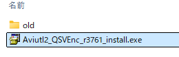
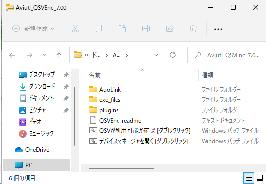
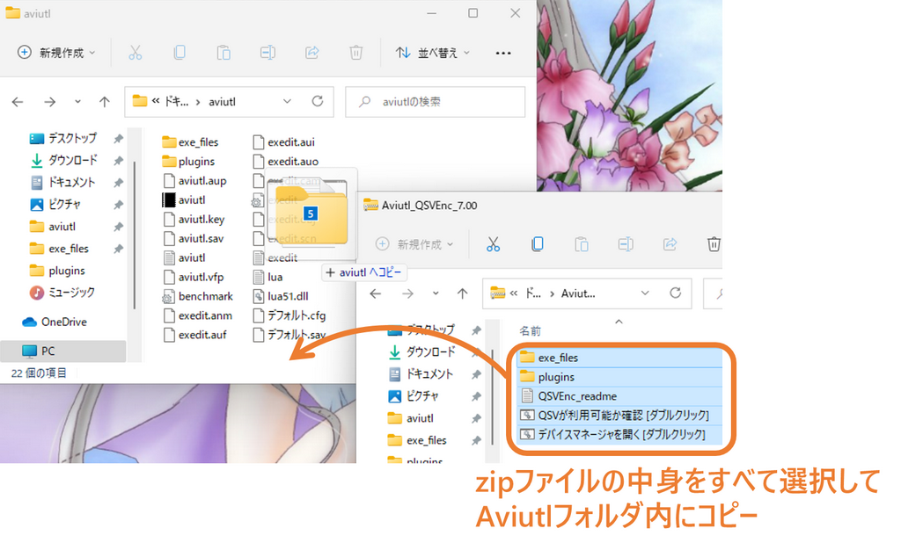
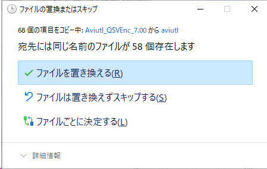
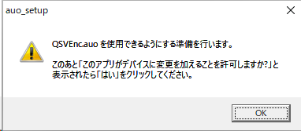
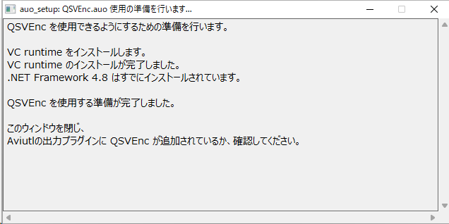
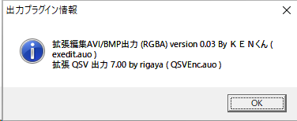
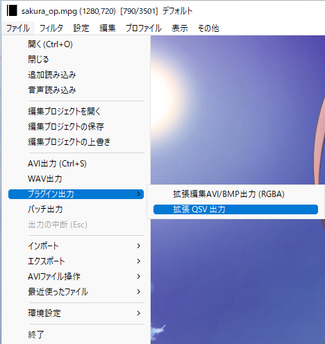
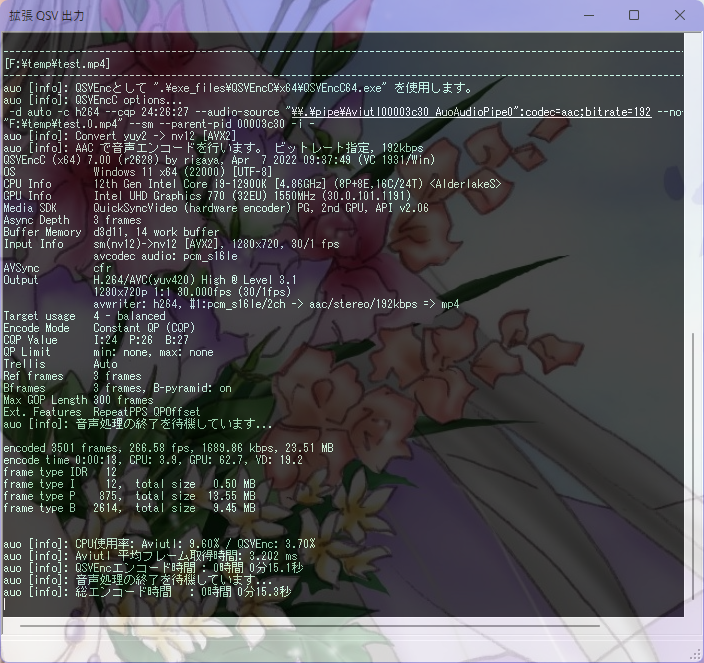
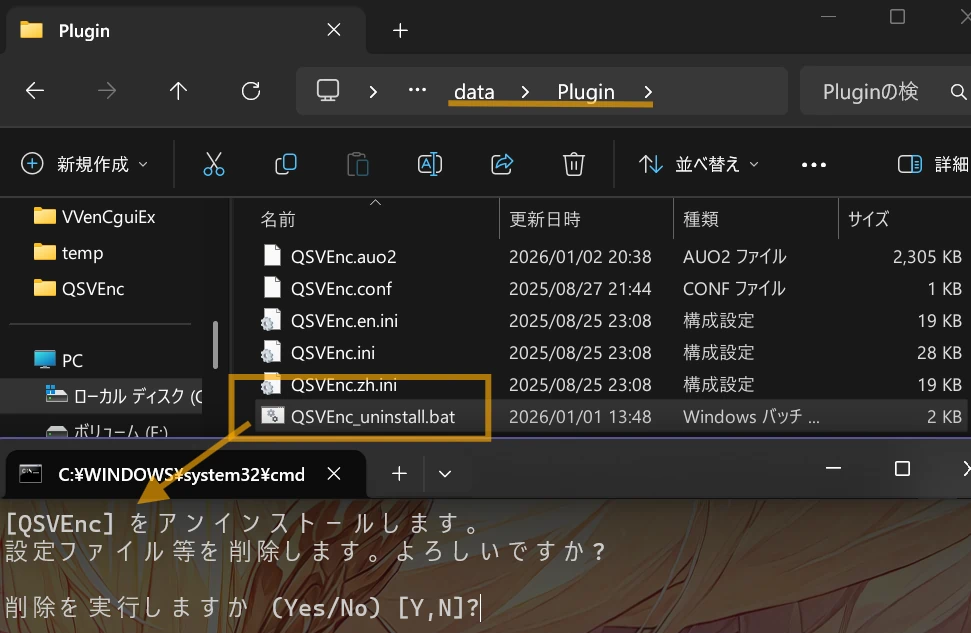

# QSVEnc.auo
by rigaya

[](https://github.com/rigaya/QSVEnc/actions/workflows/build_releases.yml)  [](https://github.com/rigaya/QSVEnc/actions/workflows/build_packages.yml)  

このソフトウェアは、IntelのCPUに搭載されているHWエンコーダ(QSV)の画質や速度といった性能の実験を目的としています。
Aviutlの出力プラグイン版と単体で動作するコマンドライン版があります。  

- [QSVEnc.auo](./QSVEnc_auo_readme.md)  
  Intel Media SDK を使用してエンコードを行うAviutlの出力プラグインです。本項で説明します。の使用方法については、[こちら](./QSVEnc_auo_readme.md)を参照してください。

- QSVEncC.exe  
  単体で動作するコマンドライン版の使用方法については、[こちら](./Readme.ja.md)を参照してください。

## 想定動作環境
Windows 10/11 (x86/x64)  
Aviutl 1.00 以降  

## QSVEnc 使用にあたっての注意事項
無保証です。自己責任で使用してください。  
QSVEncを使用したことによる、いかなる損害・トラブルについても責任を負いません。

## ダウンロード & 更新履歴
[こちら](https://github.com/rigaya/QSVEnc/releases)から、Aviutl_QSVEnc_x.xx.zipをダウンロードしてください。

### AviUtl2 への導入・更新

ダウンロードしたexeファイルをダブルクリックして開きます。



インストールしますか? とでたら [はい] をクリックします。


自動的にアーカイブが展開され、インストールが開始されます。


QSVEncの動作に必要な追加モジュール(VC runtime)の導入が追加で必要な環境では、ユーザーアカウント制御画面が表示されます。
その場合は、 [はい] をクリックします。
_環境によっては準備が不要な場合があり、その場合は表示されません。_


下記のような画面になり、「QSVEnc を使用する準備が完了しました。」と出れば終了です。
ウィンドウを閉じ、AviUtl2を起動してQSVEncが追加されているか確認してください。


## QSVEnc の Aviutl への導入・更新

### ダウンロード

まず、[こちら](https://github.com/rigaya/QSVEnc/releases)から、Aviutl_QSVEnc_x.xx.zipをダウンロードしてください。

### 導入・更新

ダウンロードしたzipファイルをダブルクリックして開きます。中身はこんな感じです。



中身をすべてAviutlフォルダにコピーします。

> [!IMPORTANT]
> Aviutl2では、
> - exe_filesフォルダをAviutlフォルダの中に、
> - ```plugins```フォルダの**中身**を全て```C:\ProgramData\aviutl2\Plugin```の中に
>
> それぞれコピーしてください。



更新時には、下記のように上書きするか聞いてくることがあります。

その場合には「ファイルを置き換える」を選択して上書きしてください。


  
  
  
このあとAviutlをダブルクリックして起動してください。

初回起動時に必要に応じて下の図のようにQSVEncの使用準備をするというメッセージが出ます。環境によっては準備が不要な場合があり、その場合は表示されません。

OKをクリックすると使用準備が開始されます。


  
  
  
下の図のように、「この不明な発行元からのアプリがデバイスに変更を加えることを許可しますか?」というメッセージが表示されますので、「はい」をクリックしてください。


  
  
  
下の図のようなウィンドウが表示され、QSVEncの使用に必要なモジュールがインストールされます。

エラーなくインストールが完了すると下記のように表示されますので、右上の[x]ボタンでウィンドウを閉じてください。



これで使用準備は完了です。

### 確認

QSVEncがAviutlに認識されているか確認します。

Aviutlの [その他] > [出力プラグイン情報]を選択します。


QSVEnc 7.xxが表示されていれば成功です。




### エンコード
[ ファイル ] > [ プラグイン出力 ] > [ 拡張 QSV 出力 (GUI) ] を選択し、出力ファイル名を入力して、「保存」をクリックしてください。



エンコードが開始されます。



エンコードが完了するまで待ちます。お疲れ様でした。

## 使用出来る主な機能
### QSVEnc/QSVEncC共通
- QuickSyncVideoを使用したエンコード
   - H.264/AVC
   - H.265/HEVC (8bit/10bit)
   - MPEG2
   - VP9 (8bit/10bit)
- QuickSyncVideoの各エンコードモード
   - CQP       固定量子化量
   - CBR       固定ビットレート
   - VBR       可変ビットレート
   - AVBR      適応的可変ビットレート
   - QVBR      品質ベース可変ビットレート
   - Lookahead 先行探索レート制御
   - LA-HRD    先行探索レート制御 (HRD互換)
   - ICQ       固定品質モード
   - LA-ICQ    先行探索付き固定品質モード
   - VCM       ビデオ会議モード
- エンコード品質の7段階による指定
- インタレ保持エンコード (PAFF方式)
- シーンチェンジ検出
- SAR比指定
- colormatrix等の指定
- H.264 Level / Profileの指定
- Blurayエンコードモード
- 最大ビットレート等の指定
- 最大GOP長の指定
- AVX2までを使用した処理の高速化
- エンコード結果のSSIM/PSNRを計算
- VPP機能
  - Media Functionを使用した高速フィルタリング
    - リサイズ
    - インタレ解除 (normal / bob / it)
    - エッジ強調
    - ノイズ低減
    - Image Stablizier
  - CUDAによるGPUフィルタリング
    - インタレ解除
      - afs (自動フィールドシフト)
      - nnedi
    - decimate
    - mpdecimate
    - delogo
    - 字幕焼きこみ
    - 色空間変換 (x64版のみ)
      - hdr2sdr
    - リサイズ  
      - bilinear
      - spline16, spline36, spline64
      - lanczos2, lanczos3, lanczos4
    - 回転 / 反転
    - パディング(黒帯)の追加
    - バンディング低減
    - ノイズ除去
      - knn (K-nearest neighbor)
      - pmd (正則化pmd法)
    - 輪郭・ディテール強調
      - unsharp
      - edgelevel (エッジレベル調整)
      - warpsharp

### QSVEnc
- 音声エンコード
- 音声及びチャプターとのmux機能
- 自動フィールドシフト対応

## QSVEnc の AviUtl からの削除

QSVEnc を AviUtl/AviUtl2 から削除するには、プラグインフォルダの ```QSVEnc_uninstall.bat``` をダブルクリックして実行します。



上記画面が表示されたら、```y``` と入力し、削除を実行してください。

## 多言語対応

現在、日本語、英語、中国語の切り替えに対応しています。

中国語については、Aviutlの中国語対応をされているNsyw様に翻訳いただきました。メッセージ量の多い中、ご対応いただき、ありがとうございました！

他の言語については、QSVEnc.auoと同じフォルダに下記2ファイルを置くことで、新たな言語を追加できます。

| ファイル名 | 翻訳元 |
|:---        |:---   |
| QSVEnc.<2文字の言語コード>.lng | QSVEnc.ja.lng |
| QSVEnc.<2文字の言語コード>.ini | QSVEnc.ja.ini |

いずれもUTF-8で保存してください。
