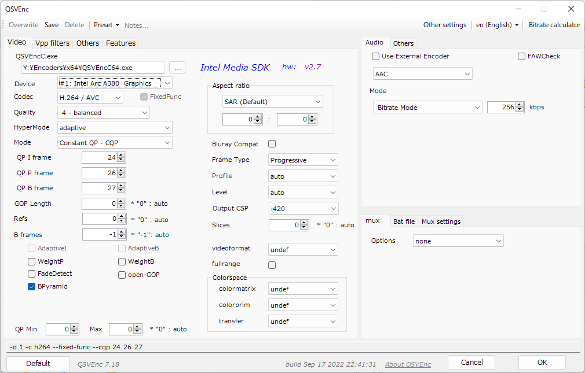

# QSVEnc
by rigaya

    

**[日本語版はこちら＞＞](./Readme.ja.md)**

This software is meant to investigate performance and image quality of HW encoder (QSV) of Intel.
There are 2 types of software developed, one is command line version that runs independently, and the nother is a output plug-in of [Aviutl](http://spring-fragrance.mints.ne.jp/aviutl/).

- QSVEncC.exe ... Command line version supporting transcoding.  
- QSVEnc.auo ... Output plugin for [Aviutl](http://spring-fragrance.mints.ne.jp/aviutl/).

## Downloads & update history
[rigayaの日記兼メモ帳＞＞](http://rigaya34589.blog135.fc2.com/blog-category-10.html)  
[github releases](https://github.com/rigaya/QSVEnc/releases)  

## Install
[Install instructions for Windows and Linux](./Install.en.md)

## Build
[Build instructions for Windows and Linux](./Build.en.md)

## System Requirements
### Windows
Windows 10/11 (x86/x64)  
Aviutl 1.00 or later (QSVEnc.auo)  

### Linux
Debian/Ubuntu (QSVEncC)  
Fedora (QSVEncC)  
  Requires Broadwell CPU or later.  
  It may be possible to run on other distributions (not tested).

## Precautions for using QSVEnc
THE SOFTWARE IS PROVIDED "AS IS", WITHOUT WARRANTY OF ANY KIND.

## Usage and options of QSVEncC
[Option list and details of QSVEncC](./QSVEncC_Options.en.md)

## Major Features
### Common to QSVEnc.auo / QSVEncC
- Encoding using QuickSyncVideo
   - H.264/AVC
   - H.265/HEVC (8bit/10bit)
   - MPEG2
   - VP9 (8bit/10bit)
   - AV1 (8bit/10bit)
- Encode mode of QuickSyncVideo
   - CQP       (Fixed Quantization)
   - CBR       (Constant bitrate)
   - VBR       (Variable bitrate)
   - AVBR      (Adaptive Variable bitrate)
   - QVBR      (Quality based Variable bitrate)
   - LA        (Lookahead mode)
   - LA-HRD    (HRD compatible Lookahead mode)
   - ICQ       (Constant Quality)
   - LA-ICQ    (Constant Quality with Lookahead)
   - VCM       (Video Conference mode)
- Quality preset of 7 steps
- Interlaced encoding (by PAFF)
- Supports setting of codec profile & level, SAR, colormatrix, maxbitrate, GOP len, etc...
- Parallel encoding supporting multi GPU
- Calculation of ssim/psnr of the encode
- Supports various vpp(video pre-processing) filters
  - MFX (Media Fixed function) filters
    - resize
    - deinterlace (normal / bob / it)
    - detail enhancement
    - denoise
    - image stablizier
  - OpenCL filters
    - deinterlacer
      - afs (Automatic field shift)
      - nnedi
    - decimate
    - mpdecimate
    - colorspace conversion
      - hdr2sdr
      - tonemap ([libplacebo](https://code.videolan.org/videolan/libplacebo))
    - delogo
    - subburn
    - resize
      - bilinear
      - spline16, spline36, spline64
      - lanczos2, lanczos3, lanczos4
      - [libplacebo](https://code.videolan.org/videolan/libplacebo)
    - transpose / rotate / flip
    - padding
    - deband
      - deband
      - [libplacebo](https://code.videolan.org/videolan/libplacebo)
    - noise reduction
      - knn (K-nearest neighbor)
      - pmd (modified pmd method)
    - edge / detail enhancement
      - unsharp
      - edgelevel (edge ​​level adjustment)
      - warpsharp

### QSVEncC
- Supports QSV(hw) decoding
  - MPEG2
  - H.264/AVC
  - HEVC
  - VP8
  - VP9
  - AV1
- Supports various formats such as avs, vpy, y4m, and raw
- Supports demux/muxing using libavformat
- Supports decode using libavcodec

### QSVEnc.auo (Aviutl plugin)
- Audio encoding
- Mux audio and chapter
- afs (Automatic field shift) support

## Supported Features
This depends on the version of QSVEnc, the generation of the GPU, and also the GPU driver.

| CPU Gen     | GPU Gen |  Windows                                                 | Linux | 
|:--          |:--      |:--                                                      |:--    |
| SandyBridge | Gen6     | [i5 2410M](./GPUFeatures/QSVEnc_SND_i5_2410M_Win.txt)   |  |
| IvyBridge   | Gen7     |                                                         |  |
| Haswell     | Gen7.5   | [i3 4170](./GPUFeatures/QSVEnc_HSW_i3_4170_Win.txt) [i7 4610Y](./GPUFeatures/QSVEnc_HSW_i7_4610Y_Win.txt)     |  |
| Broadwell   | Gen8     | [i7 5500U](./GPUFeatures/QSVEnc_BDW_i7_5500U_Win.txt)   | [i7 5500U](./GPUFeatures/QSVEnc_BDW_i7_5500U_Ubuntu2204.txt)  |
| SkyLake     | Gen9     |                                                         |  |
| KabyLake    | Gen9.5   | [i5 7500](./GPUFeatures/QSVEnc_KBL_i5_7500_Win.txt)   | [i7 7700K](./GPUFeatures/QSVEnc_KBL_i7_7700K_Ubuntu2204.txt) [i7 7500](./GPUFeatures/QSVEnc_KBL_i5_7500_Ubuntu2404.txt)  |
| CoffeeLake  | Gen9.5   |                                                         |  |
| CommetLake  | Gen9.5   |                                                         |  |
| Cannonlake  | Gen10    |                                                         |  |
| IceLake     | Gen11    | [i5 1035G7](./GPUFeatures/QSVEnc_ICL_i5_1035G7_Win.txt) | [i5 1035G7](./GPUFeatures/QSVEnc_ICL_i5_1035G7_Ubuntu2004.txt)  |
| TigerLake   | Gen12    |                                                         |  |
| RocketLake  | Gen12    | [i7 11700K](./GPUFeatures/QSVEnc_RKL_i7_11700K_Win.txt) | [i7 11700K](./GPUFeatures/QSVEnc_RKL_i7_11700K_Ubuntu2204_libmfxgen.txt)  |
| AlderLake   | Gen12    | [i9 12900K](./GPUFeatures/QSVEnc_ADL_i9_12900K_Win.txt) [i3 N305](./GPUFeatures/QSVEnc_ADL_i3_N305_Win.txt) | [i9 12900K](./GPUFeatures/QSVEnc_ADL_i9_12900K_Ubuntu2204.txt) [i3 N305](./GPUFeatures/QSVEnc_ADL_i3_N305_Ubuntu2404.txt) |
| ArrowLake   | Gen12.74 | [u5 245K](./GPUFeatures/QSVEnc_ARL_u5_245K_Win.txt) |  |
| Alchemist   | DG2(ACM) | [Arc A380](./GPUFeatures/QSVEnc_DG2_Arc_A380_Win.txt)   | [Arc A380](./GPUFeatures/QSVEnc_DG2_Arc_A380_Ubuntu2204.txt) [Arc A310](./GPUFeatures/QSVEnc_DG2_Arc_A310_Ubuntu2404.txt)  |
| Battlemage  | BMG      | [Arc A580](./GPUFeatures/QSVEnc_BMG_Arc_A580_Win.txt)   |  |

## Supported HW Encoder (@ Windows OS)

| CPU Gen     | GPU Gen  | MPEG2  | H.264 PG | H.264 FF | HEVC PG | HEVC FF | VP9 FF | AV1 FF |
|:--         |:--       |:--:     |:--:     |:--:     |:--:     |:--:     |:--:   |:--:    |
| SandyBridge | Gen6     | 8bit   | 8bit     |          |         |         |        |        |
| IvyBridge   | Gen7     | 8bit   | 8bit     |          |         |         |        |        |
| Haswell     | Gen7.5   | 8bit   | 8bit     |          |         |         |        |        |
| Broadwell   | Gen8     | 8bit   | 8bit     |          |         |         |        |        |
| SkyLake     | Gen9     | 8bit   | 8bit     |          | 8bit    |         |        |        |
| KabyLake    | Gen9.5   | 8bit   | 8bit     | 8bit     | 10bit   |         |        |        |
| CoffeeLake  | Gen9.5   | 8bit   | 8bit     | 8bit     | 10bit   |         |        |        |
| CommetLake  | Gen9.5   | 8bit   | 8bit     | 8bit     | 10bit   |         |        |        |
| CannonLake  | Gen10    | -      | -        | -        | -       | -       | -      | -      |
| IceLake     | Gen11    | 8bit   | 8bit     | 8bit     | 10bit   | 10bit   | 10bit  |        |
| TigerLake   | Gen12    | 8bit   | 8bit     | 8bit     | 10bit   | 10bit   | 10bit  |        |
| RocketLake  | Gen12    | 8bit   | 8bit     | 8bit     | 10bit   | 10bit   | 10bit  |        |
| AlderLake   | Gen12    | 8bit   | 8bit     | 8bit     | 10bit   | 10bit   | 10bit  |        |
| ArrowLake   | Gen12.74 |        |          | 8bit     |         | 10bit   | 10bit  | 10bit  |
| Alchemist   | DG2(ACM) |        |          | 8bit     |         | 10bit   | 10bit  | 10bit  |
| Battlemage  | BMG      |        |          | 8bit     |         | 10bit   | 10bit  | 10bit  |

## Supported HW Decoder

| CPU Gen     | GPU Gen  | MPEG2  | H.264 | HEVC    | VP8    | VP9    | AV1    |
|:--         |:--       |:--:     |:--:    |:--:    |:--:    |:--:   |:--:    |
| SandyBridge | Gen6     | 8bit   | 8bit   |        |        |        |        |
| IvyBridge   | Gen7     | 8bit   | 8bit   |        |        |        |        |
| Haswell     | Gen7.5   | 8bit   | 8bit   |        |        |        |        |
| Broadwell   | Gen8     | 8bit   | 8bit   |        | 8bit   |        |        |
| SkyLake     | Gen9     | 8bit   | 8bit   | 8bit   | 8bit   |        |        |
| KabyLake    | Gen9.5   | 8bit   | 8bit   | 10bit  | 8bit   | 8bit   |        |
| CoffeeLake  | Gen9.5   | 8bit   | 8bit   | 10bit  | 8bit   | 8bit   |        |
| CommetLake  | Gen9.5   | 8bit   | 8bit   | 10bit  | 8bit   | 8bit   |        |
| CannonLake  | Gen10    | -      | -      | -      |-       | -      | -      |
| IceLake     | Gen11    | 8bit   | 8bit   | 10bit  | 8bit   | 10bit  |        |
| TigerLake   | Gen12    | 8bit   | 8bit   | 12bit  |        | 12bit  | 10bit  |
| RocketLake  | Gen12    | 8bit   | 8bit   | 12bit  |        | 12bit  | 10bit  |
| AlderLake   | Gen12    | 8bit   | 8bit   | 12bit  |        | 12bit  | 10bit  |
| ArrowLake   | Gen12.74 | 8bit   | 8bit   | 12bit  |        | 12bit  | 12bit  |
| Alchemist   | DG2(ACM) | 8bit   | 8bit   | 12bit  |        | 12bit  | 12bit  |
| Battlemage  | BMG      | 8bit   | 8bit   | 12bit  |        | 12bit  | 12bit  |

## Auto GPU selection in multi GPU envinronment (Windows Only)
QSVEncC will automatically select a GPU depending on the options used,
when there are multiple GPUs available which support QSV.
--device option can be used to specify on which GPU to run manually. 

1. Select GPU which supports...  
  Items below will be checked whether the GPU supports it or not  
  - Codec, Profile, Level
  - Additionally, below items will be checked if specified
    - 10bit depth encoding
    - HW decode
  
2. If there are multiple GPUs which suports all the items checked in 1. and 2., GPU below will be prefered.  
  - GPU which has low Video Engine(VE) utilization
  - GPU which has low GPU core utilization
  
  The purpose of selecting GPU with lower VE/GPU ulitization is to assign tasks to mulitple GPUs
  and improve the throughput of the tasks.  
  
  Please note that VE and GPU ulitization are check at the initialization pahse of the app,
  and there are delays in values taken. Therefore, it is likely that the multiple tasks started at the same time
  to run on the same GPU, and divided into multiple GPUs, even if the options are supported in every GPUs.

## QSVEnc source code
- MIT license.
- This software depends on
  [oneVPL](https://github.com/oneapi-src/oneVPL/),
  [ffmpeg](https://ffmpeg.org/),
  [libplacebo](https://code.videolan.org/videolan/libplacebo),
  [libhdr10plus](https://github.com/quietvoid/hdr10plus_tool),
  [libdovi](https://github.com/quietvoid/dovi_tool),
  [libass](https://github.com/libass/libass),
  [tinyxml2](http://www.grinninglizard.com/tinyxml2/),
  [dtl](https://github.com/cubicdaiya/dtl),
  [clRNG](https://github.com/clMathLibraries/clRNG),
  [ttmath](http://www.ttmath.org/) &
  [Caption2Ass](https://github.com/maki-rxrz/Caption2Ass_PCR).
  For these licenses, please see the header part of the corresponding source and license.txt.

### About source code
Windows ... VC build  
Linux ... makefile + gcc/clang build    

Character code: UTF-8-BOM  
Line feed: CRLF  
Indent: blank x4  
